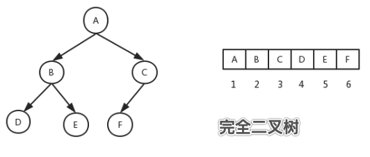

# 优先队列及堆排序

堆排序( `Heap Sort` )由威尔士-加拿大计算机科学家 `J. W. J. Williams` 在 `1964` 年发明，它利用了二叉堆 `(A binary heap)` 的性质实现了排序，并证明了二叉堆数据结构的可用性。同年，美国籍计算机科学家 `R. W. Floyd` 在其树排序研究的基础上，发布了一个改进的原地排序的堆排序版本。

堆排序属于选择类排序算法。

## 一、二叉堆

优先队列是一种能完成以下任务的队列：插入一个数值，取出最小或最大的数值（获取数值，并且删除）。

优先队列可以用二叉树来实现，我们称这种结构为二叉堆。

>树：是指有唯一一个根节点，根节点下面有若干儿子节点，且每一个儿子节点本身是一棵树，是一个递归的结构。最底部的节点称为叶子节点，这些叶子节点没有下属节点。
>
>二叉树：每个节点最多只有两个儿子节点的树。
>
>完全二叉树：除了叶子节点，任何节点的儿子节点都是满的二叉树。也就是叶子节点与叶子节点之间高度不会超过一层，即树的高度不会超过一层，也称平衡二叉树。


最小堆和最大堆是二叉堆的一种，是一颗完全二叉树（一种平衡树）。

如图是一颗完全二叉树：




最小堆的性质：

1. 父节点的值都小于左右儿子节点。
2. 这是一个递归的性质。

最大堆的性质：

1. 父节点的值都大于左右儿子节点。
2. 这是一个递归的性质。

最大堆和最小堆实现方式一样，只不过根节点一个是最大的，一个是最小的。

最小堆实现细节(两个操作)：

1. push：向堆中插入数据时，首先在堆的末尾插入数据，如果该数据比父亲节点还小，那么交换，然后不断向上提升，直到没有大小颠倒为止。
2. pop：从堆中删除最小值时，首先把最后一个值复制到根节点上，并且删除最后一个数值，然后和儿子节点比较，如果值大于儿子，与儿子节点交换，然后不断向下交换， 直到没有大小颠倒为止。在向下交换过程中，如果有两个子儿子都小于自己，就选择较小的。

最大堆同理。可用此结构实现堆排序算法。

因为最小堆是完全二叉树，相当于一直一分为二，树的高度是 `logn`，也就是 `n` 个元素的最小堆，最多有 `logn` 层。

初始化建堆的时间复杂度为O(n)，排序重建堆的时间复杂度为nlog(n)，所以总的时间复杂度为O(n+nlogn)=O(nlogn)。另外堆排序的比较次数和序列的初始状态有关，但只是在序列初始状态为堆的情况下比较次数显著减少，在序列有序或逆序的情况下比较次数不会发生明显变化。

因为可以原地排序，所以空间复杂度为：`O(1)`。

堆排序不是稳定的，因为两个相同的值，先


## 二、最小堆实现

```go
// 一个最小堆，一颗完全二叉树
// 最小堆要求节点元素都不大于其左右孩子
type Heap struct {
	// 堆的大小
	Size int
	// 使用内部的数组来模拟树
	// 一个节点下标为 i，那么父亲节点的下标为 (i-1)/2
	// 一个节点下标为 i，那么左儿子的下标为 2i+1，右儿子下标为 2i+2
	Array []int
}

// 初始化一个堆，直接原地排序
func NewHeap(array []int) *Heap {
	h := new(Heap)
	h.Array = array
	return h
}

// 最小堆插入元素
func (h *Heap) Push(x int) {
	// 堆没有元素时，使元素成为顶点后退出
	if h.Size == 0 {
		h.Array[0] = x
		h.Size++
		return
	}

	// i 是要插入节点的下标
	i := h.Size

	// 如果下标存在
	// 将小的值 x 一直上浮
	for i > 0 {
		// parent为该元素父亲节点的下标
		parent := (i - 1) / 2

		// 如果插入的值大于父亲节点，那么可以直接退出循环，因为父亲仍然是最小的
		if x >= h.Array[parent] {
			break
		}

		// 否则将父亲节点与该节点互换，然后向上翻转，将最小的元素一直往上推
		h.Array[i] = h.Array[parent]
		i = parent
	}

	// 将该值 x 放在不会再翻转的位置
	h.Array[i] = x

	// 堆数量加一
	h.Size++
}

// 最小堆移除根节点元素，也就是最小的元素
func (h *Heap) Pop() int {
	// 没有元素，返回-1
	if h.Size == 0 {
		return -1
	}

	// 取出根节点
	ret := h.Array[0]

	// 因为根节点要被删除了，将最后一个节点放到根节点的位置上
	h.Size--
	x := h.Array[h.Size] // 最后一个元素的值

	// 对根节点进行向下翻转，大的值 x 一直下沉，维持最小堆的特征
	i := 0
	for {
		// a，b为下标 i 左右两个子节点的下标
		a := 2*i + 1
		b := 2*i + 2

		// 左儿子下标超出了，表示没有左子树，那么右子树也没有，直接返回
		if a >= h.Size {
			break
		}

		// 有右子树，拿到两个子节点中较小节点的下标
		if b < h.Size && h.Array[b] < h.Array[a] {
			a = b
		}

		// 父亲节点的值都小于或等于两个儿子较小的那个，不需要向下继续翻转了，返回
		if x <= h.Array[a] {
			break
		}

		// 将较小的儿子与父亲交换，维持这个最小堆的特征
		h.Array[i]= h.Array[a]

		// 继续往下操作
		i = a
	}

	// 将最后一个元素的值 x 放在不会再翻转的位置
	h.Array[i] = x
	return ret
}
```


## 三、堆排序实现

先构建一个最小堆，然后依次把根节点元素 `pop` 出即可：

```go
func main() {
	list := []int{5, 9, 1, 6, 8, 14, 6, 49, 25, 4, 6, 3}

	// 构建最小堆
	h := NewHeap(list)
	for _, v := range list {
		h.Push(v)
	}

	// 堆排序
	for range list {
		fmt.Print(h.Pop(), " ")
	}
}
```

输出：

```
1 3 4 5 6 6 6 8 9 14 25 49 
```