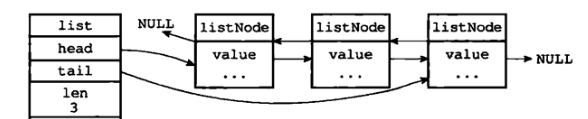
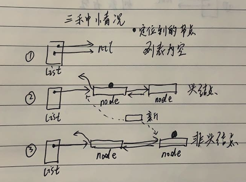
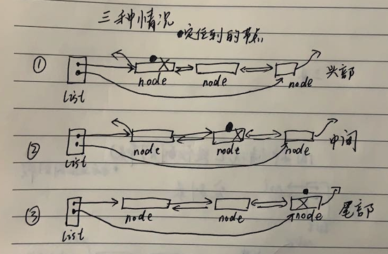

# 列表

## 一、列表 List

我们又经常听到 `列表 List` 数据结构，其实这只是更宏观的统称，表示存放数据的队列。

>列表 `List`：可以存放数据的数据结构，数据按顺序排列，可以依次入队和出队，

>列表有序号关系，可以取出某个序号的数据。先进先出的 `队列 (queue)` 和先进后出的 `栈（stack）` 都是列表。

>大家也经常听说一种叫 `线性表` 的数据结构，表示具有相同特性的数据元素的有限序列，实际上就是 `列表` 的同义词。

我们一般写算法进行数据计算，数据处理，都需要有个地方来存数据，我们可以使用封装好的数据结构 `List`。

列表的实现有 `顺序表示` 或 `链式表示`。

顺序表示：指的是用一组 `地址连续的存储单元` 依次存储线性表的数据元素，称为线性表的 `顺序存储结构`。它以 `物理位置相邻` 来表示线性表中数据元素间的逻辑关系，可随机存取表中任一元素。顺序表示的又叫 `顺序表`，也就是用数组来实现的列表。

链式表示：指的是用一组 `任意的存储单元` 存储线性表中的数据元素，称为线性表的 `链式存储结构`。它的存储单元可以是连续的，也可以是不连续的。在表示数据元素之间的逻辑关系时，除了存储其本身的信息之外，还需存储一个指示其直接后继的信息，也就是用链表来实现的列表。

我们在前面已经实现过这两种表示的数据结构：先进先出的 `队列 (queue)` 和先进后出的 `栈（stack）`。

接下来我们会来实现链表形式的双端列表，也叫双端队列，这个数据结构应用场景更广泛一点。在实际工程应用上，缓存数据库 `Redis` 的 `列表List` 基本类型就是用它来实现的。

## 二、实现双端列表

双端列表，也可以叫双端队列。

我们会用双向链表来实现这个数据结构：

```go
// DoubleList 双端列表，双端队列
type DoubleList struct {
	head *ListNode  // 指向链表头部
	tail *ListNode  // 指向链表尾部
	len  int        // 列表长度
	lock sync.Mutex // 为了进行并发安全pop弹出操作
}

// ListNode 列表节点
type ListNode struct {
	pre   *ListNode // 前驱节点
	next  *ListNode // 后驱节点
	value string    // 值
}
```

设计结构体 `DoubleList` 指向队列头部 `head` 和尾部 `tail` 的指针字段，方便找到链表最前和最后的节点。

链表节点之间是双向链接的，链表的第一个元素的前驱节点为 `nil`，最后一个元素的后驱节点也为 `nil`。如图：



我们实现的双端列表和 `Golang` 标准库 `container/list` 中实现的不一样，感兴趣的可以阅读标准库的实现。

### 2.1.列表节点普通操作

```go
// GetValue 获取节点值
func (node *ListNode) GetValue() string {
	return node.value
}

// GetPre 获取节点前驱节点
func (node *ListNode) GetPre() *ListNode {
	return node.pre
}

// GetNext 获取节点后驱节点
func (node *ListNode) GetNext() *ListNode {
	return node.next
}

// HashNext 是否存在后驱节点
func (node *ListNode) HashNext() bool {
	return node.pre != nil
}

// HashPre 是否存在前驱节点
func (node *ListNode) HashPre() bool {
	return node.next != nil
}

// IsNil 是否为空节点
func (node *ListNode) IsNil() bool {
	return node == nil
}

// Len 返回列表长度
func (list *DoubleList) Len() int {
	return list.len
}
```

以上是对节点结构体 `ListNode` 的操作，主要判断节点是否为空，有没有后驱和前驱节点，返回值等，时间复杂度都是 `O(1)`。

### 2.2.从头部开始某个位置前插入新节点

我们参考数组下标，下标从0开始。从双端列表的头部，插入新的节点。

```go
// AddNodeFromHead 从头部开始，添加节点到第N+1个元素之前，
// N=0表示添加到第一个元素之前，表示新节点成为新的头部，
// N=1表示添加到第二个元素之前，以此类推
func (list *DoubleList) AddNodeFromHead(n int, v string) {
	// 加并发锁
	list.lock.Lock()
	defer list.lock.Unlock()

	// 如果索引超过或等于列表长度，一定找不到，直接panic
	if n != 0 && n >= list.len {
		panic("index out")
	}

	// 先找出头部
	node := list.head

	// 往后遍历拿到第 N+1 个位置的元素
	for i := 1; i <= n; i++ {
		node = node.next
	}

	// 新节点
	newNode := new(ListNode)
	newNode.value = v

	// 如果定位到的节点为空，表示列表为空，将新节点设置为新头部和新尾部
	if node.IsNil() {
		list.head = newNode
		list.tail = newNode
	} else {
		// 定位到的节点，它的前驱
		pre := node.pre

		// 如果定位到的节点前驱为nil，那么定位到的节点为链表头部，需要换头部
		if pre.IsNil() {
			// 将新节点链接在老头部之前
			newNode.next = node
			node.pre = newNode
			// 新节点成为头部
			list.head = newNode
		} else {
			// 将新节点插入到定位到的节点之前
			// 定位到的节点的前驱节点 pre 现在链接到新节点上
			pre.next = newNode
			newNode.pre = pre

			// 定位到的节点的后驱节点 node.next 现在链接到新节点上
			node.next.pre = newNode
			newNode.next = node.next

		}

	}

	// 列表长度+1
	list.len = list.len + 1
}
```

首先加锁实现并发安全：

```go
    // 加并发锁
	list.lock.Lock()
	defer list.lock.Unlock()
```

然后判断索引是否超出列表长度，其中 `n=0` 表示要成为新的头部节点，我们放过它：

```go
	// 如果索引超过或等于列表长度，一定找不到，直接panic
	if n != 0 && n >= list.len {
		panic("index out")
	}
```

如果 `n=0` 表示要插入到第一个节点之前，也就是新节点想成为新的链表头部。

如果 `n=1` 表示要插入到第二个节点之前，新节点成为第二个节点，以此类推。

首先，找出列表的头部：

```go
    node := list.head
```

然后往后面遍历，定位到索引 `n` 指定的节点 `node`，我们要在这个节点之前插入新的节点：

```go
	// 往后遍历拿到第 N+1 个位置的元素
	for i := 1; i <= n; i++ {
		node = node.next
	}
```

接着初始化新节点：

```go
    newNode := new(ListNode)
```

定位到的节点有三种情况，我们需要在该节点之前插入新节点：



第一种情况，判断定位到的节点 `node` 是否为空，如果为空，表明列表没有元素，将新节点设置为新头部和新尾部即可：

```go
	// 如果定位到的节点为空，表示列表为空，将新节点设置为新头部和新尾部
	if node.IsNil() {
		list.head = newNode
		list.tail = newNode
	}
```

否则，我们要插入新的节点到非空的列表上。 我们找到定位到的节点的前驱节点：`pre := node.pre`，我们要把新节点变成定位到的节点的前驱节点，之前的前驱节点 `pre` 要往前顺延。

第二种情况，如果前驱节点为空：`pre.IsNil()`，表明定位到的节点 `node` 为头部，那么新节点要取代它，成为新的头部：

```go
		if pre.IsNil() {
			// 将新节点链接在老头部之前
			newNode.next = node
			node.pre = newNode
			// 新节点成为头部
			list.head = newNode
		}
```

新节点成为新的头部，需要将新节点的后驱设置为老头部：`newNode.next = node`，老头部的前驱为新头部：`node.pre = newNode`，并且新头部变化：`list.head = newNode`。

第三种情况，如果定位到的节点的前驱节点不为空，表明定位到的节点 `node` 不是头部节点，那么我们只需将新节点链接到节点 `node` 之前即可：

```go
			// 定位到的节点的前驱节点 pre 现在链接到新节点前
			pre.next = newNode
			newNode.pre = pre

			// 定位到的节点链接到新节点之后
			newNode.next = node
			node.pre = newNode
```

先将定位到的节点的前驱节点和新节点绑定，因为现在新节点插在前面了，把定位节点的前驱节点的后驱设置为新节点：`pre.next = newNode`，新节点的前驱设置为定位节点的前驱节点：`newNode.pre = pre`。

同时，定位到的节点现在要链接到新节点之后，所以新节点的后驱设置为：`newNode.next = node`，定位到的节点的前驱设置为：`node.pre = newNode`。

当然插入新节点的最后，我们要将链表长度加一：

```go
	// 列表长度+1
	list.len = list.len + 1
```


大部分时间花在遍历位置上，如果 `n=0`，那么时间复杂度为 `O(1)`，否则为 `O(n)`。

### 2.3.从尾部开始某个位置后插入新节点

```go
// AddNodeFromTail 从尾部开始，添加节点到第N+1个元素之后，N=0表示添加到第一个元素之后，表示新节点成为新的尾部，N=1表示添加到第二个元素之后，以此类推
func (list *DoubleList) AddNodeFromTail(n int, v string) {
	// 加并发锁
	list.lock.Lock()
	defer list.lock.Unlock()

	// 如果索引超过或等于列表长度，一定找不到，直接panic
	if n != 0 && n >= list.len {
		panic("index out")
	}

	// 先找出尾部
	node := list.tail

	// 往前遍历拿到第 N+1 个位置的元素
	for i := 1; i <= n; i++ {
		node = node.pre
	}

	// 新节点
	newNode := new(ListNode)
	newNode.value = v

	// 如果定位到的节点为空，表示列表为空，将新节点设置为新头部和新尾部
	if node.IsNil() {
		list.head = newNode
		list.tail = newNode
	} else {
		// 定位到的节点，它的后驱
		next := node.next

		// 如果定位到的节点后驱为nil，那么定位到的节点为链表尾部，需要换尾部
		if next.IsNil() {
			// 将新节点链接在老尾部之后
			node.next = newNode
			newNode.pre = node

			// 新节点成为尾部
			list.tail = newNode
		} else {
			// 将新节点插入到定位到的节点之后
			// 新节点链接到定位到的节点之后
			newNode.pre = node
			node.next = newNode

			// 定位到的节点的后驱节点链接在新节点之后
			newNode.next = next
			next.pre = newNode

		}

	}

	// 列表长度+1
	list.len = list.len + 1
}
```

操作和头部插入节点相似，自行分析。

### 2.4.从头部开始某个位置获取列表节点

```go
// IndexFromHead 从头部开始往后找，获取第N+1个位置的节点，索引从0开始。
func (list *DoubleList) IndexFromHead(n int) *ListNode {
	// 索引超过或等于列表长度，一定找不到，返回空指针
	if n >= list.len {
		return nil
	}

	// 获取头部节点
	node := list.head

	// 往后遍历拿到第 N+1 个位置的元素
	for i := 1; i <= n; i++ {
		node = node.next
	}

	return node
}
````

如果索引超出或等于列表长度，那么找不到节点，返回空。

否则从头部开始遍历，拿到节点。

时间复杂度为：`O(n)`。

### 2.5.从尾部开始某个位置获取列表节点

```go
// IndexFromTail 从尾部开始往前找，获取第N+1个位置的节点，索引从0开始。
func (list *DoubleList) IndexFromTail(n int) *ListNode {
	// 索引超过或等于列表长度，一定找不到，返回空指针
	if n >= list.len {
		return nil
	}

	// 获取尾部节点
	node := list.tail

	// 往前遍历拿到第 N+1 个位置的元素
	for i := 1; i <= n; i++ {
		node = node.pre
	}

	return node
}
```

操作和从头部获取节点一样，请自行分析。

### 2.6.从头部开始移除并返回某个位置的节点

获取某个位置的元素，并移除它。

```go
// PopFromHead 从头部开始往后找，获取第N+1个位置的节点，并移除返回
func (list *DoubleList) PopFromHead(n int) *ListNode {
	// 加并发锁
	list.lock.Lock()
	defer list.lock.Unlock()

	// 索引超过或等于列表长度，一定找不到，返回空指针
	if n >= list.len {
		return nil
	}

	// 获取头部
	node := list.head

	// 往后遍历拿到第 N+1 个位置的元素
	for i := 1; i <= n; i++ {
		node = node.next
	}

	// 移除的节点的前驱和后驱
	pre := node.pre
	next := node.next

	// 如果前驱和后驱都为nil，那么移除的节点为链表唯一节点
	if pre.IsNil() && next.IsNil() {
		list.head = nil
		list.tail = nil
	} else if pre.IsNil() {
		// 表示移除的是头部节点，那么下一个节点成为头节点
		list.head = next
		next.pre = nil
	} else if next.IsNil() {
		// 表示移除的是尾部节点，那么上一个节点成为尾节点
		list.tail = pre
		pre.next = nil
	} else {
		// 移除的是中间节点
		pre.next = next
		next.pre = pre
	}

	// 节点减一
	list.len = list.len - 1
	return node
}
```

首先加并发锁实现并发安全:

```go
	// 加并发锁
	list.lock.Lock()
	defer list.lock.Unlock()
```

先判断索引是否超出列表长度，如果超出直接返回空指针。：

```go
	// 索引超过或等于列表长度，一定找不到，返回空指针
	if n >= list.len {
		return nil
	}
```

获取头部，然后遍历定位到第 `N+1` 个位置的元素:

```go
	// 获取头部
	node := list.head
	
	// 往后遍历拿到第 N+1 个位置的元素
	for i := 1; i <= n; i++ {
		node = node.next
	}
```

获取要移除的节点的前驱和后驱：

```go
	// 移除的节点的前驱和后驱
	pre := node.pre
	next := node.next
```

定位到的并要移除的节点有三种情况发生，移除的是头部，尾部或者中间节点：



我们这么这里：

如果前驱和后驱都为空：

```go
	// 如果前驱和后驱都为nil，那么移除的节点为链表唯一节点
	if pre.IsNil() && next.IsNil() {
		list.head = nil
		list.tail = nil
	}
```

那么要移除的节点是链表中唯一的节点，直接将列表头部和尾部置空即可。

如果移除的是头部或尾部节点：


```go
    else if pre.IsNil() {
		// 表示移除的是头部节点，那么下一个节点成为头节点
		list.head = next
		next.pre = nil
	} else if next.IsNil() {
		// 表示移除的是尾部节点，那么上一个节点成为尾节点
		list.tail = pre
		pre.next = nil
	} 
```

当前驱节点为空：`pre.IsNil()`，表示移除的是头部节点，那么头部节点的下一个节点要成为新的头部：`list.head = next`，并且这时新的头部前驱要设置为空：`next.pre = nil`。

同理，当后驱节点为空：`next.IsNil()`，表示移除的是尾部节点，需要将尾部节点的前一个节点设置为新的尾部：`list.tail = pre`，并且这时新的尾部后驱要设置为空：`pre.next = nil`。

如果移除的节点处于两个节点之间，那么将这两个节点链接起来即可:

```go
    // 移除的是中间节点
    pre.next = next
    next.pre = pre
```

当然，最后列表长度减一：

```go
    // 节点减一
	list.len = list.len - 1
```

主要的耗时用在定位节点上，其他的操作都是链表链接，可以知道时间复杂度为：`O(n)`。

### 2.7.从尾部开始移除并返回某个位置的节点

```go
// PopFromTail 从尾部开始往前找，获取第N+1个位置的节点，并移除返回
func (list *DoubleList) PopFromTail(n int) *ListNode {
	// 加并发锁
	list.lock.Lock()
	defer list.lock.Unlock()

	// 索引超过或等于列表长度，一定找不到，返回空指针
	if n >= list.len {
		return nil
	}

	// 获取尾部
	node := list.tail

	// 往前遍历拿到第 N+1 个位置的元素
	for i := 1; i <= n; i++ {
		node = node.pre
	}

	// 移除的节点的前驱和后驱
	pre := node.pre
	next := node.next

	// 如果前驱和后驱都为nil，那么移除的节点为链表唯一节点
	if pre.IsNil() && next.IsNil() {
		list.head = nil
		list.tail = nil
	} else if pre.IsNil() {
		// 表示移除的是头部节点，那么下一个节点成为头节点
		list.head = next
		next.pre = nil
	} else if next.IsNil() {
		// 表示移除的是尾部节点，那么上一个节点成为尾节点
		list.tail = pre
		pre.next = nil
	} else {
		// 移除的是中间节点
		pre.next = next
		next.pre = pre
	}

	// 节点减一
	list.len = list.len - 1
	return node
}
```

操作和从头部移除节点相似，请自行分析。

### 2.8.完整例子

```go
package main

import (
	"fmt"
	"sync"
)

// DoubleList 双端列表，双端队列
type DoubleList struct {
	head *ListNode  // 指向链表头部
	tail *ListNode  // 指向链表尾部
	len  int        // 列表长度
	lock sync.Mutex // 为了进行并发安全pop弹出操作
}

// ListNode 列表节点
type ListNode struct {
	pre   *ListNode // 前驱节点
	next  *ListNode // 后驱节点
	value string    // 值
}

// GetValue 获取节点值
func (node *ListNode) GetValue() string {
	return node.value
}

// GetPre 获取节点前驱节点
func (node *ListNode) GetPre() *ListNode {
	return node.pre
}

// GetNext 获取节点后驱节点
func (node *ListNode) GetNext() *ListNode {
	return node.next
}

// HashNext 是否存在后驱节点
func (node *ListNode) HashNext() bool {
	return node.pre != nil
}

// HashPre 是否存在前驱节点
func (node *ListNode) HashPre() bool {
	return node.next != nil
}

// IsNil 是否为空节点
func (node *ListNode) IsNil() bool {
	return node == nil
}

// Len 返回列表长度
func (list *DoubleList) Len() int {
	return list.len
}

// AddNodeFromHead 从头部开始，添加节点到第N+1个元素之前，N=0表示添加到第一个元素之前，表示新节点成为新的头部，N=1表示添加到第二个元素之前，以此类推
func (list *DoubleList) AddNodeFromHead(n int, v string) {
	// 加并发锁
	list.lock.Lock()
	defer list.lock.Unlock()

	// 如果索引超过或等于列表长度，一定找不到，直接panic
	if n != 0 && n >= list.len {
		panic("index out")
	}

	// 先找出头部
	node := list.head

	// 往后遍历拿到第 N+1 个位置的元素
	for i := 1; i <= n; i++ {
		node = node.next
	}

	// 新节点
	newNode := new(ListNode)
	newNode.value = v

	// 如果定位到的节点为空，表示列表为空，将新节点设置为新头部和新尾部
	if node.IsNil() {
		list.head = newNode
		list.tail = newNode
	} else {
		// 定位到的节点，它的前驱
		pre := node.pre

		// 如果定位到的节点前驱为nil，那么定位到的节点为链表头部，需要换头部
		if pre.IsNil() {
			// 将新节点链接在老头部之前
			newNode.next = node
			node.pre = newNode
			// 新节点成为头部
			list.head = newNode
		} else {
			// 将新节点插入到定位到的节点之前
			// 定位到的节点的前驱节点 pre 现在链接到新节点前
			pre.next = newNode
			newNode.pre = pre

			// 定位到的节点链接到新节点之后
			newNode.next = node
			node.pre = newNode
		}

	}

	// 列表长度+1
	list.len = list.len + 1
}

// AddNodeFromTail 从尾部开始，添加节点到第N+1个元素之后，N=0表示添加到第一个元素之后，表示新节点成为新的尾部，N=1表示添加到第二个元素之后，以此类推
func (list *DoubleList) AddNodeFromTail(n int, v string) {
	// 加并发锁
	list.lock.Lock()
	defer list.lock.Unlock()

	// 如果索引超过或等于列表长度，一定找不到，直接panic
	if n != 0 && n >= list.len {
		panic("index out")
	}

	// 先找出尾部
	node := list.tail

	// 往前遍历拿到第 N+1 个位置的元素
	for i := 1; i <= n; i++ {
		node = node.pre
	}

	// 新节点
	newNode := new(ListNode)
	newNode.value = v

	// 如果定位到的节点为空，表示列表为空，将新节点设置为新头部和新尾部
	if node.IsNil() {
		list.head = newNode
		list.tail = newNode
	} else {
		// 定位到的节点，它的后驱
		next := node.next

		// 如果定位到的节点后驱为nil，那么定位到的节点为链表尾部，需要换尾部
		if next.IsNil() {
			// 将新节点链接在老尾部之后
			node.next = newNode
			newNode.pre = node

			// 新节点成为尾部
			list.tail = newNode
		} else {
			// 将新节点插入到定位到的节点之后
			// 新节点链接到定位到的节点之后
			newNode.pre = node
			node.next = newNode

			// 定位到的节点的后驱节点链接在新节点之后
			newNode.next = next
			next.pre = newNode

		}

	}

	// 列表长度+1
	list.len = list.len + 1
}

// First 返回列表链表头结点
func (list *DoubleList) First() *ListNode {
	return list.head
}

// Last 返回列表链表尾结点
func (list *DoubleList) Last() *ListNode {
	return list.tail
}

// IndexFromHead 从头部开始往后找，获取第N+1个位置的节点，索引从0开始。
func (list *DoubleList) IndexFromHead(n int) *ListNode {
	// 索引超过或等于列表长度，一定找不到，返回空指针
	if n >= list.len {
		return nil
	}

	// 获取头部节点
	node := list.head

	// 往后遍历拿到第 N+1 个位置的元素
	for i := 1; i <= n; i++ {
		node = node.next
	}

	return node
}

// IndexFromTail 从尾部开始往前找，获取第N+1个位置的节点，索引从0开始。
func (list *DoubleList) IndexFromTail(n int) *ListNode {
	// 索引超过或等于列表长度，一定找不到，返回空指针
	if n >= list.len {
		return nil
	}

	// 获取尾部节点
	node := list.tail

	// 往前遍历拿到第 N+1 个位置的元素
	for i := 1; i <= n; i++ {
		node = node.pre
	}

	return node
}

// PopFromHead 从头部开始往后找，获取第N+1个位置的节点，并移除返回
func (list *DoubleList) PopFromHead(n int) *ListNode {
	// 加并发锁
	list.lock.Lock()
	defer list.lock.Unlock()

	// 索引超过或等于列表长度，一定找不到，返回空指针
	if n >= list.len {
		return nil
	}

	// 获取头部
	node := list.head

	// 往后遍历拿到第 N+1 个位置的元素
	for i := 1; i <= n; i++ {
		node = node.next
	}

	// 移除的节点的前驱和后驱
	pre := node.pre
	next := node.next

	// 如果前驱和后驱都为nil，那么移除的节点为链表唯一节点
	if pre.IsNil() && next.IsNil() {
		list.head = nil
		list.tail = nil
	} else if pre.IsNil() {
		// 表示移除的是头部节点，那么下一个节点成为头节点
		list.head = next
		next.pre = nil
	} else if next.IsNil() {
		// 表示移除的是尾部节点，那么上一个节点成为尾节点
		list.tail = pre
		pre.next = nil
	} else {
		// 移除的是中间节点
		pre.next = next
		next.pre = pre
	}

	// 节点减一
	list.len = list.len - 1
	return node
}

// PopFromTail 从尾部开始往前找，获取第N+1个位置的节点，并移除返回
func (list *DoubleList) PopFromTail(n int) *ListNode {
	// 加并发锁
	list.lock.Lock()
	defer list.lock.Unlock()

	// 索引超过或等于列表长度，一定找不到，返回空指针
	if n >= list.len {
		return nil
	}

	// 获取尾部
	node := list.tail

	// 往前遍历拿到第 N+1 个位置的元素
	for i := 1; i <= n; i++ {
		node = node.pre
	}

	// 移除的节点的前驱和后驱
	pre := node.pre
	next := node.next

	// 如果前驱和后驱都为nil，那么移除的节点为链表唯一节点
	if pre.IsNil() && next.IsNil() {
		list.head = nil
		list.tail = nil
	} else if pre.IsNil() {
		// 表示移除的是头部节点，那么下一个节点成为头节点
		list.head = next
		next.pre = nil
	} else if next.IsNil() {
		// 表示移除的是尾部节点，那么上一个节点成为尾节点
		list.tail = pre
		pre.next = nil
	} else {
		// 移除的是中间节点
		pre.next = next
		next.pre = pre
	}

	// 节点减一
	list.len = list.len - 1
	return node
}

func main() {
	list := new(DoubleList)

	// 在列表头部插入新元素
	list.AddNodeFromHead(0, "I")
	list.AddNodeFromHead(0, "love")
	list.AddNodeFromHead(0, "you")
	// 在列表尾部插入新元素
	list.AddNodeFromTail(0, "may")
	list.AddNodeFromTail(0, "happy")

	list.AddNodeFromTail(list.Len()-1, "begin second")
	list.AddNodeFromHead(list.Len()-1, "end second")

	// 正常遍历，比较慢，因为内部会遍历拿到值返回
	for i := 0; i < list.Len(); i++ {
		// 从头部开始索引
		node := list.IndexFromHead(i)

		// 节点为空不可能，因为list.Len()使得索引不会越界
		if !node.IsNil() {
			fmt.Println(node.GetValue())
		}
	}

	fmt.Println("----------")

	// 正常遍历，特别快，因为直接拿到的链表节点
	// 先取出第一个元素
	first := list.First()
	for !first.IsNil() {
		// 如果非空就一直遍历
		fmt.Println(first.GetValue())
		// 接着下一个节点
		first = first.GetNext()
	}

	fmt.Println("----------")

	// 元素一个个 POP 出来
	for {
		node := list.PopFromHead(0)
		if node.IsNil() {
			// 没有元素了，直接返回
			break
		}
		fmt.Println(node.GetValue())
	}

	fmt.Println("----------")
	fmt.Println("len", list.Len())
}
```

输出：

```go
you
begin second
love
I
may
end second
happy
----------
you
begin second
love
I
may
end second
happy
----------
you
begin second
love
I
may
end second
happy
----------
len 0

```

首先，先从列表头部插入三个新元素，然后从尾部插入两个新元素，再往头部和尾部插入两个新元素：

```go
	list := new(DoubleList)

	// 在列表头部插入新元素
	list.AddNodeFromHead(0, "I")
	list.AddNodeFromHead(0, "love")
	list.AddNodeFromHead(0, "you")
	// 在列表尾部插入新元素
	list.AddNodeFromTail(0, "may")
	list.AddNodeFromTail(0, "happy")

	list.AddNodeFromTail(list.Len()-1, "begin second")
	list.AddNodeFromHead(list.Len()-1, "end second")
```

最后用三种方式进行遍历，前两种仅仅是查看元素，后一种是 `PopFromHead` 遍历后移除元素。

## 附录

代码下载： [https://github.com/hunterhug/goa.c/blob/master/code/double_list/double_list.go](https://github.com/hunterhug/goa.c/blob/master/code/double_list/double_list.go) 。
