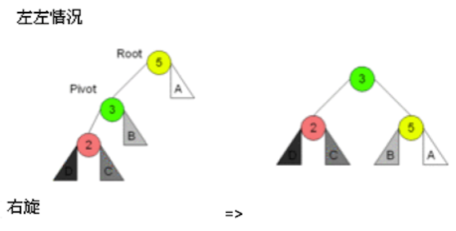
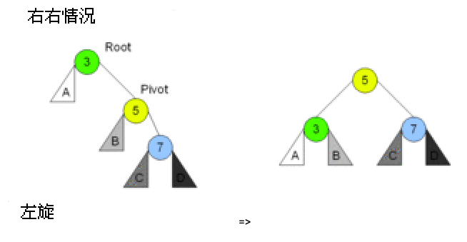
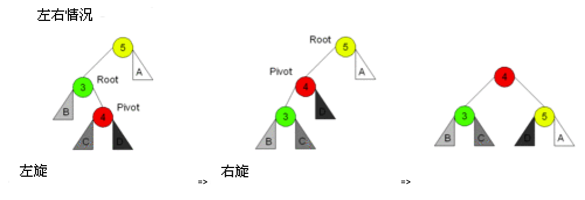

# AVL树和红黑树

二叉查找树的效率来源其二分查找的特征，时间复杂度在于二叉树的高度。

AVL树和红黑树都是相对平衡的二叉查找树，因为特殊的旋转平衡操作，树的高度被大大压低。它们查找效率较高，添加，删除，查找操作的平均时间复杂度都为 `log(n)`，经常在各种程序中被使用。

## 一、AVL树

AVL树是一颗严格自平衡的二叉查找树，1962年，发明者 `Adelson-Velsky` 和 `Landis` 发表了论文，以两个作者的名字命名了该数据结构。

1. 首先它是一颗二叉查找树。
2. 任意一个节点的左右子树最大高度差为1。

它的定义如此地简单，由于树特征定义，我们可以计算出其高度 `h` 的上界 `h<=1.44log(n)`，也就是最坏情况下，树的高度约等于 `1.44log(n)`。

>假设高度 `h` 的AVL树最少有 `f(h)` 个节点，因为左右子树的高度差不能大于1，根节点加上左右子树的节点为 `f(h) = 1 + f(h-1) + f(h-2)`，初始条件 `f(0)=0,f(1)=1`。
>
>经过数学的推算可以得出 h<=1.44log(n)，由于计算过程超纲了，在此不进行演算。

为了维持AVL树的特征，每次添加和删除元素都需要一次或多次旋转来调整树的平衡。调整的依据来自于二叉树节点的平衡因子：节点的左子树与右子树的高度差称为该节点的平衡因子，范围为 `[-1，0，1]`。

AVL树的数据结构如下：

```go
// AVL树
type AVLTree struct {
	Root *AVLTreeNode // 树根节点
}

// AVL节点
type AVLTreeNode struct {
	Value  int64                 // 值
	Times  int64                 // 值出现的次数
	Height int64                 // 该节点作为树根节点，树的高度，方便计算平衡因子
	Left   *AVLTreeNode // 左子树
	Right  *AVLTreeNode // 右字树
}

// 初始化一个AVL树
func NewAVLTree() *AVLTree {
	return new(AVLTree)
}
```

其中 `Height` 表示以该节点作为树的根节点，树的高度，方便计算平衡因子。更新树高度和计算平衡因子代码如下：

```go
// 更新节点的树高度
func (node *AVLTreeNode) UpdateHeight() {
	var leftHeight, rightHeight int64 = 0, 0
	if node.Left != nil {
		leftHeight = node.Left.Height
	}
	if node.Right != nil {
		rightHeight = node.Right.Height
	}
	// 哪个子树高算哪颗的
	maxHeight := leftHeight
	if rightHeight > maxHeight {
		maxHeight = rightHeight
	}
	// 高度加上自己那一层
	node.Height = maxHeight + 1
}

// 计算平衡因子
func (node *AVLTreeNode) BalanceFactor() int64 {
	var leftHeight, rightHeight int64 = 0, 0
	if node.Left != nil {
		leftHeight = node.Left.Height
	}
	if node.Right != nil {
		rightHeight = node.Right.Height
	}
	return leftHeight - rightHeight
}
```

### 1.1. AVL树添加元素

添加元素前需要定位到元素的位置，然后查找节点的平衡因子是否在 `[-1，0，1]` 范围内，如果不在，需要进行旋转调整。

旋转有四种情况：

1. 左旋，转一次。
2. 右旋，转一次。
3. 先左后右旋，转两次。
4. 先右后左旋，转两次。

以下示意图摘自维基百科，阅读代码时可以参考。


在左子树上插上左儿子导致失衡，需要单右旋：



代码如下：

```go
// 单右旋操作，看图说话
func RightRotation(Root *AVLTreeNode) *AVLTreeNode {
	// 只有Pivot和B，Root位置变了
	Pivot := Root.Left
	B := Pivot.Right
	Pivot.Right = Root
	Root.Left = B

	// 只有Root和Pivot变化了高度
	Root.UpdateHeight()
	Pivot.UpdateHeight()
	return Pivot
}
```

在右子树上插上右儿子导致失衡，需要单左旋：



代码如下：

```go
// 单左旋操作，看图说话
func LeftRotation(Root *AVLTreeNode) *AVLTreeNode {
	// 只有Pivot和B，Root位置变了
	Pivot := Root.Right
	B := Pivot.Left
	Pivot.Left = Root
	Root.Right = B

	// 只有Root和Pivot变化了高度
	Root.UpdateHeight()
	Pivot.UpdateHeight()
	return Pivot
}
```

在左子树上插上右儿子导致失衡，先左后右旋：



代码如下：

```go
// 先左后右旋操作，看图说话
func LeftRightRotation(node *AVLTreeNode) *AVLTreeNode {
	node.Left = LeftRotation(node.Left)
	return RightRotation(node)
}
```

在右子树上插上左儿子导致失衡，先右后左旋：


代码如下：

```go
// 先右后左旋操作，看图说话
func RightLeftRotation(node *AVLTreeNode) *AVLTreeNode {
	node.Right = RightRotation(node.Right)
	return LeftRotation(node)
}
```

四种旋转代码实现后，我们开始进行添加元素操作：

```go
// 添加元素
func (tree *AVLTree) Add(value int64) {
	// 往树根添加元素，会返回新的树根
	tree.Root = tree.Root.Add(value)
}

func (node *AVLTreeNode) Add(value int64) *AVLTreeNode {
	// 添加值到根节点node，如果node为空，那么让值成为新的根节点，树的高度为1
	if node == nil {
		return &AVLTreeNode{Value: value, Height: 1}
	}
	// 如果值重复，什么都不用做，直接更新次数
	if node.Value == value {
		node.Times = node.Times + 1
		return node
	}

	// 辅助变量
	var newTreeNode *AVLTreeNode

	if value > node.Value {
		// 插入的值大于节点值，要从右子树继续插入
		node.Right = node.Right.Add(value)
		// 平衡因子，插入右子树后，要确保树根左子树的高度不能比右子树低一层。
		factor := node.BalanceFactor()
		// 右子树的高度变高了，导致左子树-右子树的高度从-1变成了-2。
		if factor == -2 {
			if value > node.Right.Value {
				// 表示在右子树上插上右儿子导致失衡，需要单左旋：
				newTreeNode = LeftRotation(node)
			} else {
				//表示在右子树上插上左儿子导致失衡，先右后左旋：
				newTreeNode = RightLeftRotation(node)
			}
		}
	} else {
		// 插入的值小于节点值，要从左子树继续插入
		node.Left = node.Left.Add(value)
		// 平衡因子，插入左子树后，要确保树根左子树的高度不能比右子树高一层。
		factor := node.BalanceFactor()
		// 左子树的高度变高了，导致左子树-右子树的高度从1变成了2。
		if factor == 2 {
			if value < node.Left.Value {
				// 表示在左子树上插上左儿子导致失衡，需要单右旋：
				newTreeNode = RightRotation(node)
			} else {
				//表示在左子树上插上右儿子导致失衡，先左后右旋：
				newTreeNode = LeftRightRotation(node)
			}
		}
	}

	if newTreeNode == nil {
		// 表示什么旋转都没有，根节点没变，直接刷新树高度
		node.UpdateHeight()
		return node
	} else {
		// 旋转了，树根节点变了，需要刷新新的树根高度
		newTreeNode.UpdateHeight()
		return newTreeNode
	}
}
```

一开始从树根节点开始插入新值：`tree.Root = tree.Root.Add(value)`，因为插入值会返回新的根节点，所以要重新赋予根节点。

在 `func (node *AVLTreeNode) Add(value int64)` 函数中，如果根节点为空，那么需要返回新的根节点：

```go
	// 添加值到根节点node，如果node为空，那么让值成为新的根节点，树的高度为1
	if node == nil {
		return &AVLTreeNode{Value: value, Height: 1}
	}
```


接着，如果插入的值和节点的值一样，直接更新 `Times`：

```go
// 如果值重复，什么都不用做，直接更新次数
	if node.Value == value {
		node.Times = node.Times + 1
		return node
	}
```

否则根据值的大小，旋转插入到左子树或右子树，我们分析插入右子树的代码：

```go
	if value > node.Value {
		// 插入的值大于节点值，要从右子树继续插入
		node.Right = node.Right.Add(value)
		// 平衡因子，插入右子树后，要确保树根左子树的高度不能比右子树低一层。
		factor := node.BalanceFactor()
		// 右子树的高度变高了，导致左子树-右子树的高度从-1变成了-2。
		if factor == -2 {
			if value > node.Right.Value {
				// 表示在右子树上插上右儿子导致失衡，需要单左旋：
				newTreeNode = LeftRotation(node)
			} else {
				//表示在右子树上插上左儿子导致失衡，先右后左旋：
				newTreeNode = RightLeftRotation(node)
			}
		}
    }
```

因为值添加到了右子树，所以递归：`node.Right = node.Right.Add(value)`，之后要判断根节点的平衡因子是否变化了。

值插入右子树后，要确保树根左子树的高度不能比右子树低一层。当平衡因子 `factor == -2` 表示右子树的高度变高了，导致左子树-右子树的高度从-1变成了-2，所以要旋转。

判断新插入的值是在右子树的左儿子还是右儿子上：`value > node.Right.Value`。

如果在右子树上插上右儿子导致失衡，需要单左旋：`LeftRotation(node)`，如果在右子树上插上左儿子导致失衡，先右后左旋：`RightLeftRotation(node)`。

最后需要更新树根节点的高度，并返回树根：

```go
	if newTreeNode == nil {
		// 表示什么旋转都没有，根节点没变，直接刷新树高度
		node.UpdateHeight()
	} else {
		// 旋转了，树根节点变了，需要刷新新的树根高度
		newTreeNode.UpdateHeight()
		return newTreeNode
	}
```

如果曾经旋转，表示树根变了，需要返回新的数根。

### 1.2. AVL树查找等操作

其他操作与二叉查找树通用，代码如下：

```go
// 找出最小值的节点
func (tree *AVLTree) FindMinValue() *AVLTreeNode {
	if tree.Root == nil {
		// 如果是空树，返回空
		return nil
	}

	return tree.Root.FindMinValue()
}

func (node *AVLTreeNode) FindMinValue() *AVLTreeNode {
	// 左子树为空，表面已经是最左的节点了，该值就是最小值
	if node.Left == nil {
		return node
	}

	// 一直左子树递归
	return node.Left.FindMinValue()
}

// 找出最大值的节点
func (tree *AVLTree) FindMaxValue() *AVLTreeNode {
	if tree.Root == nil {
		// 如果是空树，返回空
		return nil
	}

	return tree.Root.FindMaxValue()
}

func (node *AVLTreeNode) FindMaxValue() *AVLTreeNode {
	// 右子树为空，表面已经是最右的节点了，该值就是最大值
	if node.Right == nil {
		return node
	}

	// 一直右子树递归
	return node.Right.FindMaxValue()
}

// 查找指定节点
func (tree *AVLTree) Find(value int64) *AVLTreeNode {
	if tree.Root == nil {
		// 如果是空树，返回空
		return nil
	}

	return tree.Root.Find(value)
}

func (node *AVLTreeNode) Find(value int64) *AVLTreeNode {
	if value == node.Value {
		// 如果该节点刚刚等于该值，那么返回该节点
		return node
	} else if value < node.Value {
		// 如果查找的值小于节点值，从节点的左子树开始找
		if node.Left == nil {
			// 左子树为空，表示找不到该值了，返回nil
			return nil
		}
		return node.Left.Find(value)
	} else {
		// 如果查找的值大于节点值，从节点的右子树开始找
		if node.Right == nil {
			// 右子树为空，表示找不到该值了，返回nil
			return nil
		}
		return node.Right.Find(value)
	}
}

// 中序遍历
func (tree *AVLTree) MidOrder() {
	tree.Root.MidOrder()
}

func (node *AVLTreeNode) MidOrder() {
	if node == nil {
		return
	}

	// 先打印左子树
	node.Left.MidOrder()

	// 按照次数打印根节点
	for i := 0; i <= int(node.Times); i++ {
		fmt.Println(node.Value)
	}

	// 打印右子树
	node.Right.MidOrder()
}
```

### 1.3. AVL树删除元素

删除元素有两种情况：

1. 第一种情况，删除的节点没有儿子，直接删除即可。之后需要做平衡操作。
2. 第二种情况，删除的节点下有子树，选择高度更高的子树下的节点来替换被删除的节点，如果左子树更高，选择左子树中最大的节点，如果右子树更高，选择右子树中最小的节点。之后需要做平衡操作。

```go
// 删除指定的元素
func (tree *AVLTree) Delete(value int64) {
	if tree.Root == nil {
		// 如果是空树，直接返回
		return
	}

	tree.Root = tree.Root.Delete(value)
}

func (node *AVLTreeNode) Delete(value int64) *AVLTreeNode {
	if node == nil {
		// 如果是空树，直接返回
		return nil
	}
	if value < node.Value {
		// 从左子树开始删除
		node.Left = node.Left.Delete(value)
	} else if value > node.Value {
		// 从右子树开始删除
		node.Right = node.Right.Delete(value)
	} else {
		// 找到该值对应的节点
		// 该节点没有左右子树
		if node.Left == nil && node.Right == nil {
			return nil // 直接返回nil，表示直接该值删除
		}

		// 该节点有两颗子树，选择更高的哪个来替换
		if node.Left != nil && node.Right != nil {
			// 左子树更高，拿左子树中最大值的节点替换
			if node.Left.Height > node.Right.Height {
				maxNode := node.Left
				for maxNode.Right != nil {
					maxNode = maxNode.Right
				}

				// 最大值的节点替换被删除节点
				node.Value = maxNode.Value
				node.Times = maxNode.Times

				// 把最大的节点删掉
				node.Left = node.Left.Delete(node.Value)
			} else {
				// 右子树更高，拿右子树中最小值的节点替换
				minNode := node.Right
				for minNode.Left != nil {
					minNode = minNode.Left
				}

				// 最小值的节点替换被删除节点
				node.Value = minNode.Value
				node.Times = minNode.Times

				// 把最小的节点删掉
				node.Right = node.Right.Delete(node.Value)
			}
		}

		// 只有左子树
		if node.Left != nil && node.Right == nil {
			maxNode := node.Left
			for maxNode.Right != nil {
				maxNode = maxNode.Right
			}

			// 最大值的节点替换被删除节点
			node.Value = maxNode.Value
			node.Times = maxNode.Times

			// 把最大的节点删掉
			node.Left = node.Left.Delete(node.Value)
		}

		// 只有右子树
		if node.Left == nil && node.Right != nil {
			// 右子树更高，拿右子树中最小值的节点替换
			minNode := node.Right
			for minNode.Left != nil {
				minNode = minNode.Left
			}

			// 最小值的节点替换被删除节点
			node.Value = minNode.Value
			node.Times = minNode.Times

			// 把最小的节点删掉
			node.Right = node.Right.Delete(node.Value)
		}
	}

	var newNode *AVLTreeNode
	// 左边比右边高了，不平衡
	if node.BalanceFactor() == 2 {
		if node.Left.BalanceFactor() == 1 {
			newNode = RightRotation(node)
		} else {
			newNode = LeftRightRotation(node)
		}
	} else if node.BalanceFactor() == -2 {
		// 右边比左边高了，不平衡
		if node.Right.BalanceFactor() == -1 {
			newNode = LeftRotation(node)
		} else {
			newNode = RightLeftRotation(node)
		}
	}

	if newNode == nil {
		node.UpdateHeight()
		return node
	} else {
		newNode.UpdateHeight()
		return newNode
	}
}
```

### 1.4. 完整程序

```go
package main

import (
	"fmt"
)

// AVL树
type AVLTree struct {
	Root *AVLTreeNode // 树根节点
}

// AVL节点
type AVLTreeNode struct {
	Value  int64        // 值
	Times  int64        // 值出现的次数
	Height int64        // 该节点作为树根节点，树的高度，方便计算平衡因子
	Left   *AVLTreeNode // 左子树
	Right  *AVLTreeNode // 右字树
}

// 初始化一个AVL树
func NewAVLTree() *AVLTree {
	return new(AVLTree)
}

// 更新节点的树高度
func (node *AVLTreeNode) UpdateHeight() {
	var leftHeight, rightHeight int64 = 0, 0
	if node.Left != nil {
		leftHeight = node.Left.Height
	}
	if node.Right != nil {
		rightHeight = node.Right.Height
	}
	// 哪个子树高算哪颗的
	maxHeight := leftHeight
	if rightHeight > maxHeight {
		maxHeight = rightHeight
	}
	// 高度加上自己那一层
	node.Height = maxHeight + 1
}

// 计算平衡因子
func (node *AVLTreeNode) BalanceFactor() int64 {
	var leftHeight, rightHeight int64 = 0, 0
	if node.Left != nil {
		leftHeight = node.Left.Height
	}
	if node.Right != nil {
		rightHeight = node.Right.Height
	}
	return leftHeight - rightHeight
}

// 单右旋操作，看图说话
func RightRotation(Root *AVLTreeNode) *AVLTreeNode {
	// 只有Pivot和B，Root位置变了
	Pivot := Root.Left
	B := Pivot.Right
	Pivot.Right = Root
	Root.Left = B

	// 只有Root和Pivot变化了高度
	Root.UpdateHeight()
	Pivot.UpdateHeight()
	return Pivot
}

// 单左旋操作，看图说话
func LeftRotation(Root *AVLTreeNode) *AVLTreeNode {
	// 只有Pivot和B，Root位置变了
	Pivot := Root.Right
	B := Pivot.Left
	Pivot.Left = Root
	Root.Right = B

	// 只有Root和Pivot变化了高度
	Root.UpdateHeight()
	Pivot.UpdateHeight()
	return Pivot
}

// 先左后右旋操作，看图说话
func LeftRightRotation(node *AVLTreeNode) *AVLTreeNode {
	node.Left = LeftRotation(node.Left)
	return RightRotation(node)
}

// 先右后左旋操作，看图说话
func RightLeftRotation(node *AVLTreeNode) *AVLTreeNode {
	node.Right = RightRotation(node.Right)
	return LeftRotation(node)
}

// 添加元素
func (tree *AVLTree) Add(value int64) {
	// 往树根添加元素，会返回新的树根
	tree.Root = tree.Root.Add(value)
}

func (node *AVLTreeNode) Add(value int64) *AVLTreeNode {
	// 添加值到根节点node，如果node为空，那么让值成为新的根节点，树的高度为1
	if node == nil {
		return &AVLTreeNode{Value: value, Height: 1}
	}

	// 如果值重复，什么都不用做，直接更新次数
	if node.Value == value {
		node.Times = node.Times + 1
		return node
	}

	// 辅助变量
	var newTreeNode *AVLTreeNode

	if value > node.Value {
		// 插入的值大于节点值，要从右子树继续插入
		node.Right = node.Right.Add(value)
		// 平衡因子，插入右子树后，要确保树根左子树的高度不能比右子树低一层。
		factor := node.BalanceFactor()
		// 右子树的高度变高了，导致左子树-右子树的高度从-1变成了-2。
		if factor == -2 {
			if value > node.Right.Value {
				// 表示在右子树上插上右儿子导致失衡，需要单左旋：
				newTreeNode = LeftRotation(node)
			} else {
				//表示在右子树上插上左儿子导致失衡，先右后左旋：
				newTreeNode = RightLeftRotation(node)
			}
		}
	} else {
		// 插入的值小于节点值，要从左子树继续插入
		node.Left = node.Left.Add(value)
		// 平衡因子，插入左子树后，要确保树根左子树的高度不能比右子树高一层。
		factor := node.BalanceFactor()
		// 左子树的高度变高了，导致左子树-右子树的高度从1变成了2。
		if factor == 2 {
			if value < node.Left.Value {
				// 表示在左子树上插上左儿子导致失衡，需要单右旋：
				newTreeNode = RightRotation(node)
			} else {
				//表示在左子树上插上右儿子导致失衡，先左后右旋：
				newTreeNode = LeftRightRotation(node)
			}
		}
	}

	if newTreeNode == nil {
		// 表示什么旋转都没有，根节点没变，直接刷新树高度
		node.UpdateHeight()
		return node
	} else {
		// 旋转了，树根节点变了，需要刷新新的树根高度
		newTreeNode.UpdateHeight()
		return newTreeNode
	}
}

// 找出最小值的节点
func (tree *AVLTree) FindMinValue() *AVLTreeNode {
	if tree.Root == nil {
		// 如果是空树，返回空
		return nil
	}

	return tree.Root.FindMinValue()
}

func (node *AVLTreeNode) FindMinValue() *AVLTreeNode {
	// 左子树为空，表面已经是最左的节点了，该值就是最小值
	if node.Left == nil {
		return node
	}

	// 一直左子树递归
	return node.Left.FindMinValue()
}

// 找出最大值的节点
func (tree *AVLTree) FindMaxValue() *AVLTreeNode {
	if tree.Root == nil {
		// 如果是空树，返回空
		return nil
	}

	return tree.Root.FindMaxValue()
}

func (node *AVLTreeNode) FindMaxValue() *AVLTreeNode {
	// 右子树为空，表面已经是最右的节点了，该值就是最大值
	if node.Right == nil {
		return node
	}

	// 一直右子树递归
	return node.Right.FindMaxValue()
}

// 查找指定节点
func (tree *AVLTree) Find(value int64) *AVLTreeNode {
	if tree.Root == nil {
		// 如果是空树，返回空
		return nil
	}

	return tree.Root.Find(value)
}

func (node *AVLTreeNode) Find(value int64) *AVLTreeNode {
	if value == node.Value {
		// 如果该节点刚刚等于该值，那么返回该节点
		return node
	} else if value < node.Value {
		// 如果查找的值小于节点值，从节点的左子树开始找
		if node.Left == nil {
			// 左子树为空，表示找不到该值了，返回nil
			return nil
		}
		return node.Left.Find(value)
	} else {
		// 如果查找的值大于节点值，从节点的右子树开始找
		if node.Right == nil {
			// 右子树为空，表示找不到该值了，返回nil
			return nil
		}
		return node.Right.Find(value)
	}
}

// 删除指定的元素
func (tree *AVLTree) Delete(value int64) {
	if tree.Root == nil {
		// 如果是空树，直接返回
		return
	}

	tree.Root = tree.Root.Delete(value)
}

func (node *AVLTreeNode) Delete(value int64) *AVLTreeNode {
	if node == nil {
		// 如果是空树，直接返回
		return nil
	}
	if value < node.Value {
		// 从左子树开始删除
		node.Left = node.Left.Delete(value)
	} else if value > node.Value {
		// 从右子树开始删除
		node.Right = node.Right.Delete(value)
	} else {
		// 找到该值对应的节点
		// 该节点没有左右子树
		if node.Left == nil && node.Right == nil {
			return nil // 直接返回nil，表示直接该值删除
		}

		// 该节点有两颗子树，选择更高的哪个来替换
		if node.Left != nil && node.Right != nil {
			// 左子树更高，拿左子树中最大值的节点替换
			if node.Left.Height > node.Right.Height {
				maxNode := node.Left
				for maxNode.Right != nil {
					maxNode = maxNode.Right
				}

				// 最大值的节点替换被删除节点
				node.Value = maxNode.Value
				node.Times = maxNode.Times

				// 把最大的节点删掉
				node.Left = node.Left.Delete(node.Value)
			} else {
				// 右子树更高，拿右子树中最小值的节点替换
				minNode := node.Right
				for minNode.Left != nil {
					minNode = minNode.Left
				}

				// 最小值的节点替换被删除节点
				node.Value = minNode.Value
				node.Times = minNode.Times

				// 把最小的节点删掉
				node.Right = node.Right.Delete(node.Value)
			}
		}

		// 只有左子树
		if node.Left != nil && node.Right == nil {
			maxNode := node.Left
			for maxNode.Right != nil {
				maxNode = maxNode.Right
			}

			// 最大值的节点替换被删除节点
			node.Value = maxNode.Value
			node.Times = maxNode.Times

			// 把最大的节点删掉
			node.Left = node.Left.Delete(node.Value)
		}

		// 只有右子树
		if node.Left == nil && node.Right != nil {
			// 右子树更高，拿右子树中最小值的节点替换
			minNode := node.Right
			for minNode.Left != nil {
				minNode = minNode.Left
			}

			// 最小值的节点替换被删除节点
			node.Value = minNode.Value
			node.Times = minNode.Times

			// 把最小的节点删掉
			node.Right = node.Right.Delete(node.Value)
		}
	}

	var newNode *AVLTreeNode
	// 左边比右边高了，不平衡
	if node.BalanceFactor() == 2 {
		if node.Left.BalanceFactor() == 1 {
			newNode = RightRotation(node)
		} else {
			newNode = LeftRightRotation(node)
		}
	} else if node.BalanceFactor() == -2 {
		// 右边比左边高了，不平衡
		if node.Right.BalanceFactor() == -1 {
			newNode = LeftRotation(node)
		} else {
			newNode = RightLeftRotation(node)
		}
	}

	if newNode == nil {
		node.UpdateHeight()
		return node
	} else {
		newNode.UpdateHeight()
		return newNode
	}
}

// 中序遍历
func (tree *AVLTree) MidOrder() {
	tree.Root.MidOrder()
}

func (node *AVLTreeNode) MidOrder() {
	if node == nil {
		return
	}

	// 先打印左子树
	node.Left.MidOrder()

	// 按照次数打印根节点
	for i := 0; i <= int(node.Times); i++ {
		fmt.Println(node.Value)
	}

	// 打印右子树
	node.Right.MidOrder()
}

func main() {
	values := []int64{2, 3, 7, 10, 10, 10, 10, 23, 9, 102, 109}

	// 初始化二叉查找树并添加元素
	tree := NewAVLTree()
	for _, v := range values {
		tree.Add(v)
	}

	// 找到最大值或最小值的节点
	fmt.Println("find min value:", tree.FindMinValue())
	fmt.Println("find max value:", tree.FindMaxValue())

	// 查找不存在的99
	node := tree.Find(99)
	if node != nil {
		fmt.Println("find it 99!")
	} else {
		fmt.Println("not find it 99!")
	}

	// 查找存在的9
	node = tree.Find(9)
	if node != nil {
		fmt.Println("find it 9!")
	} else {
		fmt.Println("not find it 9!")
	}

	// 删除存在的9后，再查找9
	tree.Delete(9)
	tree.Delete(10)
	node = tree.Find(9)
	if node != nil {
		fmt.Println("find it 9!")
	} else {
		fmt.Println("not find it 9!")
	}

	// 中序遍历，实现排序
	tree.MidOrder()
}
```

运行结果：

```go
find min value: &{2 0 1 <nil> <nil>}
find max value: &{109 0 1 <nil> <nil>}
not find it 99!
find it 9!
not find it 9!
2
3
7
23
102
109
```

## 二、红黑树

红黑树是一颗近似平衡的二叉查找树，从 `2-3` 树衍生而来。

通过对节点进行染色，用二叉树形式实现的 `2-3` 树也就是红黑树。我们先介绍 `2-3` 树，再用二叉树形式来实现它。

### 2.1. `2-3` 树

`2-3` 树 也称 `对称B树`，是一棵严格自平衡的多路查找树，它不是一棵二叉树。具有以下特征：

1. 每个节点有1个或2个key，对应的key有2个或3个子节点。
2. 所有叶子节点到根节点的长度一致。
3. 每个节点的key保持从小到大排序，两个key之间的子树的所有值大小介于两个key之间。

如图：

