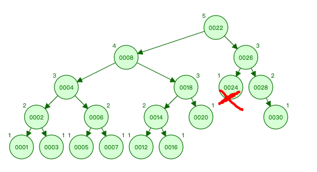
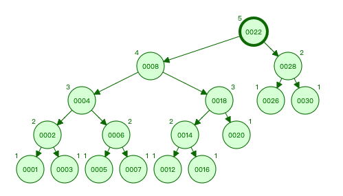
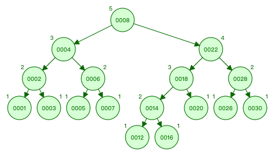
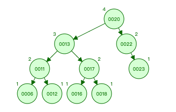
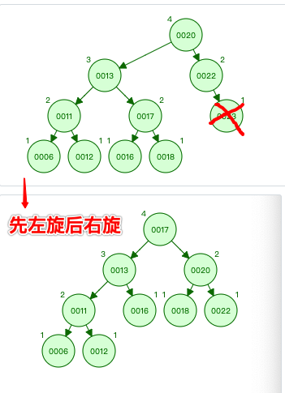
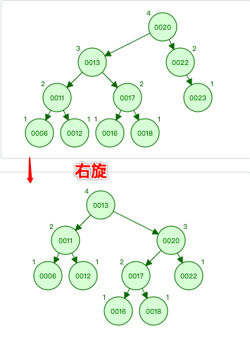
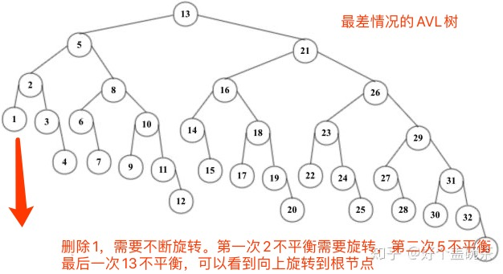

# AVL树

二叉查找树的树高度影响了查找的效率，需要尽量减小树的高度，AVL树正是这样的树。

## 一、AVL树介绍

AVL树是一棵严格自平衡的二叉查找树，1962年，发明者 `Adelson-Velsky` 和 `Landis` 发表了论文，以两个作者的名字命名了该数据结构，这是较早发明的平衡二叉树。

定义如下：

1. 首先它是一棵二叉查找树。
2. 任意一个节点的左右子树最大高度差为1。

由于树特征定义，我们可以计算出其高度 `h` 的上界 `h<=1.44log(n)`，也就是最坏情况下，树的高度约等于 `1.44log(n)`。

>假设高度 `h` 的AVL树最少有 `f(h)` 个节点，因为左右子树的高度差不能大于1，所以左子树和右子树最少节点为： `f(h-1)`，`f(h-2)`。
>
>因此，树根节点加上左右子树的节点，满足公式 `f(h) = 1 + f(h-1) + f(h-2)`，初始条件 `f(0)=0,f(1)=1`。
>
>经过数学的推算可以得出 h<=1.44log(n)，由于计算过程超纲了，在此不进行演算。
>


树的高度被限制于 `1.44log(n)`， 所以查找元素时使用二分查找，最坏查找 `1.44log(n)` 次，此时最坏时间复杂度为 `1.44log(n)`，去掉常数项，时间复杂度为：`log(n)`。

为了维持AVL树的特征，每次添加和删除元素都需要一次或多次旋转来调整树的平衡。调整的依据来自于二叉树节点的平衡因子：节点的左子树与右子树的高度差称为该节点的平衡因子，约束范围为 `[-1，0，1]`。

平衡二叉查找树比较难以理解的是添加和删除元素时的调整操作，我们将会具体分析。

##  二、AVL树基本结构

AVL树的数据结构如下：

```go
// AVL树
type AVLTree struct {
	Root *AVLTreeNode // 树根节点
}

// AVL节点
type AVLTreeNode struct {
	Value  int64                 // 值
	Times  int64                 // 值出现的次数
	Height int64                 // 该节点作为树根节点，树的高度，方便计算平衡因子
	Left   *AVLTreeNode // 左子树
	Right  *AVLTreeNode // 右字树
}

// 初始化一个AVL树
func NewAVLTree() *AVLTree {
	return new(AVLTree)
}
```

其中 `Height` 表示以该节点作为树的根节点时该树的高度，方便计算平衡因子。

更新树的高度，代码如下：

```go
// 更新节点的树高度
func (node *AVLTreeNode) UpdateHeight() {
	var leftHeight, rightHeight int64 = 0, 0
	if node.Left != nil {
		leftHeight = node.Left.Height
	}
	if node.Right != nil {
		rightHeight = node.Right.Height
	}
	// 哪个子树高算哪棵的
	maxHeight := leftHeight
	if rightHeight > maxHeight {
		maxHeight = rightHeight
	}
	// 高度加上自己那一层
	node.Height = maxHeight + 1
}
```


计算树的平衡因子，也就是左右子树的高度差，代码如下：

```go
// 计算平衡因子
func (node *AVLTreeNode) BalanceFactor() int64 {
	var leftHeight, rightHeight int64 = 0, 0
	if node.Left != nil {
		leftHeight = node.Left.Height
	}
	if node.Right != nil {
		rightHeight = node.Right.Height
	}
	return leftHeight - rightHeight
}
```

##  三、AVL树添加元素

添加元素前需要定位到元素的位置，也就是使用二分查找找到该元素需要插入的地方。

插入后，需要满足所有节点的平衡因子在 `[-1，0，1]` 范围内，如果不在，需要进行旋转调整。

旋转有四种情况：

1. 在右子树上插上右儿子导致失衡，左旋，转一次。
2. 在左子树上插上左儿子导致失衡，右旋，转一次。
3. 在左子树上插上右儿子导致失衡，先左后右旋，转两次。
4. 在右子树上插上左儿子导致失衡，先右后左旋，转两次。

旋转规律记忆法：单旋和双旋，单旋反方向，双旋同方向。

以下示意图摘自维基百科，阅读代码时可以参考。


### 3.1. 左子树插左儿子：单右旋

在左子树上插上左儿子导致失衡，需要单右旋：


因为红色元素 `2` 的产生，其最近的父亲节点 `Root` 失衡了，元素 `2` 导致了元素 `Root=5` 的失衡，需要调整。

将 `Pivot=3` 代替元素 `5` 的位置成为新的 `Root`，然后元素 `5` 委屈一下成为 `3` 的右儿子，而 `3` 的右儿子变成了 `5` 的左儿子，如上图。

相应调整后树的高度降低了，该失衡消失。我们可以看到红色元素 `2` 有两个儿子，实际上在添加操作时它是一个新的节点，是没有儿子的，这种有儿子的情况只发生在删除操作。

如果一时难以理解，可以多看几次图好好思考。

代码如下：

```go
// 单右旋操作，看图说话
func RightRotation(Root *AVLTreeNode) *AVLTreeNode {
	// 只有Pivot和B，Root位置变了
	Pivot := Root.Left
	B := Pivot.Right
	Pivot.Right = Root
	Root.Left = B

	// 只有Root和Pivot变化了高度
	Root.UpdateHeight()
	Pivot.UpdateHeight()
	return Pivot
}
```

### 3.2. 右子树插右儿子：单左旋

在右子树上插上右儿子导致失衡，需要单左旋：


代码如下：

```go
// 单左旋操作，看图说话
func LeftRotation(Root *AVLTreeNode) *AVLTreeNode {
	// 只有Pivot和B，Root位置变了
	Pivot := Root.Right
	B := Pivot.Left
	Pivot.Left = Root
	Root.Right = B

	// 只有Root和Pivot变化了高度
	Root.UpdateHeight()
	Pivot.UpdateHeight()
	return Pivot
}
```

### 3.3. 左子树插右儿子：先左后右旋

在左子树上插上右儿子导致失衡，先左后右旋：


代码如下：

```go
// 先左后右旋操作，看图说话
func LeftRightRotation(node *AVLTreeNode) *AVLTreeNode {
	node.Left = LeftRotation(node.Left)
	return RightRotation(node)
}
```

直接复用了之前左旋和右旋的代码，虽然难以理解，但是画一下图，确实这样调整后树高度降了，不再失衡，一切 perfect。

### 3.4. 右子树插左儿子：先右后左旋

在右子树上插上左儿子导致失衡，先右后左旋：


代码如下：

```go
// 先右后左旋操作，看图说话
func RightLeftRotation(node *AVLTreeNode) *AVLTreeNode {
	node.Right = RightRotation(node.Right)
	return LeftRotation(node)
}
```

### 3.5. 具体实现

四种旋转代码实现后，我们开始进行添加元素操作：

```go
// 添加元素
func (tree *AVLTree) Add(value int64) {
	// 往树根添加元素，会返回新的树根
	tree.Root = tree.Root.Add(value)
}

func (node *AVLTreeNode) Add(value int64) *AVLTreeNode {
	// 添加值到根节点node，如果node为空，那么让值成为新的根节点，树的高度为1
	if node == nil {
		return &AVLTreeNode{Value: value, Height: 1}
	}
	// 如果值重复，什么都不用做，直接更新次数
	if node.Value == value {
		node.Times = node.Times + 1
		return node
	}

	// 辅助变量
	var newTreeNode *AVLTreeNode

	if value > node.Value {
		// 插入的值大于节点值，要从右子树继续插入
		node.Right = node.Right.Add(value)
		// 平衡因子，插入右子树后，要确保树根左子树的高度不能比右子树低一层。
		factor := node.BalanceFactor()
		// 右子树的高度变高了，导致左子树-右子树的高度从-1变成了-2。
		if factor == -2 {
			if value > node.Right.Value {
				// 表示在右子树上插上右儿子导致失衡，需要单左旋：
				newTreeNode = LeftRotation(node)
			} else {
				//表示在右子树上插上左儿子导致失衡，先右后左旋：
				newTreeNode = RightLeftRotation(node)
			}
		}
	} else {
		// 插入的值小于节点值，要从左子树继续插入
		node.Left = node.Left.Add(value)
		// 平衡因子，插入左子树后，要确保树根左子树的高度不能比右子树高一层。
		factor := node.BalanceFactor()
		// 左子树的高度变高了，导致左子树-右子树的高度从1变成了2。
		if factor == 2 {
			if value < node.Left.Value {
				// 表示在左子树上插上左儿子导致失衡，需要单右旋：
				newTreeNode = RightRotation(node)
			} else {
				//表示在左子树上插上右儿子导致失衡，先左后右旋：
				newTreeNode = LeftRightRotation(node)
			}
		}
	}

	if newTreeNode == nil {
		// 表示什么旋转都没有，根节点没变，直接刷新树高度
		node.UpdateHeight()
		return node
	} else {
		// 旋转了，树根节点变了，需要刷新新的树根高度
		newTreeNode.UpdateHeight()
		return newTreeNode
	}
}
```

一开始从树根节点开始插入新值：`tree.Root = tree.Root.Add(value)`，因为插入值后会返回新的根节点，也就是说调整过程中树根节点会变化，所以要重新将新根节点赋予老的根节点。

在 `func (node *AVLTreeNode) Add(value int64)` 函数中，如果根节点为空，那么需要返回新的根节点：

```go
	// 添加值到根节点node，如果node为空，那么让值成为新的根节点，树的高度为1
	if node == nil {
		return &AVLTreeNode{Value: value, Height: 1}
	}
```

接着，如果插入的值和节点的值一样，直接更新 `Times`：

```go
// 如果值重复，什么都不用做，直接更新次数
	if node.Value == value {
		node.Times = node.Times + 1
		return node
	}
```

否则根据值的大小，旋转插入到左子树或右子树，我们只分析插入右子树的代码：

```go
	if value > node.Value {
		// 插入的值大于节点值，要从右子树继续插入
		node.Right = node.Right.Add(value)
		// 平衡因子，插入右子树后，要确保树根左子树的高度不能比右子树低一层。
		factor := node.BalanceFactor()
		// 右子树的高度变高了，导致左子树-右子树的高度从-1变成了-2。
		if factor == -2 {
			if value > node.Right.Value {
				// 表示在右子树上插上右儿子导致失衡，需要单左旋：
				newTreeNode = LeftRotation(node)
			} else {
				//表示在右子树上插上左儿子导致失衡，先右后左旋：
				newTreeNode = RightLeftRotation(node)
			}
		}
    }
```

因为值添加到了右子树，所以转换成了在右子树添加元素：`node.Right = node.Right.Add(value)`，之后要判断根节点的平衡因子是否变化了。

值插入右子树后，要确保树根左子树的高度不能比右子树低一层。当平衡因子 `factor == -2` 表示右子树的高度变高了，导致 `左子树-右子树` 的高度从 `-1` 变成了 `-2`，所以要旋转。

判断新插入的值是在右子树的左儿子还是右儿子上：

```go
			if value > node.Right.Value {
				// 表示在右子树上插上右儿子导致失衡，需要单左旋：
				newTreeNode = LeftRotation(node)
			} else {
				//表示在右子树上插上左儿子导致失衡，先右后左旋：
				newTreeNode = RightLeftRotation(node)
			}
```

如果在右子树上插上右儿子导致失衡，需要单左旋：`LeftRotation(node)`，如果在右子树上插上左儿子导致失衡，先右后左旋：`RightLeftRotation(node)`。

最后需要更新树根节点的高度，并返回树根(如果曾经旋转，表示树根变了，需要返回新的树根)：

```go
	if newTreeNode == nil {
		// 表示什么旋转都没有，根节点没变，直接刷新树高度
		node.UpdateHeight()
		return node
	} else {
		// 旋转了，树根节点变了，需要刷新新的树根高度
		newTreeNode.UpdateHeight()
		return newTreeNode
	}
```

### 3.6. 时间复杂度分析

添加元素时先要找到元素插入的位置，找到位置后逐层自底向上更新每个子树的树高度，并根据子树平衡是否被破坏，需要进行旋转操作。

由于树的高度最高为 `1.44log(n)`，查找元素插入位置，最坏次数为 `1.44log(n)` 次。逐层更新子树高度并判断平衡是否被破坏，最坏需要 `1.44log(n)` 次，因此可以得知添加元素最坏时间复杂度为：`2.88log(n)`，去掉常数项，时间复杂度为：`log(n)`。

关于旋转次数，当插入节点后，某子树不平衡时最多旋转 `2次`，也就是双旋该子树即可恢复平衡，该调整为局部特征，调整完后其父层不再需要旋转。也就是说，插入操作最坏旋转两次即可。

由于代码的递归实现方式，当某子树旋转过后其父层子树仍然需要判断平衡因子，判断是否需要旋转，该操作是不必要的，因为子树旋转过后全局已经平衡了，不必再判断父层的平衡因子。

对此可以进行代码优化，在左子树或右子树插入元素后，除了返回根节点，还返回其是否旋转过的辅助变量，如：`func (node *AVLTreeNode) Add(value int64) (newNode *AVLTreeNode, rotate bool)` ，根据返回的辅助变量 `rotate`，可以：

```go
    node.Right, rotate= node.Right.Add(value)
    if !rotate {
        //  子树没有旋转过，那么需要判断是否需要旋转

        // 平衡因子，插入右子树后，要确保树根左子树的高度不能比右子树低一层。
        factor := node.BalanceFactor()
        // 右子树的高度变高了，导致左子树-右子树的高度从-1变成了-2。
        if factor == -2 {
            if value > node.Right.Value {
                // 表示在右子树上插上右儿子导致失衡，需要单左旋：
                newTreeNode = LeftRotation(node)
            } else {
                //表示在右子树上插上左儿子导致失衡，先右后左旋：
                newTreeNode = RightLeftRotation(node)
            }
        }
    }else{
        // do nothing
    }
```

但此优化意义不大，因为返回辅助变量后仍然需要判断，判断辅助变量和判断平衡因子，时间复杂度一样。

插入元素进行调整后，需要递归向上更新每一棵子树高度，其时间复杂度为 `log(n)`，但可以优化，当两棵子树高度都没有变化时，那么上面的父层子树们都不需要更新树高度，直接退出，由于是递归程序，如何向上传递这个信息，引入了额外空间成本，且不可避免仍然会出现所有层级的父节点都必须更新树高度，优化意义不是很大。

##  四、AVL树查找元素等操作

其他操作与二叉查找树通用，代码如下：

```go
// 找出最小值的节点
func (tree *AVLTree) FindMinValue() *AVLTreeNode {
	if tree.Root == nil {
		// 如果是空树，返回空
		return nil
	}

	return tree.Root.FindMinValue()
}

func (node *AVLTreeNode) FindMinValue() *AVLTreeNode {
	// 左子树为空，表面已经是最左的节点了，该值就是最小值
	if node.Left == nil {
		return node
	}

	// 一直左子树递归
	return node.Left.FindMinValue()
}

// 找出最大值的节点
func (tree *AVLTree) FindMaxValue() *AVLTreeNode {
	if tree.Root == nil {
		// 如果是空树，返回空
		return nil
	}

	return tree.Root.FindMaxValue()
}

func (node *AVLTreeNode) FindMaxValue() *AVLTreeNode {
	// 右子树为空，表面已经是最右的节点了，该值就是最大值
	if node.Right == nil {
		return node
	}

	// 一直右子树递归
	return node.Right.FindMaxValue()
}

// 查找指定节点
func (tree *AVLTree) Find(value int64) *AVLTreeNode {
	if tree.Root == nil {
		// 如果是空树，返回空
		return nil
	}

	return tree.Root.Find(value)
}

func (node *AVLTreeNode) Find(value int64) *AVLTreeNode {
	if value == node.Value {
		// 如果该节点刚刚等于该值，那么返回该节点
		return node
	} else if value < node.Value {
		// 如果查找的值小于节点值，从节点的左子树开始找
		if node.Left == nil {
			// 左子树为空，表示找不到该值了，返回nil
			return nil
		}
		return node.Left.Find(value)
	} else {
		// 如果查找的值大于节点值，从节点的右子树开始找
		if node.Right == nil {
			// 右子树为空，表示找不到该值了，返回nil
			return nil
		}
		return node.Right.Find(value)
	}
}

// 中序遍历
func (tree *AVLTree) MidOrder() {
	tree.Root.MidOrder()
}

func (node *AVLTreeNode) MidOrder() {
	if node == nil {
		return
	}

	// 先打印左子树
	node.Left.MidOrder()

	// 按照次数打印根节点
	for i := 0; i <= int(node.Times); i++ {
		fmt.Println(node.Value)
	}

	// 打印右子树
	node.Right.MidOrder()
}
```

查找操作逻辑与通用的二叉查找树一样，并无区别。

##  五、AVL树删除元素

删除元素有四种情况：

1. 删除的节点是叶子节点，没有儿子，直接删除后看离它最近的父亲节点是否失衡，做调整操作。
2. 删除的节点下有两个子树，选择高度更高的子树下的节点来替换被删除的节点，如果左子树更高，选择左子树中最大的节点，也就是左子树最右边的叶子节点，如果右子树更高，选择右子树中最小的节点，也就是右子树最左边的叶子节点。最后，删除这个叶子节点，也就是变成情况1。
3. 删除的节点只有左子树，可以知道左子树其实就只有一个节点，被删除节点本身（假设左子树多于2个节点，那么高度差就等于2了，不符合AVL树定义），将左节点替换被删除的节点，最后删除这个左节点，变成情况1。
4. 删除的节点只有右子树，可以知道右子树其实就只有一个节点，被删除节点本身（假设右子树多于2个节点，那么高度差就等于2了，不符合AVL树定义），将右节点替换被删除的节点，最后删除这个右节点，变成情况1。

后面三种情况最后都变成 `情况1`，就是将删除的节点变成叶子节点，然后可以直接删除该叶子节点，然后看其最近的父亲节点是否失衡，失衡时对树进行平衡。

举个例子，删除叶子节点，如图：



删除节点 `24`，导致节点 `26` 的子树不平衡了，这时需要对该子树进行旋转，旋转后如图：



可以发现这时树仍然不平衡，这时是节点 `22` 的子树不平衡，需要继续旋转，旋转后如图：



实现代码如下：

```go
// 删除指定的元素
func (tree *AVLTree) Delete(value int64) {
	if tree.Root == nil {
		// 如果是空树，直接返回
		return
	}

	tree.Root = tree.Root.Delete(value)
}

func (node *AVLTreeNode) Delete(value int64) *AVLTreeNode {
	if node == nil {
		// 如果是空树，直接返回
		return nil
	}
	if value < node.Value {
		// 从左子树开始删除
		node.Left = node.Left.Delete(value)
	} else if value > node.Value {
		// 从右子树开始删除
		node.Right = node.Right.Delete(value)
	} else {
		// 找到该值对应的节点
		// 该节点没有左右子树
		// 第一种情况，删除的节点没有儿子，直接删除即可。
		if node.Left == nil && node.Right == nil {
			return nil // 直接返回nil，表示直接该值删除
		}

		// 该节点有两棵子树，选择更高的哪个来替换
		// 第二种情况，删除的节点下有两个子树，选择高度更高的子树下的节点来替换被删除的节点，如果左子树更高，选择左子树中最大的节点，也就是左子树最右边的叶子节点，如果右子树更高，选择右子树中最小的节点，也就是右子树最左边的叶子节点。最后，删除这个叶子节点。
		if node.Left != nil && node.Right != nil {
			// 左子树更高，拿左子树中最大值的节点替换
			if node.Left.Height > node.Right.Height {
				maxNode := node.Left
				for maxNode.Right != nil {
					maxNode = maxNode.Right
				}

				// 最大值的节点替换被删除节点
				node.Value = maxNode.Value
				node.Times = maxNode.Times

				// 把最大的节点删掉
				node.Left = node.Left.Delete(maxNode.Value)
			} else {
				// 右子树更高，拿右子树中最小值的节点替换
				minNode := node.Right
				for minNode.Left != nil {
					minNode = minNode.Left
				}

				// 最小值的节点替换被删除节点
				node.Value = minNode.Value
				node.Times = minNode.Times

				// 把最小的节点删掉
				node.Right = node.Right.Delete(minNode.Value)
			}
		} else {
			// 只有左子树或只有右子树
			// 只有一个子树，该子树也只是一个节点，将该节点替换被删除的节点，然后置子树为空
			if node.Left != nil {
				//第三种情况，删除的节点只有左子树，因为树的特征，可以知道左子树其实就只有一个节点，它本身，否则高度差就等于2了。
				node.Value = node.Left.Value
				node.Times = node.Left.Times
				node.Height = 1
				node.Left = nil
			} else if node.Right != nil {
				//第四种情况，删除的节点只有右子树，因为树的特征，可以知道右子树其实就只有一个节点，它本身，否则高度差就等于2了。
				node.Value = node.Right.Value
				node.Times = node.Right.Times
				node.Height = 1
				node.Right = nil
			}
		}
		
		// 找到值后，进行替换删除后，直接返回该节点
		return node
	}

	// 左右子树递归删除节点后需要平衡
	var newNode *AVLTreeNode
	// 相当删除了右子树的节点，左边比右边高了，不平衡
	if node.BalanceFactor() == 2 {
		if node.Left.BalanceFactor() == 1 {
			newNode = RightRotation(node)
		} else {
			newNode = LeftRightRotation(node)
		}
		//  相当删除了左子树的节点，右边比左边高了，不平衡
	} else if node.BalanceFactor() == -2 {
		if node.Right.BalanceFactor() == -1 {
			newNode = LeftRotation(node)
		} else {
			newNode = RightLeftRotation(node)
		}
	}

	if newNode == nil {
		node.UpdateHeight()
		return node
	} else {
		newNode.UpdateHeight()
		return newNode
	}
}
```

当删除的值不等于当前节点的值时，在相应的子树中递归删除，递归过程中会自底向上维护AVL树的特征。

1. 小于删除的值 `value < node.Value`，在左子树中递归删除：`node.Left = node.Left.Delete(value)`。
2. 大于删除的值 `value > node.Value`，在右子树中递归删除：`node.Right = node.Right.Delete(value)`。

因为删除后可能因为旋转调整，导致树根节点变了，这时会返回新的树根，递归删除后需要将返回的新根节点赋予原来的老根节点。

情况1，找到要删除的值时，该值是叶子节点，直接删除该节点即可：

```go
		// 第一种情况，删除的节点没有儿子，直接删除即可。
		if node.Left == nil && node.Right == nil {
			return nil // 直接返回nil，表示直接该值删除
		}
```


情况2，删除的节点有两棵子树，选择高度更高的子树下的节点来替换被删除的节点：

```go
		// 该节点有两棵子树，选择更高的哪个来替换
		// 第二种情况，删除的节点下有两个子树，选择高度更高的子树下的节点来替换被删除的节点，如果左子树更高，选择左子树中最大的节点，也就是左子树最右边的叶子节点，如果右子树更高，选择右子树中最小的节点，也就是右子树最左边的叶子节点。最后，删除这个叶子节点。
		if node.Left != nil && node.Right != nil {
			// 左子树更高，拿左子树中最大值的节点替换
			if node.Left.Height > node.Right.Height {
				maxNode := node.Left
				for maxNode.Right != nil {
					maxNode = maxNode.Right
				}

				// 最大值的节点替换被删除节点
				node.Value = maxNode.Value
				node.Times = maxNode.Times

				// 把最大的节点删掉
				node.Left = node.Left.Delete(maxNode.Value)
			} else {
				// 右子树更高，拿右子树中最小值的节点替换
				minNode := node.Right
				for minNode.Left != nil {
					minNode = minNode.Left
				}

				// 最小值的节点替换被删除节点
				node.Value = minNode.Value
				node.Times = minNode.Times

				// 把最小的节点删掉
				node.Right = node.Right.Delete(minNode.Value)
			}
		}
```

情况3和情况4，如果被删除的节点只有一个子树，那么该子树一定没有儿子，不然树的高度就大于1了，所以直接替换值后删除该子树节点：

```go
			// 只有左子树或只有右子树
			// 只有一个子树，该子树也只是一个节点，将该节点替换被删除的节点，然后置子树为空
			if node.Left != nil {
				//第三种情况，删除的节点只有左子树，因为树的特征，可以知道左子树其实就只有一个节点，它本身，否则高度差就等于2了。
				node.Value = node.Left.Value
				node.Times = node.Left.Times
				node.Height = 1
				node.Left = nil
			} else if node.Right != nil {
				//第四种情况，删除的节点只有右子树，因为树的特征，可以知道右子树其实就只有一个节点，它本身，否则高度差就等于2了。
				node.Value = node.Right.Value
				node.Times = node.Right.Times
				node.Height = 1
				node.Right = nil
			}
```

核心在于删除后的旋转调整，如果删除的值不匹配当前节点的值，对当前节点的左右子树进行递归删除，递归删除后该节点为根节点的子树可能不平衡，我们需要判断后决定要不要旋转这棵树。

每次递归都是自底向上，从很小的子树到很大的子树，如果自底向上每棵子树都进行调整，约束在树的高度差不超过1，那么整棵树自然也符合AVL树的平衡规则。

删除元素后，如果子树失衡，需要进行调整操作，主要有两种：删除后左子树比右子树高，删除后右子树比左子树高。

### 5.1. 删除后，左子树比右子树高

如果删除了右子树的节点，左边比右边高了，不平衡了：

```
	// 相当删除了右子树的节点，左边比右边高了，不平衡
	if node.BalanceFactor() == 2 {
		if node.Left.BalanceFactor() == 1 {
			newNode = RightRotation(node)
		} else {
			newNode = LeftRightRotation(node)
		}
    }
```

为什么要这么调整呢，看图说话，有两幅图参考：


这幅图可以看到：

1. `黄色点5.BalanceFactor() == 2`，对应：`node.BalanceFactor() == 2`。
2. `绿色点3.BalanceFactor() == 1`，对应：`node.Left.BalanceFactor() == 1`。

所以应该需要右旋：`newNode = RightRotation(node)`


这幅图可以看到：

1. `黄色点5.BalanceFactor() == 2`，对应：`node.BalanceFactor() == 2`
2. `绿色点3.BalanceFactor() == -1`，对应：`node.Left.BalanceFactor() == -1`。

所以应该需要先左后右旋：`newNode = LeftRightRotation(node)`

还有一种特殊情况，和上面的都不一样，如图：



我们如果删除节点 `22` 或节点 `23`，这个时候根节点 `20` 失衡了。

1. 根节点 `20` 的左子树比右子树高了 `2` 层，对应：`node.BalanceFactor() == 2`。
2. 左子树节点 `13` 并没有失衡，对应：`node.BalanceFactor() == 0`。

这个时候，无论使用右旋，还是先左旋后右旋都可以使树恢复平衡，我们的 `else` 判断条件使用了先左旋后右旋。

如果是先左旋后右旋，那么旋转后恢复平衡，如图对根结点进行旋转：



如果使用右旋也可以，如图对根结点进行旋转：



### 5.2. 删除后，右子树比左子树高

如果删除了左子树的节点，右边比左边高了，不平衡了：

```
        //  相当删除了左子树的节点，右边比左边高了，不平衡
        if node.BalanceFactor() == -2 {
		    if node.Right.BalanceFactor() == -1 {
			newNode = LeftRotation(node)
		    } else {
			newNode = RightLeftRotation(node)
		    }
        }
```

为什么要这么调整呢，看图说话，有两幅图参考：


这幅图可以看到：

1. `绿色点3.BalanceFactor() == -2`，对应：`node.BalanceFactor() == -2`。
2. `黄色点5.BalanceFactor() == -1`，对应：`node.Left.BalanceFactor() == -1`。

所以应该需要左旋：`newNode = LeftRotation(node)`


这幅图可以看到：

1. `绿色点3.BalanceFactor() == -2`，对应：`node.BalanceFactor() == -2`。
2. `黄色点5.BalanceFactor() == 1`，对应：`node.Left.BalanceFactor() == 1`。

所以应该需要先右后左旋：`newNode = RightLeftRotation(node)`

当然，还有另外一种特殊情况，与 `5.1` 章节类似，使用左旋还是先右旋后左旋都可以，在这里就不阐述了。

### 5.3. 删除后，调整树高度

进行调整操作后，需要更新该子树的高度。如果没有旋转过，更新之前节点的树高度。如果曾经旋转过，树根变了，更新新的树根节点高度。

```
	if newNode == nil {
		node.UpdateHeight()
		return node
	} else {
		newNode.UpdateHeight()
		return newNode
	}
```

### 5.4. 时间复杂度分析

删除操作是先找到删除的节点，然后将该节点与一个叶子节点交换，接着删除叶子节点，最后对叶子节点的父层逐层向上旋转调整。

删除操作的时间复杂度和添加操作一样。区别在于，添加操作最多旋转两次就可以达到树的平衡，而删除操作可能会旋转超过两次。

如图是一课比较糟糕的 AVL 树：



删除节点1，旋转可以一直旋转到根节点，比插入旋转最多旋转两次的次数更多。

##  六、AVL树完整代码

```go
package main

import (
	"fmt"
)

// AVL树
type AVLTree struct {
	Root *AVLTreeNode // 树根节点
}

// AVL节点
type AVLTreeNode struct {
	Value  int64        // 值
	Times  int64        // 值出现的次数
	Height int64        // 该节点作为树根节点，树的高度，方便计算平衡因子
	Left   *AVLTreeNode // 左子树
	Right  *AVLTreeNode // 右字树
}

// 初始化一个AVL树
func NewAVLTree() *AVLTree {
	return new(AVLTree)
}

// 更新节点的树高度
func (node *AVLTreeNode) UpdateHeight() {
	var leftHeight, rightHeight int64 = 0, 0
	if node.Left != nil {
		leftHeight = node.Left.Height
	}
	if node.Right != nil {
		rightHeight = node.Right.Height
	}
	// 哪个子树高算哪棵的
	maxHeight := leftHeight
	if rightHeight > maxHeight {
		maxHeight = rightHeight
	}
	// 高度加上自己那一层
	node.Height = maxHeight + 1
}

// 计算平衡因子
func (node *AVLTreeNode) BalanceFactor() int64 {
	var leftHeight, rightHeight int64 = 0, 0
	if node.Left != nil {
		leftHeight = node.Left.Height
	}
	if node.Right != nil {
		rightHeight = node.Right.Height
	}
	return leftHeight - rightHeight
}

// 单右旋操作，看图说话
func RightRotation(Root *AVLTreeNode) *AVLTreeNode {
	// 只有Pivot和B，Root位置变了
	Pivot := Root.Left
	B := Pivot.Right
	Pivot.Right = Root
	Root.Left = B

	// 只有Root和Pivot变化了高度
	Root.UpdateHeight()
	Pivot.UpdateHeight()
	return Pivot
}

// 单左旋操作，看图说话
func LeftRotation(Root *AVLTreeNode) *AVLTreeNode {
	// 只有Pivot和B，Root位置变了
	Pivot := Root.Right
	B := Pivot.Left
	Pivot.Left = Root
	Root.Right = B

	// 只有Root和Pivot变化了高度
	Root.UpdateHeight()
	Pivot.UpdateHeight()
	return Pivot
}

// 先左后右旋操作，看图说话
func LeftRightRotation(node *AVLTreeNode) *AVLTreeNode {
	node.Left = LeftRotation(node.Left)
	return RightRotation(node)
}

// 先右后左旋操作，看图说话
func RightLeftRotation(node *AVLTreeNode) *AVLTreeNode {
	node.Right = RightRotation(node.Right)
	return LeftRotation(node)
}

// 添加元素
func (tree *AVLTree) Add(value int64) {
	// 往树根添加元素，会返回新的树根
	tree.Root = tree.Root.Add(value)
}

func (node *AVLTreeNode) Add(value int64) *AVLTreeNode {
	// 添加值到根节点node，如果node为空，那么让值成为新的根节点，树的高度为1
	if node == nil {
		return &AVLTreeNode{Value: value, Height: 1}
	}

	// 如果值重复，什么都不用做，直接更新次数
	if node.Value == value {
		node.Times = node.Times + 1
		return node
	}

	// 辅助变量
	var newTreeNode *AVLTreeNode

	if value > node.Value {
		// 插入的值大于节点值，要从右子树继续插入
		node.Right = node.Right.Add(value)
		// 平衡因子，插入右子树后，要确保树根左子树的高度不能比右子树低一层。
		factor := node.BalanceFactor()
		// 右子树的高度变高了，导致左子树-右子树的高度从-1变成了-2。
		if factor == -2 {
			if value > node.Right.Value {
				// 表示在右子树上插上右儿子导致失衡，需要单左旋：
				newTreeNode = LeftRotation(node)
			} else {
				//表示在右子树上插上左儿子导致失衡，先右后左旋：
				newTreeNode = RightLeftRotation(node)
			}
		}
	} else {
		// 插入的值小于节点值，要从左子树继续插入
		node.Left = node.Left.Add(value)
		// 平衡因子，插入左子树后，要确保树根左子树的高度不能比右子树高一层。
		factor := node.BalanceFactor()
		// 左子树的高度变高了，导致左子树-右子树的高度从1变成了2。
		if factor == 2 {
			if value < node.Left.Value {
				// 表示在左子树上插上左儿子导致失衡，需要单右旋：
				newTreeNode = RightRotation(node)
			} else {
				//表示在左子树上插上右儿子导致失衡，先左后右旋：
				newTreeNode = LeftRightRotation(node)
			}
		}
	}

	if newTreeNode == nil {
		// 表示什么旋转都没有，根节点没变，直接刷新树高度
		node.UpdateHeight()
		return node
	} else {
		// 旋转了，树根节点变了，需要刷新新的树根高度
		newTreeNode.UpdateHeight()
		return newTreeNode
	}
}

// 找出最小值的节点
func (tree *AVLTree) FindMinValue() *AVLTreeNode {
	if tree.Root == nil {
		// 如果是空树，返回空
		return nil
	}

	return tree.Root.FindMinValue()
}

func (node *AVLTreeNode) FindMinValue() *AVLTreeNode {
	// 左子树为空，表面已经是最左的节点了，该值就是最小值
	if node.Left == nil {
		return node
	}

	// 一直左子树递归
	return node.Left.FindMinValue()
}

// 找出最大值的节点
func (tree *AVLTree) FindMaxValue() *AVLTreeNode {
	if tree.Root == nil {
		// 如果是空树，返回空
		return nil
	}

	return tree.Root.FindMaxValue()
}

func (node *AVLTreeNode) FindMaxValue() *AVLTreeNode {
	// 右子树为空，表面已经是最右的节点了，该值就是最大值
	if node.Right == nil {
		return node
	}

	// 一直右子树递归
	return node.Right.FindMaxValue()
}

// 查找指定节点
func (tree *AVLTree) Find(value int64) *AVLTreeNode {
	if tree.Root == nil {
		// 如果是空树，返回空
		return nil
	}

	return tree.Root.Find(value)
}

func (node *AVLTreeNode) Find(value int64) *AVLTreeNode {
	if value == node.Value {
		// 如果该节点刚刚等于该值，那么返回该节点
		return node
	} else if value < node.Value {
		// 如果查找的值小于节点值，从节点的左子树开始找
		if node.Left == nil {
			// 左子树为空，表示找不到该值了，返回nil
			return nil
		}
		return node.Left.Find(value)
	} else {
		// 如果查找的值大于节点值，从节点的右子树开始找
		if node.Right == nil {
			// 右子树为空，表示找不到该值了，返回nil
			return nil
		}
		return node.Right.Find(value)
	}
}

// 删除指定的元素
func (tree *AVLTree) Delete(value int64) {
	if tree.Root == nil {
		// 如果是空树，直接返回
		return
	}

	tree.Root = tree.Root.Delete(value)
}

func (node *AVLTreeNode) Delete(value int64) *AVLTreeNode {
	if node == nil {
		// 如果是空树，直接返回
		return nil
	}
	if value < node.Value {
		// 从左子树开始删除
		node.Left = node.Left.Delete(value)
	} else if value > node.Value {
		// 从右子树开始删除
		node.Right = node.Right.Delete(value)
	} else {
		// 找到该值对应的节点
		// 该节点没有左右子树
		// 第一种情况，删除的节点没有儿子，直接删除即可。
		if node.Left == nil && node.Right == nil {
			return nil // 直接返回nil，表示直接该值删除
		}

		// 该节点有两棵子树，选择更高的哪个来替换
		// 第二种情况，删除的节点下有两个子树，选择高度更高的子树下的节点来替换被删除的节点，如果左子树更高，选择左子树中最大的节点，也就是左子树最右边的叶子节点，如果右子树更高，选择右子树中最小的节点，也就是右子树最左边的叶子节点。最后，删除这个叶子节点。
		if node.Left != nil && node.Right != nil {
			// 左子树更高，拿左子树中最大值的节点替换
			if node.Left.Height > node.Right.Height {
				maxNode := node.Left
				for maxNode.Right != nil {
					maxNode = maxNode.Right
				}

				// 最大值的节点替换被删除节点
				node.Value = maxNode.Value
				node.Times = maxNode.Times

				// 把最大的节点删掉
				node.Left = node.Left.Delete(maxNode.Value)
			} else {
				// 右子树更高，拿右子树中最小值的节点替换
				minNode := node.Right
				for minNode.Left != nil {
					minNode = minNode.Left
				}

				// 最小值的节点替换被删除节点
				node.Value = minNode.Value
				node.Times = minNode.Times

				// 把最小的节点删掉
				node.Right = node.Right.Delete(minNode.Value)
			}
		} else {
			// 只有左子树或只有右子树
			// 只有一个子树，该子树也只是一个节点，将该节点替换被删除的节点，然后置子树为空
			if node.Left != nil {
				//第三种情况，删除的节点只有左子树，因为树的特征，可以知道左子树其实就只有一个节点，它本身，否则高度差就等于2了。
				node.Value = node.Left.Value
				node.Times = node.Left.Times
				node.Height = 1
				node.Left = nil
			} else if node.Right != nil {
				//第四种情况，删除的节点只有右子树，因为树的特征，可以知道右子树其实就只有一个节点，它本身，否则高度差就等于2了。
				node.Value = node.Right.Value
				node.Times = node.Right.Times
				node.Height = 1
				node.Right = nil
			}
		}

		// 找到值后，进行替换删除后，直接返回该节点
		return node
	}

	// 左右子树递归删除节点后需要平衡
	var newNode *AVLTreeNode
	// 相当删除了右子树的节点，左边比右边高了，不平衡
	if node.BalanceFactor() == 2 {
		if node.Left.BalanceFactor() == 1 {
			newNode = RightRotation(node)
		} else {
			newNode = LeftRightRotation(node)
		}
		//  相当删除了左子树的节点，右边比左边高了，不平衡
	} else if node.BalanceFactor() == -2 {
		if node.Right.BalanceFactor() == -1 {
			newNode = LeftRotation(node)
		} else {
			newNode = RightLeftRotation(node)
		}
	}

	if newNode == nil {
		node.UpdateHeight()
		return node
	} else {
		newNode.UpdateHeight()
		return newNode
	}
}

// 中序遍历
func (tree *AVLTree) MidOrder() {
	tree.Root.MidOrder()
}

func (node *AVLTreeNode) MidOrder() {
	if node == nil {
		return
	}

	// 先打印左子树
	node.Left.MidOrder()

	// 按照次数打印根节点
	for i := 0; i <= int(node.Times); i++ {
		fmt.Println("value:", node.Value, " tree height:", node.BalanceFactor())
	}

	// 打印右子树
	node.Right.MidOrder()
}

func main() {
	values := []int64{2, 3, 7, 10, 10, 10, 10, 23, 9, 102, 109, 111, 112, 113}

	// 初始化二叉查找树并添加元素
	tree := NewAVLTree()
	for _, v := range values {
		tree.Add(v)
	}

	// 找到最大值或最小值的节点
	fmt.Println("find min value:", tree.FindMinValue())
	fmt.Println("find max value:", tree.FindMaxValue())

	// 查找不存在的99
	node := tree.Find(99)
	if node != nil {
		fmt.Println("find it 99!")
	} else {
		fmt.Println("not find it 99!")
	}

	// 查找存在的9
	node = tree.Find(9)
	if node != nil {
		fmt.Println("find it 9!")
	} else {
		fmt.Println("not find it 9!")
	}

	// 删除存在的9后，再查找9
	tree.Delete(9)
	tree.Delete(10)
	tree.Delete(2)
	tree.Delete(3)
	node = tree.Find(9)
	if node != nil {
		fmt.Println("find it 9!")
	} else {
		fmt.Println("not find it 9!")
	}

	// 中序遍历，实现排序
	tree.MidOrder()
}

```

运行结果：

```go
find min value: &{2 0 1 <nil> <nil>}
find max value: &{113 0 1 <nil> <nil>}
not find it 99!
find it 9!
not find it 9!
value: 7  tree height: -1
value: 23  tree height: 0
value: 102  tree height: -1
value: 109  tree height: 0
value: 111  tree height: -1
value: 112  tree height: -1
value: 113  tree height: 0
```

PS：我们的程序是递归程序，如果改写为非递归形式，效率和性能会更好，在此就不实现了，理解AVL树添加和删除的总体思路即可。

## 七、应用场景

AVL 树作为严格平衡的二叉查找树，在 `windows` 对进程地址空间的管理被使用到。