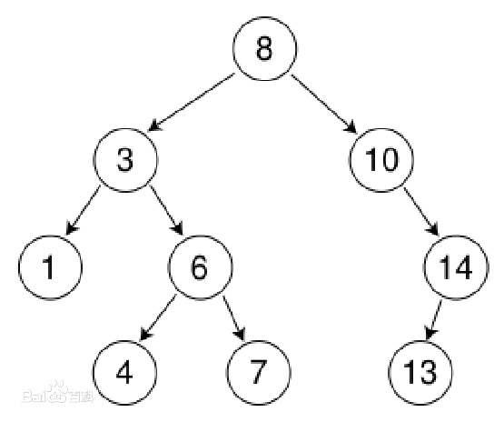

# 二叉查找树

二叉查找树，又叫二叉排序树，二叉搜索树，是一种有特定规则的二叉树，定义如下：

1. 它是一颗二叉树，或者是空树。
2. 左子树所有节点的值都小于它的根节点，右子树所有节点的值都大于它的根节点。
3. 左右子树也是一颗二叉查找树。



二叉查找树的特点是，一直往左儿子往下找左儿子，可以找到最小的元素，一直往右儿子找右儿子，可以找到最大的元素。

看起来，我们可以用它来实现元素排序，可是我们却使用了二叉堆来实现了堆排序，因为二叉查找树不保证是一个平衡的二叉树，最坏情况下二叉查找树会退化成一个链表，也就是所有节点都没有左子树或者没有右子树，树的层次太深导致排序性能太差。

使用二分查找，可以很快在一颗二叉查找树中找到我们需要的值。

我们来分析二叉查找树添加，删除，查找元素的方法。

## 一、添加元素

以下是一个二叉查找树的表示：

```go
// 二叉查找树
type BinarySearchTree struct {
	Root *BinarySearchTreeNode // 树根节点
}

// 二叉查找树节点
type BinarySearchTreeNode struct {
	Value int64                 // 值
	Times int64                 // 值出现的次数
	Left  *BinarySearchTreeNode // 左子树
	Right *BinarySearchTreeNode // 右字树
}

// 初始化一个二叉查找树
func NewBinarySearchTree() *BinarySearchTree {
	return new(BinarySearchTree)
}
```

一个节点代表一个元素，节点的 `Value` 值是用来进行二叉查找的关键，当 `Value` 值重复时，我们将值出现的次数 `Times` 加 1。添加元素代码如下：

```go
// 添加元素
func (tree *BinarySearchTree) Add(value int64) {
	// 如果没有树根，证明是颗空树，添加树根后返回
	if tree.Root == nil {
		tree.Root = &BinarySearchTreeNode{Value: value}
		return
	}

	// 将值添加进去
	tree.Root.Add(value)
}

func (node *BinarySearchTreeNode) Add(value int64) {
	if value < node.Value {
		// 如果插入的值比节点的值小，那么要插入到该节点的左子树中
		// 如果左子树为空，直接添加
		if node.Left == nil {
			node.Left = &BinarySearchTreeNode{Value: value}
		} else {
			// 否则递归
			node.Left.Add(value)
		}
	} else if value > node.Value {
		// 如果插入的值比节点的值大，那么要插入到该节点的右子树中
		// 如果右子树为空，直接添加
		if node.Right == nil {
			node.Right = &BinarySearchTreeNode{Value: value}
		} else {
			// 否则递归
			node.Right.Add(value)
		}
	} else {
		// 值相同，不需要添加，值出现的次数加1即可
		node.Times = node.Times + 1
	}
}
```

如果添加元素时是颗空树，那么初始化根节点。

然后添加的值和根节点比较，判断是要插入到根节点左子树还是右子树，还是不用插入。

当值比根节点小时，元素要插入到根节点的左子树中，当值比根节点大时，元素要插入到根节点的右子树中，相等时不插入，只更新次数。

然后再分别对根节点的左子树和右子树进行递归操作即可。

## 二、查找最大值或最小值的元素

查找最大值和最小值比较简单，一直往左儿子往下找左儿子，可以找到最小的元素，一直往右儿子找右儿子，可以找到最大的元素。

```go
// 找出最小值的节点
func (tree *BinarySearchTree) FindMinValue() *BinarySearchTreeNode {
	if tree.Root == nil {
		// 如果是空树，返回空
		return nil
	}

	return tree.Root.FindMinValue()
}

func (node *BinarySearchTreeNode) FindMinValue() *BinarySearchTreeNode {
	// 左子树为空，表面已经是最左的节点了，该值就是最小值
	if node.Left == nil {
		return node
	}

	// 一直左子树递归
	return node.Left.FindMinValue()
}

// 找出最大值的节点
func (tree *BinarySearchTree) FindMaxValue() *BinarySearchTreeNode {
	if tree.Root == nil {
		// 如果是空树，返回空
		return nil
	}

	return tree.Root.FindMaxValue()
}

func (node *BinarySearchTreeNode) FindMaxValue() *BinarySearchTreeNode {
	// 右子树为空，表面已经是最右的节点了，该值就是最大值
	if node.Right == nil {
		return node
	}

	// 一直右子树递归
	return node.Right.FindMaxValue()
}
```

## 三、查找指定元素

二分查找的技巧也在这里有用武之地了：

```go
// 查找节点
func (tree *BinarySearchTree) Find(value int64) *BinarySearchTreeNode {
	if tree.Root == nil {
		// 如果是空树，返回空
		return nil
	}

	return tree.Root.Find(value)
}

func (node *BinarySearchTreeNode) Find(value int64) *BinarySearchTreeNode {
	if value == node.Value {
		// 如果该节点刚刚等于该值，那么返回该节点
		return node
	} else if value < node.Value {
		// 如果查找的值小于节点值，从节点的左子树开始找
		if node.Left == nil {
			// 左子树为空，表示找不到该值了，返回nil
			return nil
		}
		return node.Left.Find(value)
	} else {
		// 如果查找的值大于节点值，从节点的右子树开始找
		if node.Right == nil {
			// 右子树为空，表示找不到该值了，返回nil
			return nil
		}
		return node.Right.Find(value)
	}
}

```

如果是空树，返回 nil，否则与根节点比较。

如果刚刚好等于根节点的值，返回该节点，否则根据值的比较，继续往左子树或右字树递归查找。

## 四、查找指定元素的父亲

与查找指定元素一样，只不过追踪的是该元素的父亲节点。

```go
// 查找指定节点的父亲
func (tree *BinarySearchTree) FindParent(value int64) *BinarySearchTreeNode {
	if tree.Root == nil {
		// 如果是空树，返回空
		return nil
	}

	// 如果根节点等于该值，根节点其没有父节点，返回nil
	if tree.Root.Value == value {
		return nil
	}
	return tree.Root.FindParent(value)
}

func (node *BinarySearchTreeNode) FindParent(value int64) *BinarySearchTreeNode {
	// 外层没有值相等的判定，因为在内层已经判定完毕后返回父亲节点。
	
	if value < node.Value {
		// 如果查找的值小于节点值，从节点的左子树开始找
		leftTree := node.Left
		if leftTree == nil {
			// 左子树为空，表示找不到该值了，返回nil
			return nil
		}

		// 左子树的根节点的值刚好等于该值，那么父亲就是现在的node，返回
		if leftTree.Value == value {
			return node
		} else {
			return leftTree.FindParent(value)
		}
	} else {
		// 如果查找的值大于节点值，从节点的右子树开始找
		rightTree := node.Right
		if rightTree == nil {
			// 右子树为空，表示找不到该值了，返回nil
			return nil
		}

		// 右子树的根节点的值刚好等于该值，那么父亲就是现在的node，返回
		if rightTree.Value == value {
			return node
		} else {
			return rightTree.FindParent(value)
		}
	}
}
```

代码相应的进行了调整，方便获取到父亲节点。

如果返回的父亲节点为空，表示没有父亲。

## 五、删除元素

删除元素有四种情况：

1. 第一种情况，删除的是根节点，且根节点没有儿子，直接删除即可。
2. 第二种情况，删除的节点有父亲节点，但没有子树，也就是删除的是叶子节点，直接删除即可。
3. 第三种情况，删除的节点下有两个子树，因为右子树的值都比左子树大，那么用右子树中的最小元素来替换删除的节点，这时二叉查找树的性质又满足了。右子树的最小元素，只要一直往右子树的左边一直找一直找就可以找到。
4. 第四种情况，删除的节点只有一个子树，那么该子树直接替换被删除的节点即可。

代码实现如下：

```go
// 删除指定的元素
func (tree *BinarySearchTree) Delete(value int64) {
	if tree.Root == nil {
		// 如果是空树，直接返回
		return
	}

	// 查找该值是否存在
	node := tree.Root.Find(value)
	if node == nil {
		// 不存在该值，直接返回
		return
	}

	// 查找该值的父亲节点
	parent := tree.Root.FindParent(value)

	// 第一种情况，删除的是根节点，且根节点没有儿子
	if parent == nil && node.Left == nil && node.Right == nil {
		// 置空后直接返回
		tree.Root = nil
		return
	} else if node.Left == nil && node.Right == nil {
		// 第二种情况，删除的节点有父亲节点，但没有子树

		// 如果删除的是节点是父亲的左儿子，直接将该值删除即可
		if parent.Left != nil && value == parent.Left.Value {
			parent.Left = nil
		} else {
			// 删除的原来是父亲的右儿子，直接将该值删除即可
			parent.Right = nil
		}
		return
	} else if node.Left != nil && node.Right != nil {
		// 第三种情况，删除的节点下有两个子树，因为右子树的值都比左子树大，那么用右子树中的最小元素来替换删除的节点。
		// 右子树的最小元素，只要一直往右子树的左边一直找一直找就可以找到，替换后二叉查找树的性质又满足了。

		// 找右子树中最小的值，一直往右子树的左边找
		minNode := node.Right
		for minNode.Left != nil {
			minNode = minNode.Left
		}
		// 把最小的节点删掉
		tree.Delete(minNode.Value)

		// 最小值的节点替换被删除节点
		node.Value = minNode.Value
		node.Times = minNode.Times
	} else {
		// 第四种情况，只有一个子树，那么该子树直接替换被删除的节点即可

		// 父亲为空，表示删除的是根节点，替换树根
		if parent == nil {
			if node.Left != nil {
				tree.Root = node.Left
			} else {
				tree.Root = node.Right
			}
			return
		}
		// 左子树不为空
		if node.Left != nil {
			// 如果删除的是节点是父亲的左儿子，让删除的节点的左子树接班
			if parent.Left != nil && value == parent.Left.Value {
				parent.Left = node.Left
			} else {
				parent.Right = node.Left
			}
		} else {
			// 如果删除的是节点是父亲的左儿子，让删除的节点的右子树接班
			if parent.Left != nil && value == parent.Left.Value {
				parent.Left = node.Right
			} else {
				parent.Right = node.Right
			}
		}
	}
}
```

首先查找到要删除元素的节点：`tree.Root.Find(value)`，然后找到该节点父亲：`tree.Root.FindParent(value)`，根据四种不同情况对删除节点进行补位。核心在于，第三种情况下，删除的节点有两个子树情况下，需要用右子树中最小的节点来替换被删除节点。

上面的代码可以优化，可以在查找删除元素的节点时顺道查出其父亲节点，不必要分开查询父亲节点，在第三种情况下查出右子树的最小节点时可以直接将其移除，不必递归使用 `tree.Delete(minNode.Value)`。

由于这种通用形式的二叉查找树实现甚少使用，大部分程序都使用了AVL树或红黑树，以上优化理解即可。

## 六、中序遍历(实现排序)

使用二叉查找树可以实现排序，只需要对树进行中序遍历即可。

我们先打印出左子树，然后打印根节点的值，再打印右子树，这是一个递归的过程。

```go
// 中序遍历
func (tree *BinarySearchTree) MidOrder() {
	tree.Root.MidOrder()
}

func (node *BinarySearchTreeNode) MidOrder() {
	if node == nil {
		return
	}

	// 先打印左子树
	node.Left.MidOrder()

	// 按照次数打印根节点
	for i := 0; i <= int(node.Times); i++ {
		fmt.Println(node.Value)
	}

	// 打印右子树
	node.Right.MidOrder()
}
```


## 七、完整代码

```go
package main

import (
	"fmt"
)

// 二叉查找树节点
type BinarySearchTree struct {
	Root *BinarySearchTreeNode // 树根节点
}

// 二叉查找树节点
type BinarySearchTreeNode struct {
	Value int64                 // 值
	Times int64                 // 值出现的次数
	Left  *BinarySearchTreeNode // 左子树
	Right *BinarySearchTreeNode // 右字树
}

// 初始化一个二叉查找树
func NewBinarySearchTree() *BinarySearchTree {
	return new(BinarySearchTree)
}

// 添加元素
func (tree *BinarySearchTree) Add(value int64) {
	// 如果没有树根，证明是颗空树，添加树根后返回
	if tree.Root == nil {
		tree.Root = &BinarySearchTreeNode{Value: value}
		return
	}

	// 将值添加进去
	tree.Root.Add(value)
}

func (node *BinarySearchTreeNode) Add(value int64) {
	if value < node.Value {
		// 如果插入的值比节点的值小，那么要插入到该节点的左子树中
		// 如果左子树为空，直接添加
		if node.Left == nil {
			node.Left = &BinarySearchTreeNode{Value: value}
		} else {
			// 否则递归
			node.Left.Add(value)
		}
	} else if value > node.Value {
		// 如果插入的值比节点的值大，那么要插入到该节点的右子树中
		// 如果右子树为空，直接添加
		if node.Right == nil {
			node.Right = &BinarySearchTreeNode{Value: value}
		} else {
			// 否则递归
			node.Right.Add(value)
		}
	} else {
		// 值相同，不需要添加，值出现的次数加1即可
		node.Times = node.Times + 1
	}
}

// 找出最小值的节点
func (tree *BinarySearchTree) FindMinValue() *BinarySearchTreeNode {
	if tree.Root == nil {
		// 如果是空树，返回空
		return nil
	}

	return tree.Root.FindMinValue()
}

func (node *BinarySearchTreeNode) FindMinValue() *BinarySearchTreeNode {
	// 左子树为空，表面已经是最左的节点了，该值就是最小值
	if node.Left == nil {
		return node
	}

	// 一直左子树递归
	return node.Left.FindMinValue()
}

// 找出最大值的节点
func (tree *BinarySearchTree) FindMaxValue() *BinarySearchTreeNode {
	if tree.Root == nil {
		// 如果是空树，返回空
		return nil
	}

	return tree.Root.FindMaxValue()
}

func (node *BinarySearchTreeNode) FindMaxValue() *BinarySearchTreeNode {
	// 右子树为空，表面已经是最右的节点了，该值就是最大值
	if node.Right == nil {
		return node
	}

	// 一直右子树递归
	return node.Right.FindMaxValue()
}

// 查找指定节点
func (tree *BinarySearchTree) Find(value int64) *BinarySearchTreeNode {
	if tree.Root == nil {
		// 如果是空树，返回空
		return nil
	}

	return tree.Root.Find(value)
}

func (node *BinarySearchTreeNode) Find(value int64) *BinarySearchTreeNode {
	if value == node.Value {
		// 如果该节点刚刚等于该值，那么返回该节点
		return node
	} else if value < node.Value {
		// 如果查找的值小于节点值，从节点的左子树开始找
		if node.Left == nil {
			// 左子树为空，表示找不到该值了，返回nil
			return nil
		}
		return node.Left.Find(value)
	} else {
		// 如果查找的值大于节点值，从节点的右子树开始找
		if node.Right == nil {
			// 右子树为空，表示找不到该值了，返回nil
			return nil
		}
		return node.Right.Find(value)
	}
}

// 查找指定节点的父亲
func (tree *BinarySearchTree) FindParent(value int64) *BinarySearchTreeNode {
	if tree.Root == nil {
		// 如果是空树，返回空
		return nil
	}

	// 如果根节点等于该值，根节点其没有父节点，返回nil
	if tree.Root.Value == value {
		return nil
	}
	return tree.Root.FindParent(value)
}

func (node *BinarySearchTreeNode) FindParent(value int64) *BinarySearchTreeNode {
	// 外层没有值相等的判定，因为在内层已经判定完毕后返回父亲节点。

	if value < node.Value {
		// 如果查找的值小于节点值，从节点的左子树开始找
		leftTree := node.Left
		if leftTree == nil {
			// 左子树为空，表示找不到该值了，返回nil
			return nil
		}

		// 左子树的根节点的值刚好等于该值，那么父亲就是现在的node，返回
		if leftTree.Value == value {
			return node
		} else {
			return leftTree.FindParent(value)
		}
	} else {
		// 如果查找的值大于节点值，从节点的右子树开始找
		rightTree := node.Right
		if rightTree == nil {
			// 右子树为空，表示找不到该值了，返回nil
			return nil
		}

		// 右子树的根节点的值刚好等于该值，那么父亲就是现在的node，返回
		if rightTree.Value == value {
			return node
		} else {
			return rightTree.FindParent(value)
		}
	}
}

// 删除指定的元素
func (tree *BinarySearchTree) Delete(value int64) {
	if tree.Root == nil {
		// 如果是空树，直接返回
		return
	}

	// 查找该值是否存在
	node := tree.Root.Find(value)
	if node == nil {
		// 不存在该值，直接返回
		return
	}

	// 查找该值的父亲节点
	parent := tree.Root.FindParent(value)

	// 第一种情况，删除的是根节点，且根节点没有儿子
	if parent == nil && node.Left == nil && node.Right == nil {
		// 置空后直接返回
		tree.Root = nil
		return
	} else if node.Left == nil && node.Right == nil {
		//  第二种情况，删除的节点有父亲节点，但没有子树

		// 如果删除的是节点是父亲的左儿子，直接将该值删除即可
		if parent.Left != nil && value == parent.Left.Value {
			parent.Left = nil
		} else {
			// 删除的原来是父亲的右儿子，直接将该值删除即可
			parent.Right = nil
		}
		return
	} else if node.Left != nil && node.Right != nil {
		// 第三种情况，删除的节点下有两个子树，因为右子树的值都比左子树大，那么用右子树中的最小元素来替换删除的节点，这时二叉查找树的性质又满足了。

		// 找右子树中最小的值，一直往右子树的左边找
		minNode := node.Right
		for minNode.Left != nil {
			minNode = minNode.Left
		}
		// 把最小的节点删掉
		tree.Delete(minNode.Value)

		// 最小值的节点替换被删除节点
		node.Value = minNode.Value
		node.Times = minNode.Times
	} else {
		// 第四种情况，只有一个子树，那么该子树直接替换被删除的节点即可

		// 父亲为空，表示删除的是根节点，替换树根
		if parent == nil {
			if node.Left != nil {
				tree.Root = node.Left
			} else {
				tree.Root = node.Right
			}
			return
		}
		// 左子树不为空
		if node.Left != nil {
			// 如果删除的是节点是父亲的左儿子，让删除的节点的左子树接班
			if parent.Left != nil && value == parent.Left.Value {
				parent.Left = node.Left
			} else {
				parent.Right = node.Left
			}
		} else {
			// 如果删除的是节点是父亲的左儿子，让删除的节点的右子树接班
			if parent.Left != nil && value == parent.Left.Value {
				parent.Left = node.Right
			} else {
				parent.Right = node.Right
			}
		}
	}
}

// 中序遍历
func (tree *BinarySearchTree) MidOrder() {
	tree.Root.MidOrder()
}

func (node *BinarySearchTreeNode) MidOrder() {
	if node == nil {
		return
	}

	// 先打印左子树
	node.Left.MidOrder()

	// 按照次数打印根节点
	for i := 0; i <= int(node.Times); i++ {
		fmt.Println(node.Value)
	}

	// 打印右子树
	node.Right.MidOrder()
}

func main() {
	values := []int64{3, 6, 8, 20, 9, 2, 6, 8, 9, 3, 5, 40, 7, 9, 13, 6, 8}

	// 初始化二叉查找树并添加元素
	tree := NewBinarySearchTree()
	for _, v := range values {
		tree.Add(v)
	}

	// 找到最大值或最小值的节点
	fmt.Println("find min value:", tree.FindMinValue())
	fmt.Println("find max value:", tree.FindMaxValue())

	// 查找不存在的99
	node := tree.Find(99)
	if node != nil {
		fmt.Println("find it 99!")
	} else {
		fmt.Println("not find it 99!")
	}

	// 查找存在的9
	node = tree.Find(9)
	if node != nil {
		fmt.Println("find it 9!")
	} else {
		fmt.Println("not find it 9!")
	}

	// 删除存在的9后，再查找9
	tree.Delete(9)
	node = tree.Find(9)
	if node != nil {
		fmt.Println("find it 9!")
	} else {
		fmt.Println("not find it 9!")
	}

	// 中序遍历，实现排序
	tree.MidOrder()
}
```

运行程序后，结果：

```go
find min value: &{2 0 <nil> <nil>}
find max value: &{40 0 <nil> <nil>}
not find it 99!
find it 9!
not find it 9!
2
3
3
5
6
6
6
7
8
8
8
13
20
40
```

## 八、总结

二叉查找树可能退化为链表，也可能是一颗非常平衡的二叉树，查找，添加，删除元素的时间复杂度取决于树的高度 `h`。

1. 当二叉树是满的时，树的高度是最小的，此时树节点数量 `n` 和高度 `h` 的关系为：`h = log(n)`。
2. 当二叉树是一个链表时，此时树节点数量 `n` 和高度 `h` 的关系为：`h = n`。

二叉查找树的效率来源其二分查找的特征，时间复杂度在于二叉树的高度，因此查找，添加和删除的时间复杂度范围为 `log(n)~n`。

为了提高二叉查找树查找的速度，树的高度要尽可能的小。AVL树和红黑树都是相对平衡的二叉查找树，因为特殊的旋转平衡操作，树的高度被大大压低。它们查找效率较高，添加，删除，查找操作的平均时间复杂度都为 `log(n)`，经常在各种程序中被使用。

二叉查找树是后面要学习的高级数据结构AVL树，红黑树的基础。

