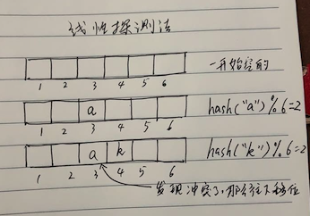
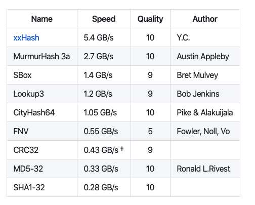

# 哈希表：散列查找

## 一、线性查找

我们要通过一个 `键key` 来查找相应的 `值value`。有一种最简单的方式，就是将键值对存放在链表里，然后遍历链表来查找是否存在 `key`，存在则更新键对应的值，不存在则将键值对链接到链表上。

这种链表查找，最坏的时间复杂度为：`O(n)`，因为可能遍历到链表最后也没找到。

## 二、散列查找

有一种算法叫散列查找，也称哈希查找，是一种空间换时间的查找算法，依赖的数据结构称为哈希表或散列表：`HashTable`。

> Hash: 翻译为散列，哈希，主要指压缩映射，它将一个比较大的域空间映射到一个比较小的域空间。
>简单的说就是把任意长度的消息压缩到某一固定长度的消息摘要的函数。Hash 算法虽然是一种算法，但更像一种思想，没有一个固定的公式，只要符合这种思想的算法都称 Hash 算法。

散列查找，主要是将键进行 `hash` 计算得出一个大整数，然后与数组长度进行取余，这样一个比较大的域空间就只会映射到数组的下标范围，利用数组索引快的特征，用空间换时间的思路，使得查找的速度快于线性查找。

首先有一个大数组，每当存一个键值对时，先把键进行哈希，计算出的哈希值是一个整数，使用这个整数对数组长度取余，映射到数组的某个下标，把该键值对存起来，取数据时按同样的步骤进行查找。

有两种方式实现哈希表：线性探测法和拉链法。

## 三、哈希表：线性探测法

线性探测法实现的哈希表是一个大数组。

首先，哈希表数据结构会初始化 `N` 个大小的数组，然后存取键 `key` 时，会求键的哈希值 `hash(key)`，这是一个整数。然后与数组的大小进行取余：`hash(key)%N`，将会知道该键值对要存在数组的哪个位置。

如果数组该位置已经被之前的键值对占领了，也就是哈希冲突，那么会偏移加1，探测下个位置是否被占用，如果下个位置为空，那么占位，否则继续探测。查找时，也是查看该位置是否为该键，不是则继续往该位置的下一个位置查找。因为这个步骤是线性的，所以叫线性探测法。



因为线性探测法很少使用，我们接下来主要分析拉链法。

## 四、哈希表：拉链法

拉链法实现的哈希表是一个数组链表，也就是数组中的元素是链表。数组链表很像一条条拉链，所以又叫拉链法查找。

首先，哈希表数据结构会初始化 `N` 个大小的数组，然后存取键 `key` 时，会求键的哈希值 `hash(key)`，这是一个整数。然后与数组的大小进行取余：`hash(key)%N`，将会知道该键值对要存在数组的哪个位置。

如果数组该位置已经被之前的键值对占领了，也就是哈希冲突，那么键值对会追加到之前键值对的后面，形成一条链表。

比如键 `51` 的哈希 `hash(51)` 假设为 `4`，那么 `hash(51) % 4 = 4 % 4 = 0`，所以放在数组的第一个位置，同样键 `43` 的哈希 `hash(43)` 假设为 `8`，那么 `hash(43) % 4 = 8 % 4 = 0`，同样要放在数组的第一个位置。

因为哈希冲突了，所以键 `43` 链接在键 `51` 后面。


查找的时候，也会继续这个过程，比如查找键 `43`，进行哈希后得到位置 `0`， 定位到数组第一位，然后遍历这条链表，先找到键 `51`，发现不到，往下找，直到找到键 `43`。

`Golang` 内置的数据类型：字典 `map` 就是用拉链法的哈希表实现的，但相对复杂，感兴趣的可参考标准库 `runtime` 下的 `map.go` 文件。

## 五、哈希函数

当哈希冲突不严重的时候，查找某个键，只需要求哈希值，然后取余，定位到数组的某个下标即可，时间复杂度为：`O(1)`。

当哈希冲突十分严重的时候，每个数组元素对应的链表会越来越长，即使定位到数组的某个下标，也要遍历一条很长很长的链表，就退化为查找链表了，时间复杂度为：`O(n)`。

所以哈希表首先要解决的问题是寻找相对均匀，具有很好随机分布性的哈希函数 `hash()`，这样才不会扎堆冲突。

`Golang` 语言实现的哈希函数参考了以下两种哈希算法：

1. xxhash:  [https://code.google.com/p/xxhash](https://code.google.com/p/xxhash)
2. cityhash: [https://code.google.com/p/cityhash](https://code.google.com/p/cityhash)

当然还有其他哈希算法如 `MurmurHash`: [https://code.google.com/p/smhasher](https://code.google.com/p/smhasher) 。

还有哈希算法如 `Md4` 和 `Md5` 等。

因为研究均匀随机分布的哈希算法，是属于数学专家们的工作，我们在此不展开了。

我们使用号称计算速度最快的哈希 `xxhash`，我们直接用该库来实现哈希：[https://github.com/OneOfOne/xxhash](https://github.com/OneOfOne/xxhash)：



实现如下:

```go
package main

import (
	"fmt"
	"github.com/OneOfOne/xxhash"
)

// 将一个键进行Hash
func XXHash(key []byte) uint64 {
	h := xxhash.New64()
	h.Write(key)
	return h.Sum64()
}

func main() {
	keys := []string{"hi", "my", "friend", "I", "love", "you", "my", "apple"}
	for _, key := range keys {
		fmt.Printf("xxhash('%s')=%d\n", key, XXHash([]byte(key)))
	}
}

```

输出：

```
xxhash('hi')=16899831174130972922
xxhash('my')=13223332975333369668
xxhash('friend')=4642001949237932008
xxhash('I')=12677399051867059349
xxhash('love')=12577149608739438547
xxhash('you')=943396405629834470
xxhash('my')=13223332975333369668
xxhash('apple')=6379808199001010847

```

拿到哈希值之后，我们要对结果取余，方便定位到数组下标 `index`。如果数组的长度为 `len`，那么 `index = xxhash(key) % len`。

我们已经寻找到了计算较快，且均匀随机分布的哈希算法 `xxhash` 了，现在就是要解决取余操作中的数组长度选择的问题，数组的长度 `len` 应该如何选择？

比如数组长度 `len=8`，那么取余之后可能有这些结果:

```
xxhash(key) % 8 = 0，1，2，3，4，5，6，7
```

如果我们选择 `2^x` 作为数组长度有一个很好的优点，就是计算速度变快了，如下是一个恒等式：

```
恒等式 hash % 2^k = hash & (2^k-1)，表示截断二进制的位数，保留后面的 k 位
```

这样取余 `%` 操作将变成按位 `&` 操作：

```
哈希表数组长度 len=8，
存在一个哈希值 hash=165，二进制表示为 1010 0101

所以： 

165 % 8 
= 165 % 2^3
= 165 & (2^3-1)
= 165 & 7
= 1010 0101 & 0000 0111 
= 0000 0000 0101 
= 5
```

选择 `2^x` 长度会使得计算速度更快，但是相当于截断二进制后保留后面的 `k` 位，如果存在很多哈希值的值很大，位数超过了 `k` 位，而二进制后 `k` 位都相同，那么会导致大片哈希冲突。

即使如此，存在很大哈希值的情况很少发生，大部分哈希值的二进制位数都不会超过 `k` 位，因此编程语言 `Golang` 使用了这种 `2^x` 长度作为哈希表的数组长度。  

实际上 `hash(key) % len` 的分布是和 `len` 有关的，一组均匀分布的 `hash(key)` 在 `len` 是素数时才能做到均匀。

>素数(`prime number`)，也叫质数，是指在大于 `1` 的自然数中，除了 `1` 和它本身以外不再有其他因数的自然数，也就是与任何数的最大公约数都为1。

举例如下：

```
f(n)为哈希表的下标，哈希表的长度是 m，而哈希值是 n，记 w=gcd(m,n) 为两个数的最大公约数，

那么：

f(n) = n % m 
     = n - a*m (a=0,1,2,3,4...)
     = w * (n/w-a*m/w)

因为 w=gcd(m,n)，所以 (n/w-a*m/w) 是一个整数。

所以哈希表的下标 f(n) 只会是 w=gcd(m,n) 的倍数，倍数就注定了不会均匀分布在 `[0,m-1]`，除非 w=1。

在哈希值数列数量特别多的情况，对偶数和奇数数列进行取余求下标，如长度 m=5 和 m=6：

哈希数值：2 4 6 8 10 12 14 16 18 20 22...
m=5时下标：2 4 1 3 0 2 4 1 3 0 2...
m=6时下标：2 4 0 2 4 0 2 4 0 2 4...

哈希数值：1 3 5 7 9 11 13 15 17...
m=5时下标：1 3 0 2 4 1 3 0 2...
m=6时下标：1 3 5 1 3 5 1 3 5...

偶数队列可以看到素数5一直重复 `2 4 1 3 0`，而合数6一直重复 `2 4 0`，只有素数均匀分布。

奇数队列可以看到素数5一直重复 `1 3 0 2 4`，而合数6一直重复 `1 3 5`，只有素数均匀分布。

将偶数和奇数数列合并起来，步长为1时，素数和奇数都一样均匀，仅当步长不为1时的随机数列，素数会更均匀点。
```

我们实现拉链哈希表的时候，为了数组扩容和计算更方便，仍然还是使用 `2^x` 的数组长度。

## 六、实现拉链哈希表

我们将实现一个简单的哈希表版本。

实现拉链哈希表有以下的一些操作：

1. 初始化：新建一个 `2^x` 个长度的数组，一开始 `x` 较小。
2. 添加键值：进行 `hash(key) & (2^x-1)`，定位到数组下标，查找数组下标对应的链表，如果链表有该键，更新其值，否则追加元素。
3. 获取键值：进行 `hash(key) & (2^x-1)`，定位到数组下标，查找数组下标对应的链表，如果链表不存在该键，返回 false，否则返回该值以及 true。
4. 删除键值：进行 `hash(key) & (2^x-1)`，定位到数组下标，查找数组下标对应的链表，如果链表不存在该键，直接返回，否则删除该键。
5. 进行键值增删时如果数组容量太大或者太小，需要相应缩容或扩容。

哈希查找的速度快，主要是利用空间换时间的优点。如果哈希表的数组特别大特别大，那么哈希冲突的几率就会降低。然而哈希表中的数组太大或太小都不行，太大浪费了空间，太小则哈希冲突太严重，所以需要对哈希表中的数组进行缩容和扩容。

如何伸缩主要根据哈希表的大小和已添加的元素数量来决定。假设哈希表的大小为 `16`，已添加到哈希表中的键值对数量是 `8`，我们称 `8/16=0.5` 为加载因子 `factor`。

我们可以设定加载因子 `factor <= 0.125` 时进行数组缩容，每次将容量砍半，当加载因子 `factor >= 0.75` 进行数组扩容，每次将容量翻倍。

大部分编程语言实现的哈希表只会扩容，不会缩容，因为对于一个经常访问的哈希表来说，缩容后会很快扩容，造成的哈希搬迁成本巨大，这个成本比起存储空间的浪费还大，所以我们在这里只实现哈希表扩容。

我们使用结构体 `HashMap` 来表示哈希表：

```go
const (
	// 扩容因子
	expandFactor = 0.75
)

// 哈希表
type HashMap struct {
	array        []*keyPairs // 哈希表数组，每个元素是一个键值对
	capacity     int         // 数组容量
	len          int         // 已添加键值对元素数量
	capacityMask int         // 掩码，等于 capacity-1
	// 增删键值对时，需要考虑并发安全
	lock sync.Mutex
}

// 键值对，连成一个链表
type keyPairs struct {
	key   string      // 键
	value interface{} // 值
	next  *keyPairs   // 下一个键值对
}
```

其中 `array` 为哈希表数组，`capacity` 为哈希表的容量，`capacityMask` 为容量掩码，主要用来计算数组下标，`len` 为实际添加的键值对元素数量。

我们还使用了 `lock` 来实现并发安全，防止并发增删元素时数组伸缩，产生混乱。

使用 `expandFactor = 0.75` 作为扩容因子，没什么其他的理由，只是它刚刚好，你也可以设置成 `0.72` 等任何值。

### 6.1. 初始化哈希表

```go
// 创建大小为 capacity 的哈希表
func NewHashMap(capacity int) *HashMap {
	// 默认大小为 16
	defaultCapacity := 1 << 4
	if capacity <= defaultCapacity {
		// 如果传入的大小小于默认大小，那么使用默认大小16
		capacity = defaultCapacity
	} else {
		// 否则，实际大小为大于 capacity 的第一个 2^k
		capacity = 1 << (int(math.Ceil(math.Log2(float64(capacity)))))
	}

	// 新建一个哈希表
	m := new(HashMap)
	m.array = make([]*keyPairs, capacity, capacity)
	m.capacity = capacity
	m.capacityMask = capacity - 1
	return m
}

// 返回哈希表已添加元素数量
func (m *HashMap) Len() int {
	return m.len
}
```

我们可以传入 `capacity` 来初始化当前哈希表数组容量，容量掩码 `capacityMask = capacity-1` 主要用来计算数组下标。

如果传入的容量小于默认容量 `16`，那么将 `16` 作为哈希表的初始数组大小。否则将第一个大于 `capacity` 的 `2 ^ k` 值作为数组的初始大小。

### 6.2. 计算哈希值和数组下标

```go
// 求 key 的哈希值
var hashAlgorithm = func(key []byte) uint64 {
	h := xxhash.New64()
	h.Write(key)
	return h.Sum64()
}

// 对键进行哈希求值，并计算下标
func (m *HashMap) hashIndex(key string, mask int) int {
	// 求哈希
	hash := hashAlgorithm([]byte(key))
	// 求下标
	index := hash & uint64(mask)
	return int(index)
}
```

首先，为结构体生成一个 `hashIndex` 方法。

根据公式 `hash(key) & (2^x-1)`，使用 `xxhash` 哈希算法来计算键 `key` 的哈希值，并且和容量掩码 `mask` 进行 `&` 求得数组的下标，用来定位键值对该放在数组的哪个下标下。

### 6.2. 添加键值对

以下是添加键值对核心方法：

```go
// 哈希表添加键值对
func (m *HashMap) Put(key string, value interface{}) {
	// 实现并发安全
	m.lock.Lock()
	defer m.lock.Unlock()

	// 键值对要放的哈希表数组下标
	index := m.hashIndex(key, m.capacityMask)

	// 哈希表数组下标的元素
	element := m.array[index]

	// 元素为空，表示空链表，没有哈希冲突，直接赋值
	if element == nil {
		m.array[index] = &keyPairs{
			key:   key,
			value: value,
		}
	} else {
		// 链表最后一个键值对
		var lastPairs *keyPairs

		// 遍历链表查看元素是否存在，存在则替换值，否则找到最后一个键值对
		for element != nil {
			// 键值对存在，那么更新值并返回
			if element.key == key {
				element.value = value
				return
			}

			lastPairs = element
			element = element.next
		}

		// 找不到键值对，将新键值对添加到链表尾端
		lastPairs.next = &keyPairs{
			key:   key,
			value: value,
		}
	}

	// 新的哈希表数量
	newLen := m.len + 1

	// 如果超出扩容因子，需要扩容
	if float64(newLen)/float64(m.capacity) >= expandFactor {
		// 新建一个原来两倍大小的哈希表
		newM := new(HashMap)
		newM.array = make([]*keyPairs, 2*m.capacity, 2*m.capacity)
		newM.capacity = 2 * m.capacity
		newM.capacityMask = 2*m.capacity - 1

		// 遍历老的哈希表，将键值对重新哈希到新哈希表
		for _, pairs := range m.array {
			for pairs != nil {
				// 直接递归Put
				newM.Put(pairs.key, pairs.value)
				pairs = pairs.next
			}
		}

		// 替换老的哈希表
		m.array = newM.array
		m.capacity = newM.capacity
		m.capacityMask = newM.capacityMask
	}

	m.len = newLen
}
```

首先使用锁实现了并发安全：

```go
	m.lock.Lock()
	defer m.lock.Unlock()
```

接着使用哈希算法计算出数组的下标，并取出该下标的元素：

```go
	// 键值对要放的哈希表数组下标
	index := m.hashIndex(key, m.capacityMask)

	// 哈希表数组下标的元素
	element := m.array[index]
```


如果该元素为空表示链表是空的，不存在哈希冲突，直接将键值对作为链表的第一个元素：

```go
	// 元素为空，表示空链表，没有哈希冲突，直接赋值
	if element == nil {
		m.array[index] = &keyPairs{
			key:   key,
			value: value,
		}
	} 
```

否则，则遍历链表，查找键是否存在：

```go
		// 链表最后一个键值对
		var lastPairs *keyPairs

		// 遍历链表查看元素是否存在，存在则替换值，否则找到最后一个键值对
		for element != nil {
			// 键值对存在，那么更新值并返回
			if element.key == key {
				element.value = value
				return
			}

			lastPairs = element
			element = element.next
		}
```

当 `element.key == key` ，那么键存在，直接更新值，退出该函数。否则，继续往下遍历。

当跳出 `for element != nil` 时，表示找不到键值对，那么往链表尾部添加该键值对：

```go
		// 找不到键值对，将新键值对添加到链表尾端
		lastPairs.next = &keyPairs{
			key:   key,
			value: value,
		}
```

最后，检查是否需要扩容，如果需要则扩容：

```go	
     	// 新的哈希表数量
     	newLen := m.len + 1
     
     	// 如果超出扩容因子，需要扩容
     	if float64(newLen)/float64(m.capacity) >= expandFactor {
     		// 新建一个原来两倍大小的哈希表
     		newM := new(HashMap)
     		newM.array = make([]*keyPairs, 2*m.capacity, 2*m.capacity)
     		newM.capacity = 2 * m.capacity
     		newM.capacityMask = 2*m.capacity - 1
     
     		// 遍历老的哈希表，将键值对重新哈希到新哈希表
     		for _, pairs := range m.array {
     			for pairs != nil {
     				// 直接递归Put
     				newM.Put(pairs.key, pairs.value)
     				pairs = pairs.next
     			}
     		}
     
     		// 替换老的哈希表
     		m.array = newM.array
     		m.capacity = newM.capacity
     		m.capacityMask = newM.capacityMask
     	}
     
     	m.len = newLen
```

创建了一个新的两倍大小的哈希表：`newM := new(HashMap)`，然后遍历老哈希表中的键值对，重新 `Put` 进新哈希表。

最后将新哈希表的属性赋予老哈希表。

### 6.3. 获取键值对

```go
// 哈希表获取键值对
func (m *HashMap) Get(key string) (value interface{}, ok bool) {
	// 实现并发安全
	m.lock.Lock()
	defer m.lock.Unlock()

	// 键值对要放的哈希表数组下标
	index := m.hashIndex(key, m.capacityMask)

	// 哈希表数组下标的元素
	element := m.array[index]

	// 遍历链表查看元素是否存在，存在则返回
	for element != nil {
		if element.key == key {
			return element.value, true
		}

		element = element.next
	}

	return
}
```

同样先加锁实现并发安全，然后进行哈希算法计算出数组下标：`index := m.hashIndex(key, m.capacityMask)`，取出元素：`element := m.array[index]`。

对链表进行遍历：

```go
	// 遍历链表查看元素是否存在，存在则返回
	for element != nil {
		if element.key == key {
			return element.value, true
		}

		element = element.next
	}
```

如果键在哈希表中存在，返回键的值 `element.value` 和 `true`。

### 6.4. 删除键值对

```go
// 哈希表删除键值对
func (m *HashMap) Delete(key string) {
	// 实现并发安全
	m.lock.Lock()
	defer m.lock.Unlock()

	// 键值对要放的哈希表数组下标
	index := m.hashIndex(key, m.capacityMask)

	// 哈希表数组下标的元素
	element := m.array[index]

	// 空链表，不用删除，直接返回
	if element == nil {
		return
	}

	// 链表的第一个元素就是要删除的元素
	if element.key == key {
		// 将第一个元素后面的键值对链上
		m.array[index] = element.next
		m.len = m.len - 1
		return
	}

	// 下一个键值对
	nextElement := element.next
	for nextElement != nil {
		if nextElement.key == key {
			// 键值对匹配到，将该键值对从链中去掉
			element.next = nextElement.next
			m.len = m.len - 1
			return
		}

		element = nextElement
		nextElement = nextElement.next
	}
}
```

删除键值对，如果键值对存在，那么删除，否则什么都不做。

键值对删除时，哈希表并不会缩容，我们不实现缩容。

同样先加锁实现并发安全，然后进行哈希算法计算出数组下标：`index := m.hashIndex(key, m.capacityMask)`，取出元素：`element := m.array[index]`。

如果元素是空的，表示链表为空，那么直接返回：

```go
	// 空链表，不用删除，直接返回
	if element == nil {
		return
	}
```

否则查看链表第一个元素的键是否匹配：`element.key == key`，如果匹配，那么对链表头部进行替换，链表的第二个元素补位成为链表头部：

```go
	// 链表的第一个元素就是要删除的元素
	if element.key == key {
		// 将第一个元素后面的键值对链上
		m.array[index] = element.next
		m.len = m.len - 1
		return
	}
```

如果链表的第一个元素不匹配，那么从第二个元素开始遍历链表，找到时将该键值对删除，然后将前后两个键值对连接起来：

```go
	// 下一个键值对
	nextElement := element.next
	for nextElement != nil {
		if nextElement.key == key {
			// 键值对匹配到，将该键值对从链中去掉
			element.next = nextElement.next
			m.len = m.len - 1
			return
		}

		element = nextElement
		nextElement = nextElement.next
	}
```

### 6.4. 遍历打印哈希表

```go
// 哈希表遍历
func (m *HashMap) Range() {
	// 实现并发安全
	m.lock.Lock()
	defer m.lock.Unlock()
	for _, pairs := range m.array {
		for pairs != nil {
			fmt.Printf("'%v'='%v',", pairs.key, pairs.value)
			pairs = pairs.next
		}
	}

	fmt.Println()
}
```

遍历哈希表比较简单，粗暴的遍历数组，如果数组中的链表不为空，打印链表中的元素。

### 6.4. 示例运行

```go
func main() {
	// 新建一个哈希表
	hashMap := NewHashMap(16)

	// 放35个值
	for i := 0; i < 35; i++ {
		hashMap.Put(fmt.Sprintf("%d", i), fmt.Sprintf("v%d", i))
	}
	fmt.Println("cap:", hashMap.Capacity(), "len:", hashMap.Len())

	// 打印全部键值对
	hashMap.Range()

	key := "4"
	value, ok := hashMap.Get(key)
	if ok {
		fmt.Printf("get '%v'='%v'\n", key, value)
	} else {
		fmt.Printf("get %v not found\n", key)
	}

	// 删除键
	hashMap.Delete(key)
	fmt.Println("after delete cap:", hashMap.Capacity(), "len:", hashMap.Len())
	value, ok = hashMap.Get(key)
	if ok {
		fmt.Printf("get '%v'='%v'\n", key, value)
	} else {
		fmt.Printf("get %v not found\n", key)
	}
}
```

输出：

```
cap: 64 len: 35
'20'='v20','16'='v16','4'='v4','32'='v32','2'='v2','28'='v28','24'='v24','10'='v10','9'='v9','15'='v15','12'='v12','29'='v29','3'='v3','19'='v19','30'='v30','27'='v27','14'='v14','13'='v13','22'='v22','7'='v7','11'='v11','23'='v23','1'='v1','31'='v31','18'='v18','17'='v17','8'='v8','26'='v26','25'='v25','0'='v0','5'='v5','34'='v34','21'='v21','6'='v6','33'='v33',
get '4'='v4'
after delete cap: 128 len: 34
get 4 not found
```

首先 `hashMap := NewHashMap(16)` 新建一个 `16` 容量的哈希表。然后往哈希表填充 `35` 个键值对，遍历打印出来 `hashMap.Range()` 。

可以看到容量从 `16` 一直翻倍到 `64`，而打印出来的键值对是随机的。

获取键值对时：`value, ok := hashMap.Get(key)` 能正常获取到值：`get '4'='v4'`。

删除键值对：`hashMap.Delete(key)` 后，哈希表的容量不变，但元素数量变少：`after delete cap: 128 len: 34`。

尝试再一次获取键 `4`，报错：`get 4 not found`。

## 七. 总结

哈希表查找，是一种用空间换时间的查找算法，时间复杂度能达到：`O(1)`，最坏情况下退化到查找链表：`O(n)`。但均匀性很好的哈希算法以及合适空间大小的数组，在很大概率避免了最坏情况。

哈希表在添加元素时会进行伸缩，会造成较大的性能消耗，所以有时候会用到其他的查找算法：树查找算法。

树查找算法在后面的章节会进行介绍。
