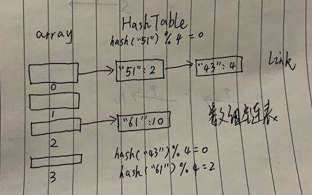

# 哈希表：散列查找

## 一、线性查找

我们要通过一个 `键key` 来查找相应的 `值value`。有一种最简单的方式，就是将键值对存放在链表里，然后遍历链表来查找是否存在 `key`，存在则更新键对应的值，不存在则将键值对链接到链表上。

这种链表查找，最坏的时间复杂度为：`O(n)`，因为可能遍历到链表最后也没找到。

## 二、散列查找

有一种算法叫散列查找，也称哈希查找，依赖的数据结构称为哈希表或散列表：`HashTable`。

> Hash: 翻译为散列，哈希，主要指压缩映射，它将一个比较大的域空间映射到一个比较小的域空间。
>简单的说就是把任意长度的消息压缩到某一固定长度的消息摘要的函数。Hash 算法虽然是一种算法，但更像一种思想，没有一个固定的公式，只要符合这种思想的算法都称 Hash 算法。

散列查找，主要利用数组索引快的特征，用空间换时间的思路，使得查找的速度快于线性查找。

首先有一个大数组，每当存一个键值对时，先把键进行哈希，哈希值是一个整数，使用这个整数对数组长度取余，映射到数组的某个下标，把该键值对存起来，取数据时按同样的步骤进行查找。

有两种方式实现哈希表：线性探测法和拉链法。

## 三、哈希表：线性探测法

线性探测法实现的哈希表是一个大数组。

首先，哈希表数据结构会初始化 `N` 个大小的数组，然后存取键 `key` 时，会求键的哈希值 `hash(key)`，这是一个整数。然后与数组的大小进行取余：`hash(key)%N`，将会知道该键值对要存在数组的哪个位置。

如果数组该位置已经被之前的键值对占领了，也就是哈希冲突，那么会偏移加1，探测下个位置是否被占用，如果下个位置为空，那么占位，否则继续探测。查找时，也是查看该位置是否为该键，不是则继续往该位置的下一个位置查找。因为这个步骤是线性的，所以叫线性探测法。

因为线性探测法很少使用，我们接下来主要分析拉链法。

## 四、哈希表：拉链法

拉链法实现的哈希表是一个数组链表，也就是数组中的元素是链表。数组链表很像一条条拉链，所以又叫拉链法查找。

首先，哈希表数据结构会初始化 `N` 个大小的数组，然后存取键 `key` 时，会求键的哈希值 `hash(key)`，这是一个整数。然后与数组的大小进行取余：`hash(key)%N`，将会知道该键值对要存在数组的哪个位置。

如果数组该位置已经被之前的键值对占领了，也就是哈希冲突，那么键值对会追加到之前键值对的后面，形成一条链表。

比如键 `51` 的哈希 `hash(51)` 假设为 `4`，那么 `hash(51) % 4 = 4 % 4 = 0`，所以放在数组的第一个位置，同样键 `43` 的哈希 `hash(43)` 假设为 `8`，那么 `hash(43) % 4 = 8 % 4 = 0`，同样要放在数组的第一个位置。

因为哈希冲突了，所以键 `43` 链接在键 `51` 后面。

查找的时候，也会继续这个过程，比如查找键 `43`，进行哈希后得到位置 `0`， 定位到数组第一位，然后遍历这条链表，先找到键 `51`，发现不到，往下找，直到找到键 `43`。

`Golang` 内置的数据类型：字典 `map` 就是用拉链法的哈希表实现的，但相对复杂，感兴趣的可参考标准库 `runtime` 下的 `map.go` 文件。

## 五、哈希函数

当哈希冲突不严重的时候，查找某个键，时间复杂度为：`O(1)`，因为求哈希值，然后取余，定位到数组的某个下标即可。

当哈希冲突十分严重的时候，每个数组元素对应的链表会越来越长，即使定位到数组的某个下标，也要遍历一条很长很长的链表，就退化为查找链表了，时间复杂度为：`O(n)`。

所以哈希表要解决的问题就是寻找相对哈希均匀的函数 `func hash()`。

## 六、实现拉链哈希表

我们将实现一个简单的哈希表版本。

https://www.cnblogs.com/maji233/p/11070853.html'

https://www.cnblogs.com/lantianxun/p/8549677.html

https://www.jianshu.com/p/aa0d4808cbb8