# 2-3-4树和普通红黑树

某些教程不区分普通红黑树和左倾红黑树的区别，直接将左倾红黑树拿来教学，并且称其为红黑树，因为左倾红黑树与普通的红黑树相比，实现起来较为简单，容易教学。在这里，我们区分开左倾红黑树和普通红黑树。

红黑树是一种近似平衡的二叉查找树，从 `2-3` 树或 `2-3-4` 树衍生而来。通过对二叉树节点进行染色，染色为红或黑节点，来模仿 `2-3` 树或 `2-3-4` 树的3节点和4节点，从而让树的高度减小。`2-3-4` 树对照实现的红黑树是普通的红黑树，而 `2-3` 树对照实现的红黑树是一种变种，称为左倾红黑树，其更容易实现。

使用平衡树数据结构，可以提高查找元素的速度，我们在本章介绍 `2-3-4` 树，再用二叉树形式来实现 `2-3-4` 树，也就是普通的红黑树。

目前已经有更加完备的代码实现，请参考：[https://github.com/hunterhug/gomap](https://github.com/hunterhug/gomap/blob/master/README_ZH.md) 。

## 一、`2-3-4` 树

### 1.1. `2-3-4` 树介绍

`2-3-4` 树是一棵严格自平衡的多路查找树，又称 `4阶的B树` (注：`B` 为 `Balance` 平衡的意思) 

它不是一棵二叉树，是一棵四叉树。具有以下特征：

1. 内部节点要么有1个数据元素和2个孩子，要么有2个数据元素和3个孩子，要么有3个数据元素和4个孩子，叶子节点没有孩子，但有1，2或3个数据元素。
2. 所有叶子节点到根节点的长度一致。这个特征保证了完全平衡，非常完美的平衡。
3. 每个节点的数据元素保持从小到大排序，两个数据元素之间的子树的所有值大小介于两个数据元素之间。

因为 `2-3-4` 树的第二个特征，它是一棵完美平衡的树，非常完美，除了叶子节点，其他的节点都没有空儿子，所以树的高度非常的小。

如图：

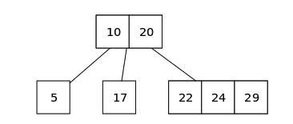


如果一个内部节点拥有一个数据元素、两个子节点，则此节点为2节点。如果一个内部节点拥有两个数据元素、三个子节点，则此节点为3节点。如果一个内部节点拥有三个数据元素、四个子节点，则此节点为4节点。

可以说，所有平衡树的核心都在于插入和删除逻辑，我们主要分析这两个操作。

### 1.2. `2-3-4` 树插入元素

在插入元素时，需要先找到插入的位置，使用二分查找从上自下查找树节点。

找到插入位置时，将元素插入该位置，然后进行调整，使得满足 `2-3-4` 树的特征。主要有三种情况：

1. 插入元素到一个2节点或3节点，直接插入即可，这样节点变成3节点或4节点。
2. 插入元素到一个4节点，该4节点的父亲不是一个4节点，将4节点的中间元素提到父节点，原4节点变成两个2节点，再将元素插入到其中一个2节点。
3. 插入元素到一个4节点，该4节点的父亲是一个4节点，也是将4节点的中间元素提到父节点，原4节点变成两个2节点，再将元素插入到其中一个2节点。当中间元素提到父节点时，父节点也是4节点，可以递归向上操作。

核心在于往4节点插入元素时，需要将4节点中间元素提升，4节点变为两个2节点后，再插入元素，如图：

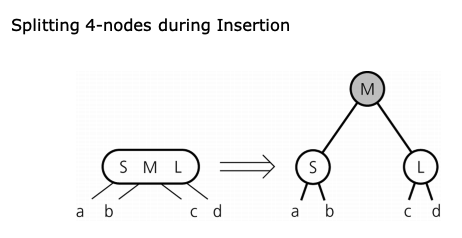

下面演示插入元素到一个4节点：

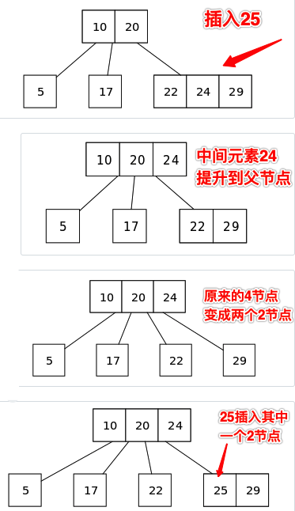

与其他二叉查找树由上而下生长不同，`2-3-4` 树是从下至上的生长。

`2-3-4` 树因为节点元素数量的增加，情况变得更复杂，下面是插入元素到一个4节点，而4节点的父节点是3节点的三种情况：

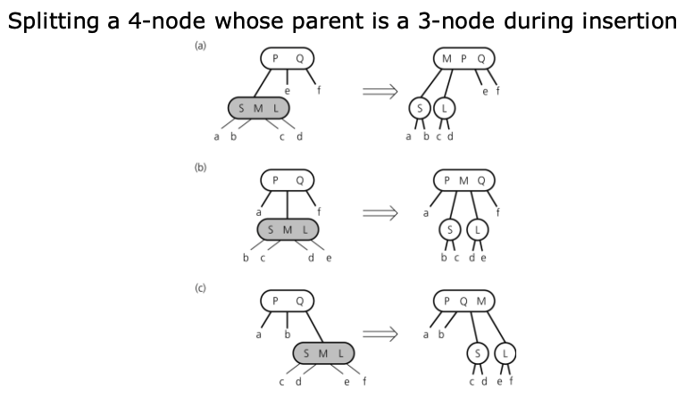

其他情况可以参考 `2-3树和左倾红黑树` 一章，非常相似，在此不再赘述。

### 1.3. `2-3-4` 树删除元素

删除操作就复杂得多了，请耐心阅读理解，和 `2-3` 树删除元素类似。

`2-3-4` 树的特征注定它是一棵非常完美平衡的四叉树，其所有子树也都是完美平衡，所以 `2-3-4` 树的某节点的儿子，要么都是空儿子，要么都不是空儿子。比如 `2-3-4` 树的某个节点 `A` 有两个儿子 `B` 和 `C`，儿子 `B` 和 `C` 要么都没有孩子，要么孩子都是满的，不然 `2-3-4` 树所有叶子节点到根节点的长度一致这个特征就被破坏了。

基于上面的现实，我们来分析删除的不同情况，删除中间节点和叶子节点。

情况1：删除中间节点

删除的是非叶子节点，该节点一定是有两棵，三棵或者四棵子树的，那么从子树中找到其最小后继节点，该节点是叶子节点，用该节点替换被删除的非叶子节点，然后再删除这个叶子节点，进入情况2。

如何找到最小后继节点，当有两棵子树时，那么从右子树一直往左下方找，如果有三棵子树，被删除节点在左边，那么从中子树一直往左下方找，否则从右子树一直往左下方找。如果有四棵子树，那么往被删除节点右边的子树，一直往左下方找。

情况2：删除叶子节点

删除的是叶子节点，这时叶子节点如果是4节点，直接变为3节点，如果是3节点，那么直接变为2节点即可，不影响平衡。但是，如果叶子节点是2节点，那么删除后，其父节点将会缺失一个儿子，破坏了满孩子的 `2-3-4` 树特征，需要进行调整后才能删除。

针对情况2，删除一个2节点的叶子节点，会导致父节点缺失一个儿子，破坏了 `2-3-4` 树的特征，我们可以进行调整变换，主要有两种调整：

1. 重新分布：尝试从兄弟节点那里借值，然后重新调整节点。
2. 合并：如果兄弟借不到值，合并节点（与父亲的元素）。

如果被删除的叶子节点有兄弟是3节点或4节点，可以向最近的兄弟借值，然后重新分布，这样叶子节点就不再是2节点了，删除元素后也不会破坏平衡。如图：

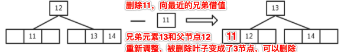

与兄弟借值，兄弟必须有多余的元素可以借，借的过程中需要和父节点元素重新分布位置，确保符合元素大小排序的正确。

如果被删除的叶子节点，兄弟都是2节点，而父亲是3节点或4节点，那么将父亲的一个元素拉下来进行合并（当父节点是3节点时，父亲元素与被删除节点合并成3节点，当父节点是4节点时，被删除节点和其最近的兄弟，以及父亲的一个元素合并成一个4节点），父亲变为2节点或3节点，这时叶子节点就不再是2节点了，删除元素后也不会破坏平衡。如图：

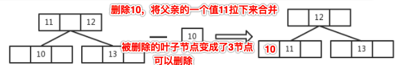

有一种最特殊的情况，也就是被删除的叶子节点，兄弟都是2节点，父亲也是2节点，这种情况没法向兄弟借，也没法和父亲合并，与父亲合并后父亲就变空了。幸运的是，这种特殊情况只会发生在根节点是其父节点的情况，如图：

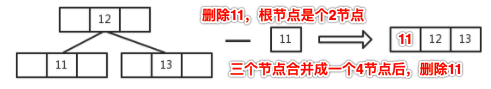

因为 `2-3-4` 树的性质，除了根节点，其他节点不可能出现其本身和儿子都是2节点。

`2-3-4` 树的实现将会放在 `B树` 章节，我们将会实现其二叉树形式的普通红黑树结构。

## 二、 普通红黑树

### 2.1. 普通红黑树介绍

普通红黑树可以由 `2-3-4` 树的二叉树形式来实现。

其定义为：

1. 根节点的链接是黑色的。
2. 每个红色节点都必须有两个黑色子节点。
3. 任意一个节点到达叶子节点的所有路径，经过的黑链接数量相同，也就是该树是完美黑色平衡的。比如，某一个节点，它可以到达5个叶子节点，那么这5条路径上的黑链接数量一样。

普通红黑树与其变种：左倾红黑树的区别是，它允许右倾的红色节点，不再限制左倾，但仍然不能有连续的两个左倾红色链接。

每一棵 `2-3-4` 树可以对应多棵普通红黑树，如图：
 
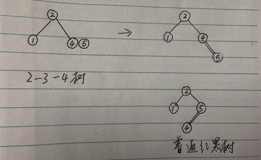

区别：`2-3` 树与左倾红黑树则是一一对应，而 `2-3-4` 树可以对应多棵普通红黑树，是因为它允许了红链接右倾。

### 2.2. 结构定义和节点旋转

首先，我们要定义树的结构 `RBTree` ，以及表示普通红黑树的节点 `RBTNode`：

```go
// 定义颜色
const (
	RED   = true
	BLACK = false
)

// 普通红黑树
type RBTree struct {
	Root *RBTNode // 树根节点
}

// 新建一棵空树
func NewRBTree() *RBTree {
	return &RBTree{}
}

// 普通红黑树节点
type RBTNode struct {
	Value  int64    // 值
	Times  int64    // 值出现的次数
	Left   *RBTNode // 左子树
	Right  *RBTNode // 右子树
	Parent *RBTNode // 父节点
	Color  bool     // 父亲指向该节点的链接颜色
}

// 节点的颜色
func IsRed(node *RBTNode) bool {
	if node == nil {
		return false
	}
	return node.Color == RED
}

// 返回节点的父亲节点
func ParentOf(node *RBTNode) *RBTNode {
	if node == nil {
		return nil
	}

	return node.Parent
}

// 返回节点的左子节点
func LeftOf(node *RBTNode) *RBTNode {
	if node == nil {
		return nil
	}

	return node.Left
}

// 返回节点的右子节点
func RightOf(node *RBTNode) *RBTNode {
	if node == nil {
		return nil
	}

	return node.Right
}

// 设置节点颜色
func SetColor(node *RBTNode, color bool) {
	if node != nil {
		node.Color = color
	}
}
```

在节点 `RBTNode` 中，我们存储的元素字段为 `Value`，由于可能有重复的元素插入，所以多了一个 `Times` 字段，表示该元素出现几次。

当然，红黑树中的红黑颜色使用 `Color` 定义，表示父亲指向该节点的链接颜色。我们还多创建了几个辅助函数。

在元素添加和实现的过程中，需要做调整操作，有两种旋转操作，对某节点的右链接进行左旋转，如图：

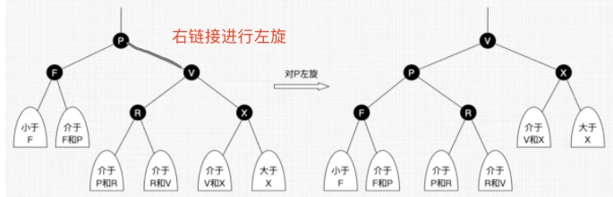

代码如下：

```go
// 对某节点左旋转
func (tree *RBTree) RotateLeft(h *RBTNode) {
	if h != nil {

		// 看图理解
		x := h.Right
		h.Right = x.Left

		if x.Left != nil {
			x.Left.Parent = h
		}

		x.Parent = h.Parent
		if h.Parent == nil {
			tree.Root = x
		} else if h.Parent.Left == h {
			h.Parent.Left = x
		} else {
			h.Parent.Right = x
		}
		x.Left = h
		h.Parent = x
	}
}
```

或者左链接进行右旋转，如图：

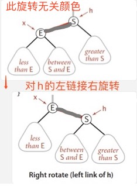

代码如下：

```go
// 对某节点右旋转
func (tree *RBTree) RotateRight(h *RBTNode) {
	if h != nil {

		// 看图理解
		x := h.Left
		h.Left = x.Right

		if x.Right != nil {
			x.Right.Parent = h
		}

		x.Parent = h.Parent
		if h.Parent == nil {
			tree.Root = x
		} else if h.Parent.Right == h {
			h.Parent.Right = x
		} else {
			h.Parent.Left = x
		}
		x.Right = h
		h.Parent = x
	}
}
```

旋转作为局部调整，并不影响全局。

可以继续查看下面的内容。

### 2.3. 添加元素实现

每次添加元素节点时，都将该节点 `Color` 字段，也就是父亲指向它的链接设置为 `RED` 红色。

总结情况如下：

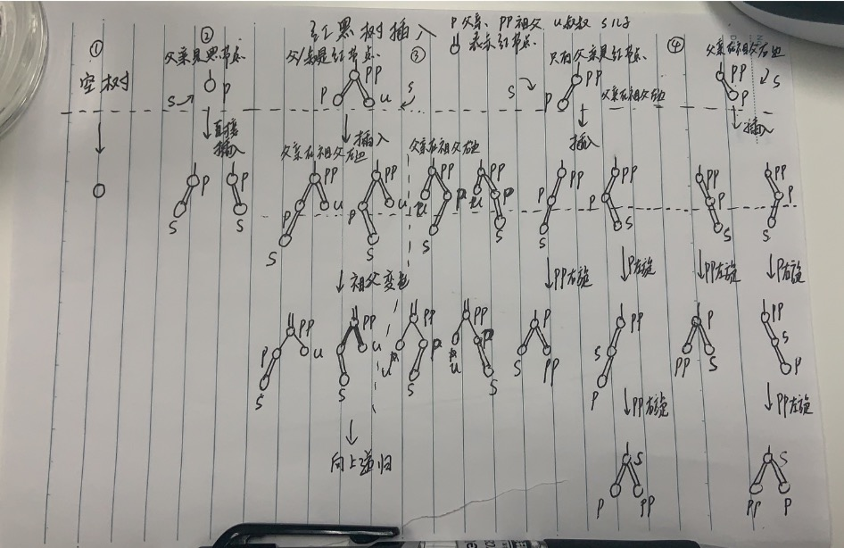

情况1：空树，那么插入节点直接变为根节点。

情况2：父节点是黑节点，直接插入即可，不破坏红黑树特征。

情况3：父节点是红节点，叔叔节点也是红节点，这时对应 `2-3-4` 树的4节点，插入后变成了5节点，破坏了平衡，直接将祖父节点变色即可，然后向上递归处理，相当于 `2-3-4` 树的4节点提升，如图：

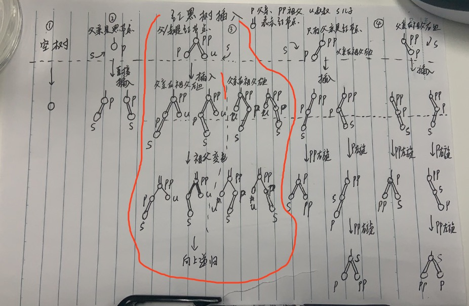

情况4：父节点是红节点，没有叔叔或者叔叔是黑节点，插入后出现了两个连续的红链接，需要进行旋转调整，如图：

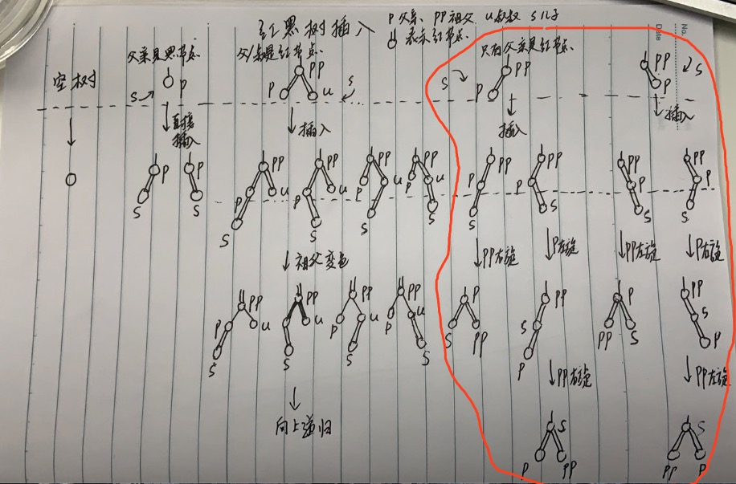

如果是顺方向连续红链接，旋转一次即可，否则需要左右旋转或者右左旋转，旋转两次。

这次我们使用非递归的形式，效率会更高（可及时跳出循环），代码实现如下：

```go
// 普通红黑树添加元素
func (tree *RBTree) Add(value int64) {
	// 根节点为空
	if tree.Root == nil {
		// 根节点都是黑色
		tree.Root = &RBTNode{
			Value: value,
			Color: BLACK,
		}
		return
	}

	// 辅助变量 t，表示新元素要插入到该子树，t是该子树的根节点
	t := tree.Root

	// 插入元素后，插入元素的父亲节点
	var parent *RBTNode

	// 辅助变量，为了知道元素最后要插到左边还是右边
	var cmp int64 = 0

	for {
		parent = t

		cmp = value - t.Value
		if cmp < 0 {
			// 比当前节点小，往左子树插入
			t = t.Left
		} else if cmp > 0 {
			// 比当前节点节点大，往右子树插入
			t = t.Right
		} else {
			// 已经存在值了，更新出现的次数
			t.Times = t.Times + 1
			return
		}

		// 终于找到要插入的位置了
		if t == nil {
			break // 这时叶子节点是 parent，要插入到 parent 的下面，跳到外层去
		}
	}

	// 新节点，它要插入到 parent下面
	newNode := &RBTNode{
		Value:  value,
		Parent: parent,
	}
	if cmp < 0 {
		// 知道要从左边插进去
		parent.Left = newNode
	} else {
		// 知道要从右边插进去
		parent.Right = newNode
	}

	// 插入新节点后，可能破坏了红黑树特征，需要修复，核心函数
	tree.fixAfterInsertion(newNode)
}

// 调整新插入的节点，自底而上
// 可以看图理解
func (tree *RBTree) fixAfterInsertion(node *RBTNode) {
	// 插入的新节点一定要是红色
	node.Color = RED

	// 节点不能是空，不能是根节点，父亲的颜色必须为红色（如果是黑色，那么直接插入不破坏平衡，不需要调整了）
	for node != nil && node != tree.Root && node.Parent.Color == RED {
		// 父亲在祖父的左边
		if ParentOf(node) == LeftOf(ParentOf(ParentOf(node))) {
			// 叔叔节点
			uncle := RightOf(ParentOf(ParentOf(node)))

			// 图例3左边部分，叔叔是红节点，祖父变色，也就是父亲和叔叔变黑，祖父变红
			if IsRed(uncle) {
				SetColor(ParentOf(node), BLACK)
				SetColor(uncle, BLACK)
				SetColor(ParentOf(ParentOf(node)), RED)
				// 还要向上递归
				node = ParentOf(ParentOf(node))
			} else {
				// 图例4左边部分，叔叔是黑节点，并且插入的节点在父亲的右边，需要对父亲左旋
				if node == RightOf(ParentOf(node)) {
					node = ParentOf(node)
					tree.RotateLeft(node)
				}

				// 变色，并对祖父进行右旋
				SetColor(ParentOf(node), BLACK)
				SetColor(ParentOf(ParentOf(node)), RED)
				tree.RotateRight(ParentOf(ParentOf(node)))
			}
		} else {
			// 父亲在祖父的右边，与父亲在祖父的左边相似
			// 叔叔节点
			uncle := LeftOf(ParentOf(ParentOf(node)))

			// 图例3右边部分，叔叔是红节点，祖父变色，也就是父亲和叔叔变黑，祖父变红
			if IsRed(uncle) {
				SetColor(ParentOf(node), BLACK)
				SetColor(uncle, BLACK)
				SetColor(ParentOf(ParentOf(node)), RED)
				// 还要向上递归
				node = ParentOf(ParentOf(node))
			} else {
				// 图例4右边部分，叔叔是黑节点，并且插入的节点在父亲的左边，需要对父亲右旋
				if node == LeftOf(ParentOf(node)) {
					node = ParentOf(node)
					tree.RotateRight(node)
				}

				// 变色，并对祖父进行左旋
				SetColor(ParentOf(node), BLACK)
				SetColor(ParentOf(ParentOf(node)), RED)
				tree.RotateLeft(ParentOf(ParentOf(node)))
			}
		}
	}

	// 根节点永远为黑
	tree.Root.Color = BLACK
}
```


首先，如果是空树，那么新建根节点：

```go
	// 根节点为空
	if tree.Root == nil {
		// 根节点都是黑色
		tree.Root = &RBTNode{
			Value: value,
			Color: BLACK,
		}
		return
	}
```

否则，需要找到叶子节点，方便新节点插进去：

```
	// 辅助变量 t，表示新元素要插入到该子树，t是该子树的根节点
	t := tree.Root

	// 插入元素后，插入元素的父亲节点
	var parent *RBTNode

	// 辅助变量，为了知道元素最后要插到左边还是右边
	var cmp int64 = 0

	for {
		parent = t

		cmp = value - t.Value
		if cmp < 0 {
			// 比当前节点小，往左子树插入
			t = t.Left
		} else if cmp > 0 {
			// 比当前节点节点大，往右子树插入
			t = t.Right
		} else {
			// 已经存在值了，更新出现的次数
			t.Times = t.Times + 1
			return
		}

		// 终于找到要插入的位置了
		if t == nil {
			break // 这时叶子节点是 parent，要插入到 parent 的下面，跳到外层去
		}
	}
```

找到了要插入的位置，该位置是 `parent`，将新元素插入：

```go
	// 新节点，它要插入到 parent下面
	newNode := &RBTNode{
		Value:  value,
		Parent: parent,
	}
	if cmp < 0 {
		// 知道要从左边插进去
		parent.Left = newNode
	} else {
		// 知道要从右边插进去
		parent.Right = newNode
	}
```

插入节点后，就需要进行调整操作了，这是核心：`tree.fixAfterInsertion(newNode)`。

参照图例对比一下，就可以理解调整操作的逻辑了：

```go
// 调整新插入的节点，自底而上
// 可以看图理解
func (tree *RBTree) fixAfterInsertion(node *RBTNode) {
	// 插入的新节点一定要是红色
	node.Color = RED

	// 节点不能是空，不能是根节点，父亲的颜色必须为红色（如果是黑色，那么直接插入不破坏平衡，不需要调整了）
	for node != nil && node != tree.Root && node.Parent.Color == RED {
		// 父亲在祖父的左边
		if ParentOf(node) == LeftOf(ParentOf(ParentOf(node))) {
			// 叔叔节点
			uncle := RightOf(ParentOf(ParentOf(node)))

			// 图例3左边部分，叔叔是红节点，祖父变色，也就是父亲和叔叔变黑，祖父变红
			if IsRed(uncle) {
				SetColor(ParentOf(node), BLACK)
				SetColor(uncle, BLACK)
				SetColor(ParentOf(ParentOf(node)), RED)
				// 还要向上递归
				node = ParentOf(ParentOf(node))
			} else {
				// 图例4左边部分，叔叔是黑节点，并且插入的节点在父亲的右边，需要对父亲左旋
				if node == RightOf(ParentOf(node)) {
					node = ParentOf(node)
					tree.RotateLeft(node)
				}

				// 变色，并对祖父进行右旋
				SetColor(ParentOf(node), BLACK)
				SetColor(ParentOf(ParentOf(node)), RED)
				tree.RotateRight(ParentOf(ParentOf(node)))
			}
		} else {
			// 父亲在祖父的右边，与父亲在祖父的左边相似
			// 叔叔节点
			uncle := LeftOf(ParentOf(ParentOf(node)))

			// 图例3右边部分，叔叔是红节点，祖父变色，也就是父亲和叔叔变黑，祖父变红
			if IsRed(uncle) {
				SetColor(ParentOf(node), BLACK)
				SetColor(uncle, BLACK)
				SetColor(ParentOf(ParentOf(node)), RED)
				// 还要向上递归
				node = ParentOf(ParentOf(node))
			} else {
				// 图例4右边部分，叔叔是黑节点，并且插入的节点在父亲的左边，需要对父亲右旋
				if node == LeftOf(ParentOf(node)) {
					node = ParentOf(node)
					tree.RotateRight(node)
				}

				// 变色，并对祖父进行左旋
				SetColor(ParentOf(node), BLACK)
				SetColor(ParentOf(ParentOf(node)), RED)
				tree.RotateLeft(ParentOf(ParentOf(node)))
			}
		}
	}

	// 根节点永远为黑
	tree.Root.Color = BLACK
}
```

可以知道，每次新插入的节点一定是红色：`node.Color = RED`。

接着判断：`node != nil && node != tree.Root && node.Parent.Color == RED`，发现节点非空，且非根节点，并且其父亲是红色，那么插入新元素到父亲下面就连续两个红链接了，需要调整，否则不需要调整。

调整时要区分父亲是在祖父的左边：`ParentOf(node) == LeftOf(ParentOf(ParentOf(node)))` 还是在右边，接着判断叔叔节点`uncle := RightOf(ParentOf(ParentOf(node)))` 的颜色。

如果叔叔是红色，对应图例3，如图：


叔叔是红节点，那么祖父变色，也就是父亲和叔叔变黑，祖父变红，然后继续往上递归：

```go
    // 图例3右边部分，叔叔是红节点，祖父变色，也就是父亲和叔叔变黑，祖父变红
    if IsRed(uncle) {
        SetColor(ParentOf(node), BLACK)
        SetColor(uncle, BLACK)
        SetColor(ParentOf(ParentOf(node)), RED)
        // 还要向上递归
        node = ParentOf(ParentOf(node))
    }
```

如果叔叔不是红色，对应图例4，如图：


在图例4左边部分，父亲在祖父左边，叔叔是黑节点，如果插入的节点在父亲的右边，需要对父亲左旋，接着对祖父变色即可：

```go
    // 图例4左边部分，叔叔是黑节点，并且插入的节点在父亲的右边，需要对父亲左旋
    if node == RightOf(ParentOf(node)) {
        node = ParentOf(node)
        tree.RotateLeft(node)
    }

    // 变色，并对祖父进行右旋
    SetColor(ParentOf(node), BLACK)
    SetColor(ParentOf(ParentOf(node)), RED)
    tree.RotateRight(ParentOf(ParentOf(node)))
```

在图例4右边部分，父亲在祖父右边，叔叔是黑节点，如果插入的节点在父亲的左边，需要对父亲右旋，接着对祖父变色即可：

```go
    // 图例4右边部分，叔叔是黑节点，并且插入的节点在父亲的左边，需要对父亲右旋
    if node == LeftOf(ParentOf(node)) {
        node = ParentOf(node)
        tree.RotateRight(node)
    }

    // 变色，并对祖父进行左旋
    SetColor(ParentOf(node), BLACK)
    SetColor(ParentOf(ParentOf(node)), RED)
    tree.RotateLeft(ParentOf(ParentOf(node)))
```

最后，调整完后，根节点永远为黑：

```go
	// 根节点永远为黑
	tree.Root.Color = BLACK
```

### 2.4. 添加元素算法分析

当父亲是红节点，叔叔为空或是黑节点时，不需要向上递归，插入最多旋转两次就恢复了平衡。而如果父亲和叔叔都是红节点，那么祖父变色之后可能需要一直递归向上处理，直到根节点，但是只要中途出现了旋转，仍然是旋转两次就不需要继续向上递归，树就平衡了。

最坏情况的红黑树高度为 `2log(n)`（证明略），查找到插入的位置最坏情况查找 `2log(n)` 次，然后进行调整，最坏情况递归到根节点，递归 `2log(n)` 次（构造最坏情况的树很难），去掉常数，添加元素的平均时间复杂度仍然为 `log(n)`，而旋转最多不超过两次。

### 2.5. 删除元素实现

删除操作就复杂得多了。对照一下 `2-3-4` 树。

1. 情况1：如果删除的是非叶子节点，找到其最小后驱节点，也就是在其右子树中一直向左找，找到的该叶子节点替换被删除的节点，然后删除该叶子节点，变成情况2。
2. 情况2：如果删除的是叶子节点，如果它是红节点，也就是父亲指向它的链接为红色，那么直接删除即可。否则，我们需要进行调整，使它变为红节点，再删除。

针对情况2，如果删除的叶子节点是红节点，那它对应 `2-3-4` 树的3节点或4节点，直接删除即可，删除后变为了2节点或3节点。否则，它是一个2节点，删除后破坏了平衡，要么向兄弟借值，要么和父亲的一个元素合并。

删除的叶子节点是黑色的，才需要向兄弟借值，或与父亲合并，有以下几种情况：

删除的叶子节点在父亲的左边：

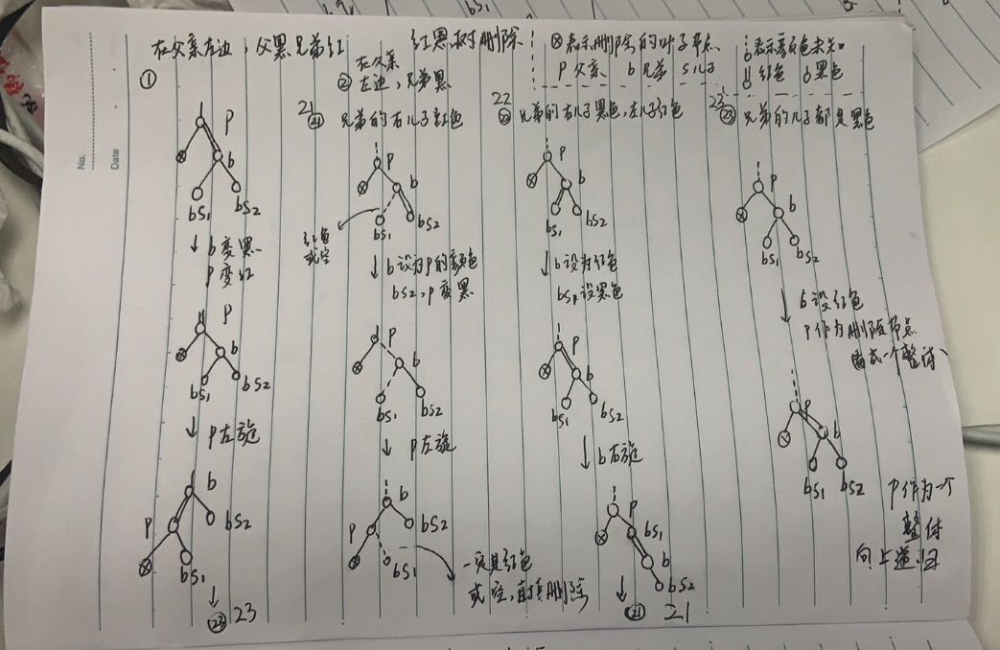

图例中 `21`， `22` 相当于向兄弟借值，而 `1` 和 `23` 相当于向父亲的一个值合并后调整。

我们仔细分析一下：

图例 `1`，当删除的叶子节点在父亲左边，而兄弟是红色节点，我们可以知道 `父亲` 和 `兄弟的儿子们` 绝对都是黑节点，将兄弟变黑，父亲变红，然后对父亲右链接左旋。如图：

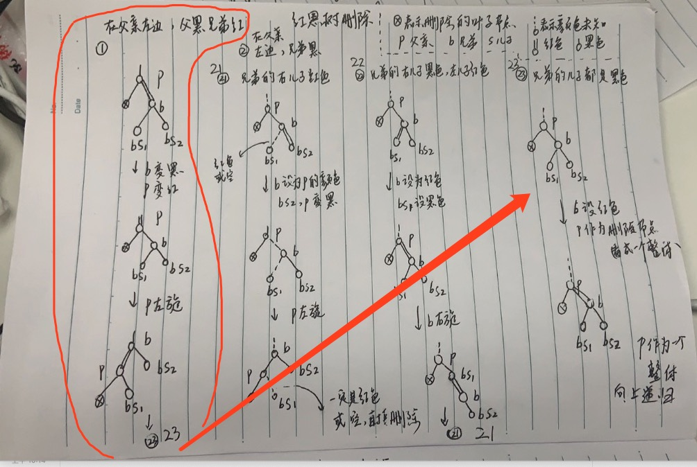

这时调整后变为了图例 `23`，这种情况实际上是在 `2-3-4` 树中和父亲的值合并，只不过将父亲的值转了一个方向，可能变为图例 `21，22，23`。

图例 `23`，当删除的叶子节点在父亲左边，兄弟节点是黑色，兄弟的儿子们也都是黑色，相当于 `2-3-4` 树和兄弟借不到值了，需要将兄弟变为红色，然后将父亲作为一个整体来删除，向上递归处理（相当于拉了父亲的一个值和兄弟合并）。如图：

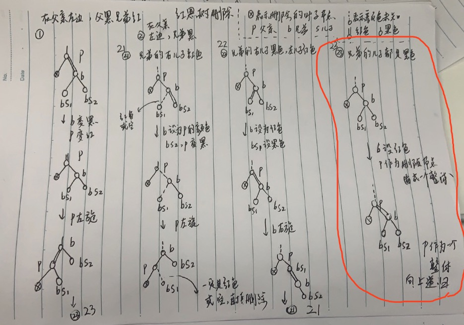

图例 `21` 和 `21` 就简单了，相当 `2-3-4` 树与兄弟借值。

图例 `21`，当删除的叶子节点在父亲左边，且兄弟是黑色，而兄弟的右儿子是红色，那么兄弟设置成父亲的颜色，兄弟的右儿子和父亲变黑，接着对父亲进行左旋，旋转后可以直接删除元素。如图：

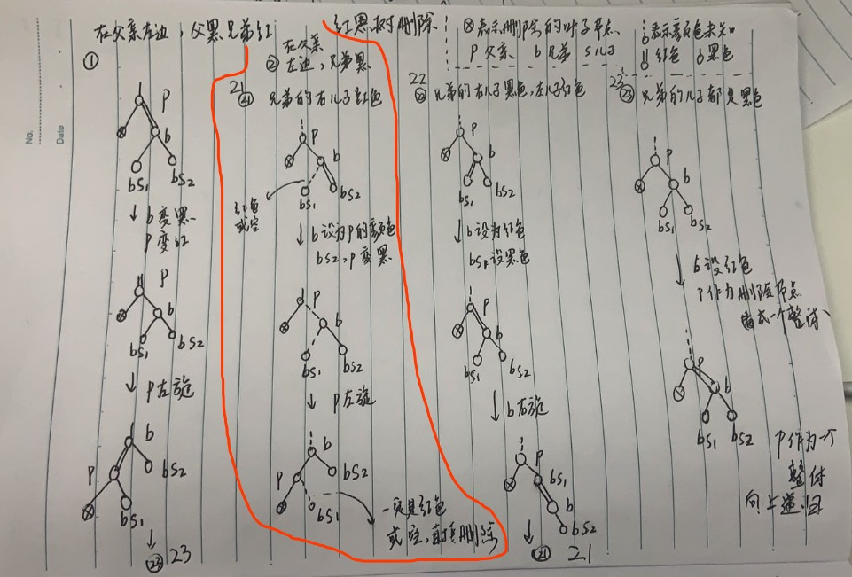

图例 `22`，当删除的叶子节点在父亲左边，且兄弟是黑色，而兄弟的右儿子是黑色，左儿子是红色，将兄弟设置为红色，兄弟的左儿子设置为黑色，对兄弟进行右旋，变为图例 `21`。如图：

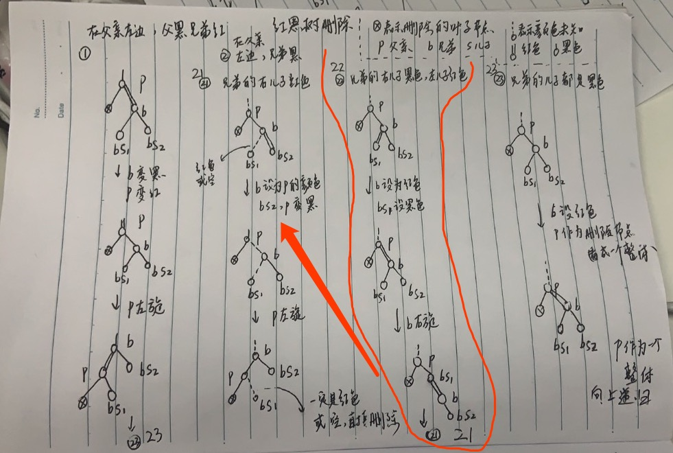

当然，删除的叶子节点可以在父亲的右边（与上述的图反方向）：


类似于删除的叶子节点在父亲的左边，在此不再分析。

上面的图例，我们其实可以将其画出 `2-3-4` 树的形式，会更容易理解，在此就不画出了。

这次我们使用非递归的形式，效率会更高（可及时跳出循环），代码实现如下：

```go
// 普通红黑树删除元素
func (tree *RBTree) Delete(value int64) {
	// 查找元素是否存在，不存在则退出
	p := tree.Find(value)
	if p == nil {
		return
	}

	// 删除该节点
	tree.delete(p)
}

// 删除节点核心函数
// 找最小后驱节点来补位，删除内部节点转为删除叶子节点
func (tree *RBTree) delete(node *RBTNode) {
	// 如果左右子树都存在，那么从右子树的左边一直找一直找，就找能到最小后驱节点
	if node.Left != nil && node.Right != nil {
		s := node.Right
		for s.Left != nil {
			s = s.Left
		}

		// 删除的叶子节点找到了，删除内部节点转为删除叶子节点
		node.Value = s.Value
		node.Times = s.Times
		node = s // 可能存在右儿子
	}

	if node.Left == nil && node.Right == nil {
		// 没有子树，要删除的节点就是叶子节点。
	} else {
		// 只有一棵子树，因为红黑树的特征，该子树就只有一个节点
		// 找到该唯一节点
		replacement := node.Left
		if node.Left == nil {
			replacement = node.Right
		}

		// 替换开始，子树的唯一节点替代被删除的内部节点
		replacement.Parent = node.Parent
		if node.Parent == nil {
			// 要删除的节点的父亲为空，表示要删除的节点为根节点，唯一子节点成为树根
			tree.Root = replacement
		} else if node == node.Parent.Left {
			// 子树的唯一节点替代被删除的内部节点
			node.Parent.Left = replacement
		} else {
			// 子树的唯一节点替代被删除的内部节点
			node.Parent.Right = replacement
		}

		// delete this node
		node.Parent = nil
		node.Right = nil
		node.Left = nil

		//  case 1: not enter this logic
		//      R(del)
		//    B   B
		//
		//  case 2: node's color must be black, and it's son must be red
		//    B(del)     B(del)
		//  R  O       O   R
		//
		// 单子树时删除的节点绝对是黑色的，而其唯一子节点必然是红色的
		// 现在唯一子节点替换了被删除节点，该节点要变为黑色
		// now son replace it's father, just change color to black
		replacement.Color = BLACK
		return
	}

	// 要删除的叶子节点没有父亲，那么它是根节点，直接置空，返回
	if node.Parent == nil {
		tree.Root = nil
		return
	}

	// 要删除的叶子节点，是一个黑节点，删除后会破坏平衡，需要进行调整，调整成可以删除的状态
	if !IsRed(node) {
		// 核心函数
		tree.fixAfterDeletion(node)
	}

	// 现在可以删除叶子节点了
	if node == node.Parent.Left {
		node.Parent.Left = nil
	} else if node == node.Parent.Right {
		node.Parent.Right = nil
	}

	node.Parent = nil

}

// 调整删除的叶子节点，自底向上
// 可以看图理解
func (tree *RBTree) fixAfterDeletion(node *RBTNode) {
	// 如果不是递归到根节点，且节点是黑节点，那么继续递归
	for tree.Root != node && !IsRed(node) {
		// 要删除的节点在父亲左边，对应图例1，2
		if node == LeftOf(ParentOf(node)) {
			// 找出兄弟
			brother := RightOf(ParentOf(node))

			// 兄弟是红色的，对应图例1，那么兄弟变黑，父亲变红，然后对父亲左旋，进入图例21,22,23
			if IsRed(brother) {
				SetColor(brother, BLACK)
				SetColor(ParentOf(node), RED)
				tree.RotateLeft(ParentOf(node))
				brother = RightOf(ParentOf(node)) // 图例1调整后进入图例21,22,23，兄弟此时变了
			}

			// 兄弟是黑色的，对应图例21，22，23
			// 兄弟的左右儿子都是黑色，进入图例23，将兄弟设为红色，父亲所在的子树作为整体，当作删除的节点，继续向上递归
			if !IsRed(LeftOf(brother)) && !IsRed(RightOf(brother)) {
				SetColor(brother, RED)
				node = ParentOf(node)
			} else {
				// 兄弟的右儿子是黑色，进入图例22，将兄弟设为红色，兄弟的左儿子设为黑色，对兄弟右旋，进入图例21
				if !IsRed(RightOf(brother)) {
					SetColor(LeftOf(brother), BLACK)
					SetColor(brother, RED)
					tree.RotateRight(brother)
					brother = RightOf(ParentOf(node)) // 图例22调整后进入图例21，兄弟此时变了
				}

				// 兄弟的右儿子是红色，进入图例21，将兄弟设置为父亲的颜色，兄弟的右儿子以及父亲变黑，对父亲左旋
				SetColor(brother, ParentOf(node).Color)
				SetColor(ParentOf(node), BLACK)
				SetColor(RightOf(brother), BLACK)
				tree.RotateLeft(ParentOf(node))

				node = tree.Root
			}
		} else {
			// 要删除的节点在父亲右边，对应图例3，4
			// 找出兄弟
			brother := RightOf(ParentOf(node))

			// 兄弟是红色的，对应图例3，那么兄弟变黑，父亲变红，然后对父亲右旋，进入图例41,42,43
			if IsRed(brother) {
				SetColor(brother, BLACK)
				SetColor(ParentOf(node), RED)
				tree.RotateRight(ParentOf(node))
				brother = LeftOf(ParentOf(node)) // 图例3调整后进入图例41,42,43，兄弟此时变了
			}

			// 兄弟是黑色的，对应图例41，42，43
			// 兄弟的左右儿子都是黑色，进入图例43，将兄弟设为红色，父亲所在的子树作为整体，当作删除的节点，继续向上递归
			if !IsRed(LeftOf(brother)) && !IsRed(RightOf(brother)) {
				SetColor(brother, RED)
				node = ParentOf(node)
			} else {
				// 兄弟的左儿子是黑色，进入图例42，将兄弟设为红色，兄弟的右儿子设为黑色，对兄弟左旋，进入图例41
				if !IsRed(LeftOf(brother)) {
					SetColor(RightOf(brother), BLACK)
					SetColor(brother, RED)
					tree.RotateLeft(brother)
					brother = LeftOf(ParentOf(node)) // 图例42调整后进入图例41，兄弟此时变了
				}

				// 兄弟的左儿子是红色，进入图例41，将兄弟设置为父亲的颜色，兄弟的左儿子以及父亲变黑，对父亲右旋
				SetColor(brother, ParentOf(node).Color)
				SetColor(ParentOf(node), BLACK)
				SetColor(LeftOf(brother), BLACK)
				tree.RotateRight(ParentOf(node))

				node = tree.Root
			}
		}
	}

	// this node always black
	SetColor(node, BLACK)
}
```

首先需要查找删除的值是否存在，不存在则不必要调用删除操作了：

```go
// 普通红黑树删除元素
func (tree *RBTree) Delete(value int64) {
	// 查找元素是否存在，不存在则退出
	p := tree.Find(value)
	if p == nil {
		return
	}

	// 删除该节点
	tree.delete(p)
}
```

存在删除的节点，那么进入删除操作：`tree.delete(p)`。

删除操作无非就是找最小后驱节点来补位，删除内部节点转为删除叶子节点，然后针对叶子节点的链接是不是黑色，是的话那么需要调整：

```go
// 删除节点核心函数
// 找最小后驱节点来补位，删除内部节点转为删除叶子节点
func (tree *RBTree) delete(node *RBTNode) {
	// 如果左右子树都存在，那么从右子树的左边一直找一直找，就找能到最小后驱节点
	if node.Left != nil && node.Right != nil {
		s := node.Right
		for s.Left != nil {
			s = s.Left
		}

		// 删除的叶子节点找到了，删除内部节点转为删除叶子节点
		node.Value = s.Value
		node.Times = s.Times
		node = s // 可能存在右儿子
	}

	if node.Left == nil && node.Right == nil {
		// 没有子树，要删除的节点就是叶子节点。
	} else {
		// 只有一棵子树，因为红黑树的特征，该子树就只有一个节点
		// 找到该唯一节点
		replacement := node.Left
		if node.Left == nil {
			replacement = node.Right
		}

		// 替换开始，子树的唯一节点替代被删除的内部节点
		replacement.Parent = node.Parent
		if node.Parent == nil {
			// 要删除的节点的父亲为空，表示要删除的节点为根节点，唯一子节点成为树根
			tree.Root = replacement
		} else if node == node.Parent.Left {
			// 子树的唯一节点替代被删除的内部节点
			node.Parent.Left = replacement
		} else {
			// 子树的唯一节点替代被删除的内部节点
			node.Parent.Right = replacement
		}

		// delete this node
		node.Parent = nil
		node.Right = nil
		node.Left = nil

		//  case 1: not enter this logic
		//      R(del)
		//    B   B
		//
		//  case 2: node's color must be black, and it's son must be red
		//    B(del)     B(del)
		//  R  O       O   R
		//
		// 单子树时删除的节点绝对是黑色的，而其唯一子节点必然是红色的
		// 现在唯一子节点替换了被删除节点，该节点要变为黑色
		// now son replace it's father, just change color to black
		replacement.Color = BLACK
		return
	}

	// 要删除的叶子节点没有父亲，那么它是根节点，直接置空，返回
	if node.Parent == nil {
		tree.Root = nil
		return
	}

	// 要删除的叶子节点，是一个黑节点，删除后会破坏平衡，需要进行调整，调整成可以删除的状态
	if !IsRed(node) {
		// 核心函数
		tree.fixAfterDeletion(node)
	}

	// 现在可以删除叶子节点了
	if node == node.Parent.Left {
		node.Parent.Left = nil
	} else if node == node.Parent.Right {
		node.Parent.Right = nil
	}

	node.Parent = nil

}
```

当删除的节点有两棵子树，那么它是内部节点，找到其最小后驱节点来替换它，也就是其右子树一直往左边找，该最小后驱节点可能是叶子结点，也可能有一个右儿子：

```go
	// 如果左右子树都存在，那么从右子树的左边一直找一直找，就找能到最小后驱节点
	if node.Left != nil && node.Right != nil {
		s := node.Right
		for s.Left != nil {
			s = s.Left
		}

		// 删除的叶子节点找到了，删除内部节点转为删除叶子节点
		node.Value = s.Value
		node.Times = s.Times
		node = s
	} 
```

接着继续判断，

如果没有子树，那么删除的节点就是叶子节点了：

```go
    if node.Left == nil && node.Right == nil {
		// 没有子树，要删除的节点就是叶子节点。
	} 
```

否则如果只有一棵子树，那么根据红黑树的特征，该子树只有一个节点：

```go
	} else {
		// 只有一棵子树，因为红黑树的特征，该子树就只有一个节点
		// 找到该唯一节点
		replacement := node.Left
		if node.Left == nil {
			replacement = node.Right
		}

		// 替换开始，子树的唯一节点替代被删除的内部节点
		replacement.Parent = node.Parent
		if node.Parent == nil {
			// 要删除的节点的父亲为空，表示要删除的节点为根节点，唯一子节点成为树根
			tree.Root = replacement
		} else if node == node.Parent.Left {
			// 子树的唯一节点替代被删除的内部节点
			node.Parent.Left = replacement
		} else {
			// 子树的唯一节点替代被删除的内部节点
			node.Parent.Right = replacement
		}

		// delete this node
		node.Parent = nil
		node.Right = nil
		node.Left = nil

		//  case 1: not enter this logic
		//      R(del)
		//    B   B
		//
		//  case 2: node's color must be black, and it's son must be red
		//    B(del)     B(del)
		//  R  O       O   R
		//
		// 单子树时删除的节点绝对是黑色的，而其唯一子节点必然是红色的
		// 现在唯一子节点替换了被删除节点，该节点要变为黑色
		// now son replace it's father, just change color to black
		replacement.Color = BLACK
		return
	}
```

删除叶子节点，如何删除呢，首先如果它是根节点，那么树就空了：

```go
	// 要删除的叶子节点没有父亲，那么它是根节点，直接置空，返回
	if node.Parent == nil {
		tree.Root = nil
		return
	}
```

否则需要判断该叶子节点是不是红节点，如果不是红节点，不能直接删除，需要调整：

```go
	// 要删除的叶子节点，是一个黑节点，删除后会破坏平衡，需要进行调整，调整成可以删除的状态
	if !IsRed(node) {
		// 核心函数
		tree.fixAfterDeletion(node)
	}
```

最后，就可以删除叶子节点了：

```go
	// 现在可以删除叶子节点了
	if node == node.Parent.Left {
		node.Parent.Left = nil
	} else if node == node.Parent.Right {
		node.Parent.Right = nil
	}
	node.Parent = nil
```

核心删除调整函数 `fixAfterDeletion` 非常重要，可以看图理解：

```go
// 调整删除的叶子节点，自底向上
// 可以看图理解
func (tree *RBTree) fixAfterDeletion(node *RBTNode) {
	// 如果不是递归到根节点，且节点是黑节点，那么继续递归
	for tree.Root != node && !IsRed(node) {
		// 要删除的节点在父亲左边，对应图例1，2
		if node == LeftOf(ParentOf(node)) {
			// 找出兄弟
			brother := RightOf(ParentOf(node))

			// 兄弟是红色的，对应图例1，那么兄弟变黑，父亲变红，然后对父亲左旋，进入图例21,22,23
			if IsRed(brother) {
				SetColor(brother, BLACK)
				SetColor(ParentOf(node), RED)
				tree.RotateLeft(ParentOf(node))
				brother = RightOf(ParentOf(node)) // 图例1调整后进入图例21,22,23，兄弟此时变了
			}

			// 兄弟是黑色的，对应图例21，22，23
			// 兄弟的左右儿子都是黑色，进入图例23，将兄弟设为红色，父亲所在的子树作为整体，当作删除的节点，继续向上递归
			if !IsRed(LeftOf(brother)) && !IsRed(RightOf(brother)) {
				SetColor(brother, RED)
				node = ParentOf(node)
			} else {
				// 兄弟的右儿子是黑色，进入图例22，将兄弟设为红色，兄弟的左儿子设为黑色，对兄弟右旋，进入图例21
				if !IsRed(RightOf(brother)) {
					SetColor(LeftOf(brother), BLACK)
					SetColor(brother, RED)
					tree.RotateRight(brother)
					brother = RightOf(ParentOf(node)) // 图例22调整后进入图例21，兄弟此时变了
				}

				// 兄弟的右儿子是红色，进入图例21，将兄弟设置为父亲的颜色，兄弟的右儿子以及父亲变黑，对父亲左旋
				SetColor(brother, ParentOf(node).Color)
				SetColor(ParentOf(node), BLACK)
				SetColor(RightOf(brother), BLACK)
				tree.RotateLeft(ParentOf(node))

				node = tree.Root
			}
		} else {
			// 要删除的节点在父亲右边，对应图例3，4
			// 找出兄弟
			brother := RightOf(ParentOf(node))

			// 兄弟是红色的，对应图例3，那么兄弟变黑，父亲变红，然后对父亲右旋，进入图例41,42,43
			if IsRed(brother) {
				SetColor(brother, BLACK)
				SetColor(ParentOf(node), RED)
				tree.RotateRight(ParentOf(node))
				brother = LeftOf(ParentOf(node)) // 图例3调整后进入图例41,42,43，兄弟此时变了
			}

			// 兄弟是黑色的，对应图例41，42，43
			// 兄弟的左右儿子都是黑色，进入图例43，将兄弟设为红色，父亲所在的子树作为整体，当作删除的节点，继续向上递归
			if !IsRed(LeftOf(brother)) && !IsRed(RightOf(brother)) {
				SetColor(brother, RED)
				node = ParentOf(node)
			} else {
				// 兄弟的左儿子是黑色，进入图例42，将兄弟设为红色，兄弟的右儿子设为黑色，对兄弟左旋，进入图例41
				if !IsRed(LeftOf(brother)) {
					SetColor(RightOf(brother), BLACK)
					SetColor(brother, RED)
					tree.RotateLeft(brother)
					brother = LeftOf(ParentOf(node)) // 图例42调整后进入图例41，兄弟此时变了
				}

				// 兄弟的左儿子是红色，进入图例41，将兄弟设置为父亲的颜色，兄弟的左儿子以及父亲变黑，对父亲右旋
				SetColor(brother, ParentOf(node).Color)
				SetColor(ParentOf(node), BLACK)
				SetColor(LeftOf(brother), BLACK)
				tree.RotateRight(ParentOf(node))

				node = tree.Root
			}
		}
	}

	// this node always black
	SetColor(node, BLACK)
}
```


只有符合 `tree.Root != node && !IsRed(node)` 才能继续进入递归。

要删除的节点在父亲左边：`node == LeftOf(ParentOf(node))`，对应图例1，2:


否则对应图例3，4：


可以参考图理解代码，代码注释很清晰地对照了示例图。

### 2.6. 删除元素算法分析

删除元素比左倾红黑树的情况还要多，但是平均时间复杂度仍然是 `log(n)`，出现在和兄弟借不到值的情况下向上递归。和 AVL树 区别是，普通红黑树删除元素最多旋转三次，参考 `1图例-22图例-21图例` 的状态转变，最多旋转三次，而 AVL树 可能旋转很多次，甚至自底向上一直旋转到根节点。

### 2.7. 查找元素等实现

略。与左倾红黑树，AVL树都一样。

### 2.8. 验证是否是一棵普通红黑树

如何确保我们的代码实现的就是一棵普通红黑树呢，可以进行验证：

```go
// 验证是不是棵红黑树
func (tree *RBTree) IsRBTree() bool {
	if tree == nil || tree.Root == nil {
		return true
	}

	// 判断树是否是一棵二分查找树
	if !tree.Root.IsBST() {
		return false
	}

	// 判断树是否遵循2-3-4树，也就是不能有连续的两个红链接
	if !tree.Root.Is234() {
		return false
	}

	// 判断树是否平衡，也就是任意一个节点到叶子节点，经过的黑色链接数量相同
	// 先计算根节点到最左边叶子节点的黑链接数量
	blackNum := 0
	x := tree.Root
	for x != nil {
		if !IsRed(x) { // 是黑色链接
			blackNum = blackNum + 1
		}
		x = x.Left
	}

	if !tree.Root.IsBalanced(blackNum) {
		return false
	}
	return true
}

// 节点所在的子树是否是一棵二分查找树
func (node *RBTNode) IsBST() bool {
	if node == nil {
		return true
	}

	// 左子树非空，那么根节点必须大于左儿子节点
	if node.Left != nil {
		if node.Value > node.Left.Value {
		} else {
			fmt.Printf("father:%#v,lchild:%#v,rchild:%#v\n", node, node.Left, node.Right)
			return false
		}
	}

	// 右子树非空，那么根节点必须小于右儿子节点
	if node.Right != nil {
		if node.Value < node.Right.Value {
		} else {
			fmt.Printf("father:%#v,lchild:%#v,rchild:%#v\n", node, node.Left, node.Right)
			return false
		}
	}

	// 左子树也要判断是否是平衡查找树
	if !node.Left.IsBST() {
		return false
	}

	// 右子树也要判断是否是平衡查找树
	if !node.Right.IsBST() {
		return false
	}

	return true
}

// 节点所在的子树是否遵循2-3-4树
func (node *RBTNode) Is234() bool {
	if node == nil {
		return true
	}

	// 不允许连续两个左红链接
	if IsRed(node) && IsRed(node.Left) {
		fmt.Printf("father:%#v,lchild:%#v\n", node, node.Left)
		return false
	}

	if IsRed(node) && IsRed(node.Right) {
		fmt.Printf("father:%#v,rchild:%#v\n", node, node.Right)
		return false
	}

	// 左子树也要判断是否遵循2-3-4树
	if !node.Left.Is234() {
		return false
	}

	// 右子树也要判断是否是遵循2-3-4树
	if !node.Right.Is234() {
		return false
	}

	return true
}

// 节点所在的子树是否平衡，是否有 blackNum 个黑链接
func (node *RBTNode) IsBalanced(blackNum int) bool {
	if node == nil {
		return blackNum == 0
	}

	if !IsRed(node) {
		blackNum = blackNum - 1
	}

	if !node.Left.IsBalanced(blackNum) {
		fmt.Println("node.Left to leaf black link is not ", blackNum)
		return false
	}

	if !node.Right.IsBalanced(blackNum) {
		fmt.Println("node.Right to leaf black link is not ", blackNum)
		return false
	}

	return true
}
```

运行请看完整代码。

### 2.9. 完整程序

```go
package main

import "fmt"

// 普通红黑树实现，参考 Java TreeMap，更强壮。
// red-black tree

// 定义颜色
const (
	RED   = true
	BLACK = false
)

// 普通红黑树
type RBTree struct {
	Root *RBTNode // 树根节点
}

// 新建一棵空树
func NewRBTree() *RBTree {
	return &RBTree{}
}

// 普通红黑树节点
type RBTNode struct {
	Value  int64    // 值
	Times  int64    // 值出现的次数
	Left   *RBTNode // 左子树
	Right  *RBTNode // 右子树
	Parent *RBTNode // 父节点
	Color  bool     // 父亲指向该节点的链接颜色
}

// 节点的颜色
func IsRed(node *RBTNode) bool {
	if node == nil {
		return false
	}
	return node.Color == RED
}

// 返回节点的父亲节点
func ParentOf(node *RBTNode) *RBTNode {
	if node == nil {
		return nil
	}

	return node.Parent
}

// 返回节点的左子节点
func LeftOf(node *RBTNode) *RBTNode {
	if node == nil {
		return nil
	}

	return node.Left
}

// 返回节点的右子节点
func RightOf(node *RBTNode) *RBTNode {
	if node == nil {
		return nil
	}

	return node.Right
}

// 设置节点颜色
func SetColor(node *RBTNode, color bool) {
	if node != nil {
		node.Color = color
	}
}

// 对某节点左旋转
func (tree *RBTree) RotateLeft(h *RBTNode) {
	if h != nil {

		// 看图理解
		x := h.Right
		h.Right = x.Left

		if x.Left != nil {
			x.Left.Parent = h
		}

		x.Parent = h.Parent
		if h.Parent == nil {
			tree.Root = x
		} else if h.Parent.Left == h {
			h.Parent.Left = x
		} else {
			h.Parent.Right = x
		}
		x.Left = h
		h.Parent = x
	}
}

// 对某节点右旋转
func (tree *RBTree) RotateRight(h *RBTNode) {
	if h != nil {

		// 看图理解
		x := h.Left
		h.Left = x.Right

		if x.Right != nil {
			x.Right.Parent = h
		}

		x.Parent = h.Parent
		if h.Parent == nil {
			tree.Root = x
		} else if h.Parent.Right == h {
			h.Parent.Right = x
		} else {
			h.Parent.Left = x
		}
		x.Right = h
		h.Parent = x
	}
}

// 普通红黑树添加元素
func (tree *RBTree) Add(value int64) {
	// 根节点为空
	if tree.Root == nil {
		// 根节点都是黑色
		tree.Root = &RBTNode{
			Value: value,
			Color: BLACK,
		}
		return
	}

	// 辅助变量 t，表示新元素要插入到该子树，t是该子树的根节点
	t := tree.Root

	// 插入元素后，插入元素的父亲节点
	var parent *RBTNode

	// 辅助变量，为了知道元素最后要插到左边还是右边
	var cmp int64 = 0

	for {
		parent = t

		cmp = value - t.Value
		if cmp < 0 {
			// 比当前节点小，往左子树插入
			t = t.Left
		} else if cmp > 0 {
			// 比当前节点节点大，往右子树插入
			t = t.Right
		} else {
			// 已经存在值了，更新出现的次数
			t.Times = t.Times + 1
			return
		}

		// 终于找到要插入的位置了
		if t == nil {
			break // 这时叶子节点是 parent，要插入到 parent 的下面，跳到外层去
		}
	}

	// 新节点，它要插入到 parent下面
	newNode := &RBTNode{
		Value:  value,
		Parent: parent,
	}
	if cmp < 0 {
		// 知道要从左边插进去
		parent.Left = newNode
	} else {
		// 知道要从右边插进去
		parent.Right = newNode
	}

	// 插入新节点后，可能破坏了红黑树特征，需要修复，核心函数
	tree.fixAfterInsertion(newNode)
}

// 调整新插入的节点，自底而上
// 可以看图理解
func (tree *RBTree) fixAfterInsertion(node *RBTNode) {
	// 插入的新节点一定要是红色
	node.Color = RED

	// 节点不能是空，不能是根节点，父亲的颜色必须为红色（如果是黑色，那么直接插入不破坏平衡，不需要调整了）
	for node != nil && node != tree.Root && node.Parent.Color == RED {
		// 父亲在祖父的左边
		if ParentOf(node) == LeftOf(ParentOf(ParentOf(node))) {
			// 叔叔节点
			uncle := RightOf(ParentOf(ParentOf(node)))

			// 图例3左边部分，叔叔是红节点，祖父变色，也就是父亲和叔叔变黑，祖父变红
			if IsRed(uncle) {
				SetColor(ParentOf(node), BLACK)
				SetColor(uncle, BLACK)
				SetColor(ParentOf(ParentOf(node)), RED)
				// 还要向上递归
				node = ParentOf(ParentOf(node))
			} else {
				// 图例4左边部分，叔叔是黑节点，并且插入的节点在父亲的右边，需要对父亲左旋
				if node == RightOf(ParentOf(node)) {
					node = ParentOf(node)
					tree.RotateLeft(node)
				}

				// 变色，并对祖父进行右旋
				SetColor(ParentOf(node), BLACK)
				SetColor(ParentOf(ParentOf(node)), RED)
				tree.RotateRight(ParentOf(ParentOf(node)))
			}
		} else {
			// 父亲在祖父的右边，与父亲在祖父的左边相似
			// 叔叔节点
			uncle := LeftOf(ParentOf(ParentOf(node)))

			// 图例3右边部分，叔叔是红节点，祖父变色，也就是父亲和叔叔变黑，祖父变红
			if IsRed(uncle) {
				SetColor(ParentOf(node), BLACK)
				SetColor(uncle, BLACK)
				SetColor(ParentOf(ParentOf(node)), RED)
				// 还要向上递归
				node = ParentOf(ParentOf(node))
			} else {
				// 图例4右边部分，叔叔是黑节点，并且插入的节点在父亲的左边，需要对父亲右旋
				if node == LeftOf(ParentOf(node)) {
					node = ParentOf(node)
					tree.RotateRight(node)
				}

				// 变色，并对祖父进行左旋
				SetColor(ParentOf(node), BLACK)
				SetColor(ParentOf(ParentOf(node)), RED)
				tree.RotateLeft(ParentOf(ParentOf(node)))
			}
		}
	}

	// 根节点永远为黑
	tree.Root.Color = BLACK
}

// 普通红黑树删除元素
func (tree *RBTree) Delete(value int64) {
	// 查找元素是否存在，不存在则退出
	p := tree.Find(value)
	if p == nil {
		return
	}

	// 删除该节点
	tree.delete(p)
}

// 删除节点核心函数
// 找最小后驱节点来补位，删除内部节点转为删除叶子节点
func (tree *RBTree) delete(node *RBTNode) {
	// 如果左右子树都存在，那么从右子树的左边一直找一直找，就找能到最小后驱节点
	if node.Left != nil && node.Right != nil {
		s := node.Right
		for s.Left != nil {
			s = s.Left
		}

		// 删除的叶子节点找到了，删除内部节点转为删除叶子节点
		node.Value = s.Value
		node.Times = s.Times
		node = s // 可能存在右儿子
	}

	if node.Left == nil && node.Right == nil {
		// 没有子树，要删除的节点就是叶子节点。
	} else {
		// 只有一棵子树，因为红黑树的特征，该子树就只有一个节点
		// 找到该唯一节点
		replacement := node.Left
		if node.Left == nil {
			replacement = node.Right
		}

		// 替换开始，子树的唯一节点替代被删除的内部节点
		replacement.Parent = node.Parent
		if node.Parent == nil {
			// 要删除的节点的父亲为空，表示要删除的节点为根节点，唯一子节点成为树根
			tree.Root = replacement
		} else if node == node.Parent.Left {
			// 子树的唯一节点替代被删除的内部节点
			node.Parent.Left = replacement
		} else {
			// 子树的唯一节点替代被删除的内部节点
			node.Parent.Right = replacement
		}

		// delete this node
		node.Parent = nil
		node.Right = nil
		node.Left = nil

		//  case 1: not enter this logic
		//      R(del)
		//    B   B
		//
		//  case 2: node's color must be black, and it's son must be red
		//    B(del)     B(del)
		//  R  O       O   R
		//
		// 单子树时删除的节点绝对是黑色的，而其唯一子节点必然是红色的
		// 现在唯一子节点替换了被删除节点，该节点要变为黑色
		// now son replace it's father, just change color to black
		replacement.Color = BLACK
		return
	}

	// 要删除的叶子节点没有父亲，那么它是根节点，直接置空，返回
	if node.Parent == nil {
		tree.Root = nil
		return
	}

	// 要删除的叶子节点，是一个黑节点，删除后会破坏平衡，需要进行调整，调整成可以删除的状态
	if !IsRed(node) {
		// 核心函数
		tree.fixAfterDeletion(node)
	}

	// 现在可以删除叶子节点了
	if node == node.Parent.Left {
		node.Parent.Left = nil
	} else if node == node.Parent.Right {
		node.Parent.Right = nil
	}

	node.Parent = nil

}

// 调整删除的叶子节点，自底向上
// 可以看图理解
func (tree *RBTree) fixAfterDeletion(node *RBTNode) {
	// 如果不是递归到根节点，且节点是黑节点，那么继续递归
	for tree.Root != node && !IsRed(node) {
		// 要删除的节点在父亲左边，对应图例1，2
		if node == LeftOf(ParentOf(node)) {
			// 找出兄弟
			brother := RightOf(ParentOf(node))

			// 兄弟是红色的，对应图例1，那么兄弟变黑，父亲变红，然后对父亲左旋，进入图例21,22,23
			if IsRed(brother) {
				SetColor(brother, BLACK)
				SetColor(ParentOf(node), RED)
				tree.RotateLeft(ParentOf(node))
				brother = RightOf(ParentOf(node)) // 图例1调整后进入图例21,22,23，兄弟此时变了
			}

			// 兄弟是黑色的，对应图例21，22，23
			// 兄弟的左右儿子都是黑色，进入图例23，将兄弟设为红色，父亲所在的子树作为整体，当作删除的节点，继续向上递归
			if !IsRed(LeftOf(brother)) && !IsRed(RightOf(brother)) {
				SetColor(brother, RED)
				node = ParentOf(node)
			} else {
				// 兄弟的右儿子是黑色，进入图例22，将兄弟设为红色，兄弟的左儿子设为黑色，对兄弟右旋，进入图例21
				if !IsRed(RightOf(brother)) {
					SetColor(LeftOf(brother), BLACK)
					SetColor(brother, RED)
					tree.RotateRight(brother)
					brother = RightOf(ParentOf(node)) // 图例22调整后进入图例21，兄弟此时变了
				}

				// 兄弟的右儿子是红色，进入图例21，将兄弟设置为父亲的颜色，兄弟的右儿子以及父亲变黑，对父亲左旋
				SetColor(brother, ParentOf(node).Color)
				SetColor(ParentOf(node), BLACK)
				SetColor(RightOf(brother), BLACK)
				tree.RotateLeft(ParentOf(node))

				node = tree.Root
			}
		} else {
			// 要删除的节点在父亲右边，对应图例3，4
			// 找出兄弟
			brother := RightOf(ParentOf(node))

			// 兄弟是红色的，对应图例3，那么兄弟变黑，父亲变红，然后对父亲右旋，进入图例41,42,43
			if IsRed(brother) {
				SetColor(brother, BLACK)
				SetColor(ParentOf(node), RED)
				tree.RotateRight(ParentOf(node))
				brother = LeftOf(ParentOf(node)) // 图例3调整后进入图例41,42,43，兄弟此时变了
			}

			// 兄弟是黑色的，对应图例41，42，43
			// 兄弟的左右儿子都是黑色，进入图例43，将兄弟设为红色，父亲所在的子树作为整体，当作删除的节点，继续向上递归
			if !IsRed(LeftOf(brother)) && !IsRed(RightOf(brother)) {
				SetColor(brother, RED)
				node = ParentOf(node)
			} else {
				// 兄弟的左儿子是黑色，进入图例42，将兄弟设为红色，兄弟的右儿子设为黑色，对兄弟左旋，进入图例41
				if !IsRed(LeftOf(brother)) {
					SetColor(RightOf(brother), BLACK)
					SetColor(brother, RED)
					tree.RotateLeft(brother)
					brother = LeftOf(ParentOf(node)) // 图例42调整后进入图例41，兄弟此时变了
				}

				// 兄弟的左儿子是红色，进入图例41，将兄弟设置为父亲的颜色，兄弟的左儿子以及父亲变黑，对父亲右旋
				SetColor(brother, ParentOf(node).Color)
				SetColor(ParentOf(node), BLACK)
				SetColor(LeftOf(brother), BLACK)
				tree.RotateRight(ParentOf(node))

				node = tree.Root
			}
		}
	}

	// this node always black
	SetColor(node, BLACK)
}

// 找出最小值的节点
func (tree *RBTree) FindMinValue() *RBTNode {
	if tree.Root == nil {
		// 如果是空树，返回空
		return nil
	}

	return tree.Root.FindMinValue()
}

func (node *RBTNode) FindMinValue() *RBTNode {
	// 左子树为空，表面已经是最左的节点了，该值就是最小值
	if node.Left == nil {
		return node
	}

	// 一直左子树递归
	return node.Left.FindMinValue()
}

// 找出最大值的节点
func (tree *RBTree) FindMaxValue() *RBTNode {
	if tree.Root == nil {
		// 如果是空树，返回空
		return nil
	}

	return tree.Root.FindMaxValue()
}

func (node *RBTNode) FindMaxValue() *RBTNode {
	// 右子树为空，表面已经是最右的节点了，该值就是最大值
	if node.Right == nil {
		return node
	}

	// 一直右子树递归
	return node.Right.FindMaxValue()
}

// 查找指定节点
func (tree *RBTree) Find(value int64) *RBTNode {
	if tree.Root == nil {
		// 如果是空树，返回空
		return nil
	}

	return tree.Root.Find(value)
}

func (node *RBTNode) Find(value int64) *RBTNode {
	if value == node.Value {
		// 如果该节点刚刚等于该值，那么返回该节点
		return node
	} else if value < node.Value {
		// 如果查找的值小于节点值，从节点的左子树开始找
		if node.Left == nil {
			// 左子树为空，表示找不到该值了，返回nil
			return nil
		}
		return node.Left.Find(value)
	} else {
		// 如果查找的值大于节点值，从节点的右子树开始找
		if node.Right == nil {
			// 右子树为空，表示找不到该值了，返回nil
			return nil
		}
		return node.Right.Find(value)
	}
}

// 中序遍历
func (tree *RBTree) MidOrder() {
	tree.Root.MidOrder()
}

func (node *RBTNode) MidOrder() {
	if node == nil {
		return
	}

	// 先打印左子树
	node.Left.MidOrder()

	// 按照次数打印根节点
	for i := 0; i <= int(node.Times); i++ {
		fmt.Println(node.Value)
	}

	// 打印右子树
	node.Right.MidOrder()
}

// 验证是不是棵红黑树
func (tree *RBTree) IsRBTree() bool {
	if tree == nil || tree.Root == nil {
		return true
	}

	// 判断树是否是一棵二分查找树
	if !tree.Root.IsBST() {
		return false
	}

	// 判断树是否遵循2-3-4树，也就是不能有连续的两个红链接
	if !tree.Root.Is234() {
		return false
	}

	// 判断树是否平衡，也就是任意一个节点到叶子节点，经过的黑色链接数量相同
	// 先计算根节点到最左边叶子节点的黑链接数量
	blackNum := 0
	x := tree.Root
	for x != nil {
		if !IsRed(x) { // 是黑色链接
			blackNum = blackNum + 1
		}
		x = x.Left
	}

	if !tree.Root.IsBalanced(blackNum) {
		return false
	}
	return true
}

// 节点所在的子树是否是一棵二分查找树
func (node *RBTNode) IsBST() bool {
	if node == nil {
		return true
	}

	// 左子树非空，那么根节点必须大于左儿子节点
	if node.Left != nil {
		if node.Value > node.Left.Value {
		} else {
			fmt.Printf("father:%#v,lchild:%#v,rchild:%#v\n", node, node.Left, node.Right)
			return false
		}
	}

	// 右子树非空，那么根节点必须小于右儿子节点
	if node.Right != nil {
		if node.Value < node.Right.Value {
		} else {
			fmt.Printf("father:%#v,lchild:%#v,rchild:%#v\n", node, node.Left, node.Right)
			return false
		}
	}

	// 左子树也要判断是否是平衡查找树
	if !node.Left.IsBST() {
		return false
	}

	// 右子树也要判断是否是平衡查找树
	if !node.Right.IsBST() {
		return false
	}

	return true
}

// 节点所在的子树是否遵循2-3-4树
func (node *RBTNode) Is234() bool {
	if node == nil {
		return true
	}

	// 不允许连续两个左红链接
	if IsRed(node) && IsRed(node.Left) {
		fmt.Printf("father:%#v,lchild:%#v\n", node, node.Left)
		return false
	}

	if IsRed(node) && IsRed(node.Right) {
		fmt.Printf("father:%#v,rchild:%#v\n", node, node.Right)
		return false
	}

	// 左子树也要判断是否遵循2-3-4树
	if !node.Left.Is234() {
		return false
	}

	// 右子树也要判断是否是遵循2-3-4树
	if !node.Right.Is234() {
		return false
	}

	return true
}

// 节点所在的子树是否平衡，是否有 blackNum 个黑链接
func (node *RBTNode) IsBalanced(blackNum int) bool {
	if node == nil {
		return blackNum == 0
	}

	if !IsRed(node) {
		blackNum = blackNum - 1
	}

	if !node.Left.IsBalanced(blackNum) {
		fmt.Println("node.Left to leaf black link is not ", blackNum)
		return false
	}

	if !node.Right.IsBalanced(blackNum) {
		fmt.Println("node.Right to leaf black link is not ", blackNum)
		return false
	}

	return true
}

func main() {
	tree := NewRBTree()
	values := []int64{2, 3, 7, 10, 10, 10, 10, 23, 9, 102, 109, 111, 112, 113}
	for _, v := range values {
		tree.Add(v)
	}

	// 找到最大值或最小值的节点
	fmt.Println("find min value:", tree.FindMinValue())
	fmt.Println("find max value:", tree.FindMaxValue())

	// 查找不存在的99
	node := tree.Find(99)
	if node != nil {
		fmt.Println("find it 99!")
	} else {
		fmt.Println("not find it 99!")
	}

	// 查找存在的9
	node = tree.Find(9)
	if node != nil {
		fmt.Println("find it 9!")
	} else {
		fmt.Println("not find it 9!")
	}

	tree.MidOrder()

	// 删除存在的9后，再查找9
	tree.Delete(9)
	tree.Delete(10)
	tree.Delete(2)
	tree.Delete(3)
	tree.Add(4)
	tree.Add(3)
	tree.Add(10)
	tree.Delete(111)
	node = tree.Find(9)
	if node != nil {
		fmt.Println("find it 9!")
	} else {
		fmt.Println("not find it 9!")
	}

	if tree.IsRBTree() {
		fmt.Println("is a rb tree")
	} else {
		fmt.Println("is not rb tree")
	}

	tree.Delete(3)
	tree.Delete(4)
	tree.Delete(7)
	tree.Delete(10)
	tree.Delete(23)
	tree.Delete(102)
	tree.Delete(109)
	tree.Delete(112)
	tree.Delete(112)
	tree.MidOrder()
}
```

运行：

```go
find min value: &{2 0 <nil> <nil> 0xc000092060 false}
find max value: &{113 0 <nil> <nil> 0xc0000921e0 true}
not find it 99!
find it 9!
2
3
7
9
10
10
10
10
23
102
109
111
112
113
not find it 9!
is a rb tree
```

红黑树，无论是左偏还是普通的红黑树，理解都可以直接理解2-3或2-3-4树，添加操作比较简单，删除则是向兄弟借值或和父亲合并，然后如果父亲空了，把父亲的子树当成删除的一个整体，继续递归向上，至于二叉化的调整实现，则是将3或4节点画成红链接，可以多画下图就理解了。

## 三、应用场景

红黑树可以用来作为字典 `Map` 的基础数据结构，可以存储键值对，然后通过一个键，可以快速找到键对应的值，相比哈希表查找，不需要占用额外的空间。我们以上的代码实现只有 `value`，没有 `key:value`，可以简单改造实现字典。 

`Java` 语言基础类库中的 `HashMap`，`TreeSet`，`TreeMap` 都有使用到，`C++` 语言的 `STL` 标准模板库中，`map` 和 `set` 类也有使用到。很多中间件也有使用到，比如 `Nginx`，但 `Golang` 语言标准库并没有它。
