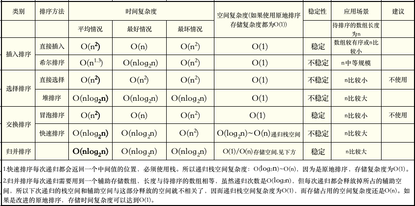

# 排序算法

人类在很多年的发展中学会了计数，比如小明今天出去打猎了，打了很多兔子，要记录多少只。

另外一方面，我们也需要做比较和排名，今天哪个人打猎打得多，比如小明打了5只兔子，小王打了8只，还有部落其他一百多个人都参与了打猎。我们要整理一个排行榜，论功行赏，谁打得多，谁就奖赏大一点。

如何排序呢？怎么在最快的时间内，找到打兔子最多的人呢？这是一个很朴素的问题。

排序这个很自然的需求就出来了。

经过很多年的研究，出现了很多的排序算法，这些算法有速度快的有速度慢的。比如：

1. 插入类排序有：直接插入排序和希尔排序
2. 选择类排序有：直接选择排序和堆排序
3. 交换类排序有：冒泡排序和快速排序

它们的复杂度如下：

## 稳定性概念

> 
>定义：能保证两个相等的数，经过排序之后，其在序列的前后位置顺序不变。（A1等于A2，排序前A1在A2前面，排序后A1还在A2前面）
> 
>意义：稳定性本质是维持具有相同属性的数据的插入顺序，如果后面需要使用该插入顺序排序，则稳定性排序可以避免这次排序。

## 初级排序算法

我们把 `冒泡排序`，`直接选择排序`，`直接插入排序` 认为是初级的排序算法。

最差的排序算法就是 `冒泡排序`（有趣的是所有人都必须先学这个算法）。

其中`直接插入排序`的性能是综合最好的，一般来说，当排序数组规模 `n` 较小时，`直接插入排序`可能比任何排序算法都要快，建议只在小规模排序中使用。

希尔排序是对`直接插入排序`的改进版本，比`直接选择排序`和`直接插入排序`快，且随着规模的递增，这种性能提升越明显。因为算法容易理解，在排序数组中等规模下，我们可以使用它。在非常大的规模下，它的性能也不那么糟糕，但大规模排序还是建议使用以下的高级排序算法。

## 高级排序算法

`快速排序`，`归并排序`和`堆排序`是比较高级的排序算法。

目前被认为综合最好的高级排序算法是`快速排序`，快速排序的平均用时最短，大多数的编程库内置的排序算法都是它。

`堆排序`也是一种很快的排序算法，通过维持一棵二叉树，树的根节点总是最大或最小从而可实现排序。

`归并排序`和`快速排序`一样使用分治法，递归地先使每个子序列有序，再将两个有序的序列进行合并成一个有序的序列。

我们在这一章将会讲解不同的排序算法。