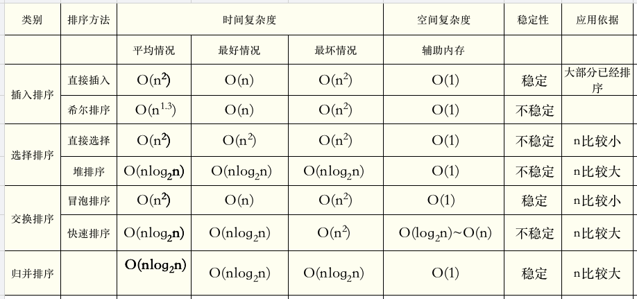

# 排序算法

人类的发展中，我们学会了计数，比如知道小明今天打猎的兔子的数量是多少。另外一方面，我们也需要判断，今天哪个人打猎打得多，我们需要比较。

所以，排序这个很自然的需求就出来了。比如小明打了5只兔子，小王打了8只，还有部落其他一百多个人也打了。我们要论功行赏，谁打得多，谁就奖赏大一点。

如何排序呢，怎么在最快的时间内，找到打兔子最多的人呢，这是一个很朴素的问题。

经过很多年的研究，出现了很多的排序算法，有快的有慢的。比如：

1. 插入排序有：直接插入排序和希尔排序
2. 选择排序有：直接选择排序和堆排序
3. 交换排序有：冒泡排序和快速排序

它们的复杂度如下：

冒泡排序可以说是最差的排序算法。

我们把冒泡排序，直接选择排序，直接插入排序认为是初级的排序算法，其中直接插入排序的性能是综合最好的，一般来说，当排序数组规模 `n` 较小时，直接插入排序可能比任何排序算法都要快。

希尔排序是对直接插入排序的改进版本，比直接选择排序和直接插入排序快，且随着规模的递增，这种性能提升越明显，因为算法容易理解，在排序数组中等规模下，我们可以使用它。在非常大的规模下，它的性能也不那么糟糕，但大规模排序还是使用以下的高级排序算法。

快速排序是目前被认为是最好的高级排序方法，当待排序的关键字是随机分布时，快速排序的平均时间最短，大多数的编程库使用的排序算法都是它。但在排序过程中，会占用额外的辅助内存空间。

堆排序也是一种很好的高级排序算法，当排序的数量很大时，并且有序程度较低时，堆排序最快，如果有序程度高时，快速排序最快。

归并排序是一种特殊的排序算法，主要是对两个已经排好序的数列进行合并。

>稳定性概念

>定义：能保证两个相等的数，经过排序之后，其在序列的前后位置顺序不变。（A1=A2，排序前A1在A2前面，排序后A1还在A2前面）

>意义：稳定性本质是维持具有相同属性的数据的插入顺序，如果后面需要使用该插入顺序排序，则稳定性排序可以避免这次排序。

我们在这一章将会讲解不同的排序算法。