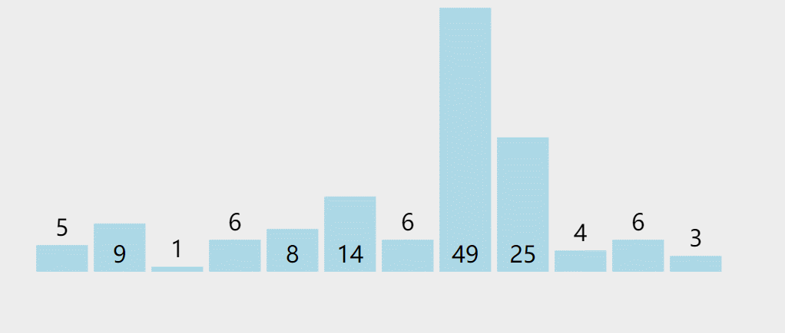
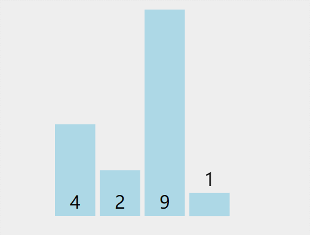

# 冒泡排序

`冒泡排序`是大多数人学的**第一种**排序算法，在面试中，也是问的最多的一种，有时候还要求现场手写排序代码（纯纯的放水，朋友们一定要会写）。

> 冷知识：美国总统奥巴马曾经在公开场合下，手写过快速排序。

冒泡排序属于交换类的排序算法。

## 一、算法介绍

现在有一堆乱序的数，比如：`5 9 1 6 8 14 6 49 25 4 6 3`。(这是一个乱序的数列)

第一轮迭代：从第一个数开始，依次比较相邻的两个数（请注意，是相邻比较两个数，也就是第一个数和第二个数比较，然后第二个数和第三个数比较...），如果前面一个数比后面一个数大，那么交换位置，直到处理到最后一个数，最后的这个数是最大的。

第二轮迭代：因为最后一个数已经是最大了，现在重复第一轮迭代的操作，但是只处理到倒数第二个数。

第三轮迭代：因为最后一个数已经是最大了，最后第二个数是次大的，现在重复第一轮迭代的操作，但是只处理到倒数第三个数。

第N轮迭代：....

图示：



经过交换，最后的结果为：`1 3 4 5 6 6 6 8 9 14 25 49`，我们可以看到已经排好序了。

因为小的元素会慢慢地浮到顶端，很像碳酸饮料的汽泡，会冒上去，所以这就是冒泡排序取名的来源。

### 1.1. 简单例子

举个简单例子，冒泡排序一个 4 个元素的数列：`4 2 9 1`：

```go
[]表示排好序 {}表示比较后交换的结果

第一轮开始： 4 2 9 1 从第一个数开始，4 比 2 大，交换 4，2
第一轮： {2 4} 9 1  接着 4 比 9 小，不交换
第一轮： 2 {4 9} 1  接着 9 比 1 大，交换 9，1
第一轮： 2 4 {1 9}  已经到底，结束
第一轮结果： 2 4 1 [9] 

第二轮开始：2 4 1 [9] 从第一个数开始，2 比 4 小，不交换
第二轮： {2 4} 1 [9] 接着 4 比 1 大，交换 4，1
第二轮： 2 {1 4} [9] 已经到底，结束
第二轮结果： 2 1 [4 9] 

第三轮开始：2 1 [4 9] 从第一个数开始，2 比 1 大，交换 2，1
第三轮： (1 2} [4 9] 已经到底，结束
第三轮结果： 1 [2 4 9] 

结果： [1 2 4 9]
```

第一轮迭代：

首先第一个数 `4` 和第二个数 `2` 比较，因为比后面的数大，所以交换，交换后第二个数为 `4`。

然后第二个数 `4` 和第三个数 `9` 比较，因为比后面的数小，不交换。

接着第三个数 `9` 和第四个数 `1` 比较，因为比后面的数大，交换，到达数列底部。

第一轮迭代结束，这时最后一个数是最大的。

以此反复迭代三次，最后排好序。图示：



### 1.2. 复杂度

当数列的元素数量为 `N`，冒泡排序有两种循环，需要比较的次数为：

```go
第一次比较的次数为： N-1 次
第二次比较的次数为： N-2 次，因为排除了最后的元素
第三次比较的次数为： N-3 次，因为排除了后两个元素
...
第某次比较的次数为：  1 次
```

比较次数：`1 + 2 + 3 + ... + (N-1) = (N^2 - N)/2`，是一个平方级别的时间复杂度，我们可以记为：`O(n^2)`。

交换次数：如果数列在有序的状态下进行冒泡排序，也就是最好情况下，那么交换次数为0，而如果完全乱序，最坏情况下那么交换的次数和比较的次数一样多。

冒泡排序交换和比较的次数相加是一个和 `N` 有关的平方数，所以冒泡排序的最好和最差时间复杂度都是：`O(n^2)`。

冒泡排序算法是稳定的，因为如果两个相邻元素相等，是不会交换的，保证了稳定性的要求。

我们可以改进最好的时间复杂度，使得冒泡排序最好情况的时间复杂度是 `O(n)`，请看下面的算法实现。

## 二、算法实现

```go
package main

import "fmt"

func BubbleSort(list []int) {
	n := len(list)

	// 进行 N-1 轮迭代
	for i := n - 1; i > 0; i-- {
		// 在一轮中有没有交换过
		didSwap := false

		// 每次从第一位开始比较，比较到第 i 位就不比较了，因为前一轮该位已经有序了
		for j := 0; j < i; j++ {
			// 如果前面的数比后面的大，那么交换
			if list[j] > list[j+1] {
				list[j], list[j+1] = list[j+1], list[j]
				didSwap = true
			}
		}

		// 如果在一轮中没有交换过，那么已经排好序了，直接返回
		if !didSwap {
			return
		}
	}
}

func main() {
	list := []int{5, 9, 1, 6, 8, 14, 6, 49, 25, 4, 6, 3}
	BubbleSort(list)
	fmt.Println(list)
}
```

输出：

```
[1 3 4 5 6 6 6 8 9 14 25 49]
```

由于切片 `list` 会原地排序，排序函数不需要返回任何值，处理完后可以直接打印：`fmt.Println(list)`。

大家还有一个疑点，很多编程语言不允许使用：`list[j], list[j+1] = list[j+1], list[j]` 来交换两个值，交换两个值时必须建一个临时变量 `a` 来作为一个过渡，如：

```go
    a := list[j+1]
    list[j+1] = list[j]
    list[j] = a
```

但是 `Golang` 语言允许我们不那么做，它会默认构建一个临时变量来中转。

特殊说明的是：

我们引入了 `didSwap` 的变量，如果在一轮中该变量值没有变化，那么表示数列是有序的，所以不需要交换。也就是说在最好的情况下：对已经排好序的数列进行冒泡排序，只需比较 `N` 次，最好时间复杂度从 `O(n^2)` 骤减为 `O(n)`。

## 三、总结

冒泡排序是效率较低的排序算法，可以说是最慢的排序算法了，我们只需知道它是什么，在实际工作上切勿使用如此之慢的排序算法!

## 附录

代码下载： [https://github.com/hunterhug/goa.c/blob/master/code/sort/bubble.go](https://github.com/hunterhug/goa.c/blob/master/code/sort/bubble.go)  。