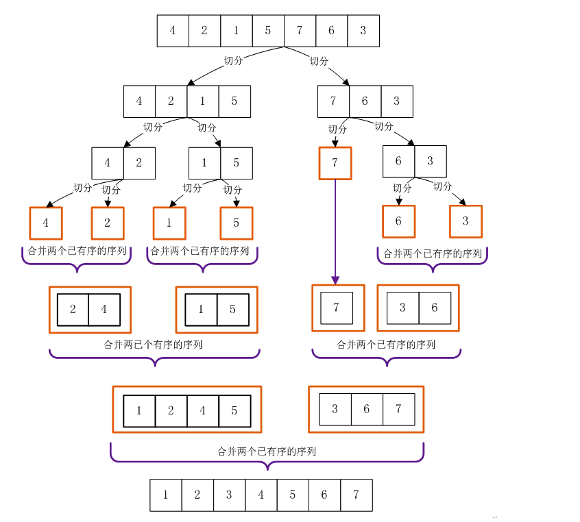
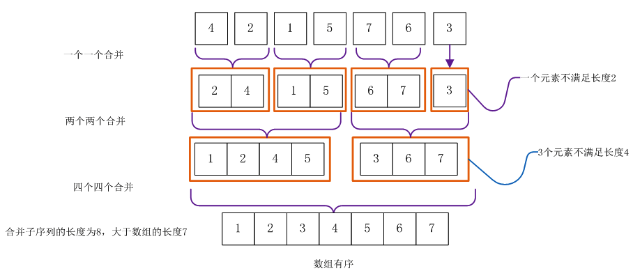
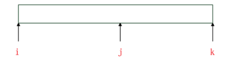
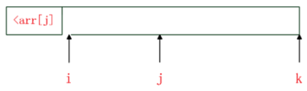
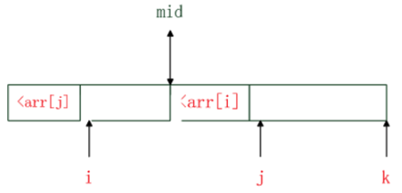

# 归并排序

归并排序是一种分治策略的排序算法。它是一种比较特殊的排序，通过递归地先使每个子序列有序，再将两个有序的序列进行合并成一个有序的序列。

## 一、算法介绍

我们先介绍两个有序的数组合并成一个有序数组的操作。

1. 先申请一个辅助数组，长度等于两个有序数组长度的和。
2. 从两个有序数组的第一位开始，比较两个元素，哪个数组的元素更小，那么该元素添加进辅助数组，然后该数组的元素变更为下一位，继续重复这个操作，直至数组没有元素。
3. 返回辅助数组。

举一个例子：

````
有序数组A：[3 8 9 11 13]
有序数组B：[1 5 8 10 17 19 20 23]
[] 表示比较的范围。

因为 1 < 3，所以 1 加入辅助数组
有序数组A：[3 8 9 11 13]
有序数组B：1 [5 8 10 17 19 20 23] 
辅助数组：1

因为 3 < 5，所以 3 加入辅助数组
有序数组A：3 [8 9 11 13]
有序数组B：1 [5 8 10 17 19 20 23] 
辅助数组：1 3

因为 5 < 8，所以 5 加入辅助数组
有序数组A：3 [8 9 11 13]
有序数组B：1 5 [8 10 17 19 20 23] 
辅助数组：1 3 5

因为 8 == 8，所以 两个数都 加入辅助数组
有序数组A：3 8 [9 11 13]
有序数组B：1 5 8 [10 17 19 20 23] 
辅助数组：1 3 5 8 8

因为 9 < 10，所以 9 加入辅助数组
有序数组A：3 8 9 [11 13]
有序数组B：1 5 8 [10 17 19 20 23] 
辅助数组：1 3 5 8 8 9

因为 10 < 11，所以 10 加入辅助数组
有序数组A：3 8 9 [11 13]
有序数组B：1 5 8 10 [17 19 20 23] 
辅助数组：1 3 5 8 8 9 10

因为 11 < 17，所以 11 加入辅助数组
有序数组A：3 8 9 11 [13]
有序数组B：1 5 8 10 [17 19 20 23] 
辅助数组：1 3 5 8 8 9 10 11

因为 13 < 17，所以 13 加入辅助数组
有序数组A：3 8 9 11 13
有序数组B：1 5 8 10 [17 19 20 23] 
辅助数组：1 3 5 8 8 9 10 11 13

因为数组A已经没有比较元素，将数组B剩下的元素拼接在辅助数组后面。

结果：1 3 5 8 8 9 10 11 13 17 19 20 23
````

将两个有序数组进行合并，最多进行 `n` 次比较就可以生成一个新的有序数组，`n` 是两个数组长度较大的那个。

归并操作最坏的时间复杂度为：`O(n)`，其中 `n` 是较长数组的长度。

归并操作最好的时间复杂度为：`O(n)`，其中 `n` 是较短数组的长度。

正是利用这个特点，归并排序先排序较小的数组，再将有序的小数组合并形成更大有序的数组。

归并排序有两种递归做法，一种是自顶向下，一种是自底向上。

### 1.1. 自顶向下归并排序

从一个大数组开始，不断地往下切分，如图：



从上往下进行递归，直到切分的小数组无法切分了，然后不断地对这些有序数组进行合并。

每次都是一分为二，特别均匀，所以最差和最坏时间复杂度都一样。归并操作的时间复杂度为：`O(n)`，因此总的时间复杂度为：`T(n)=2T(n/2)+O(n)`，根据主定理公式可以知道时间复杂度为：`O(nlogn)`。我们可以自己计算一下：

```
归并排序，每次归并操作比较的次数为两个有序数组的长度： n/2

T(n) = 2*T(n/2) + n/2
T(n/2) = 2*T(n/4) + n/4
T(n/4) = 2*T(n/8) + n/8
T(n/8) = 2*T(n/16) + n/16
...
T(4) = 2*T(2) + 4
T(2) = 2*T(1) + 2
T(1) = 1

进行合并也就是：

T(n) = 2*T(n/2) + n/2
     = 2^2*T(n/4)+ n/2 + n/2
     = 2^3*T(n/8) + n/2 + n/2 + n/2
     = 2^4*T(n/16) + n/2 + n/2 + n/2 + n/2
     = ...
     = 2^logn*T(1) + logn * n/2
     = 2^logn + 1/2*nlogn
     = n + 1/2*nlogn

因为当问题规模 n 趋于无穷大时 nlogn 比 n 大，所以 T(n) = O(nlogn)。

因此时间复杂度为：O(nlogn)。
```

因为不断地递归，程序栈层数会有 `logn` 层，所以递归栈的空间复杂度为：`O(logn)`，对于排序十亿个整数，也只要：`log(100 0000 0000)=29.897`，占用的堆栈层数最多 `30` 层忧。

### 1.2. 自底向上归并排序

从小数组开始排序，不断地合并形成更大的有序数组。



时间复杂度和自顶向上归并排序一样，也都是 `O(nlogn)`。

因为不需要使用递归，没有程序栈占用，因此递归栈的空间复杂度为：`O(1)`。

## 二、算法实现

自顶向下的归并排序递归实现：

```go
package main

import "fmt"

// 自顶向下归并排序，排序范围在 [begin,end) 的数组
func MergeSort(array []int, begin int, end int) {
	// 元素数量大于1时才进入递归
	if end-begin > 1 {

		// 将数组一分为二，分为 array[begin,mid) 和 array[mid,high)
		mid := begin + (end-begin+1)/2

		// 先将左边排序好
		MergeSort(array, begin, mid)

		// 再将右边排序好
		MergeSort(array, mid, end)

		// 两个有序数组进行合并
		merge(array, begin, mid, end)
	}
}

// 归并操作
func merge(array []int, begin int, mid int, end int) {
	// 申请额外的空间来合并两个有序数组，这两个数组是 array[begin,mid),array[mid,end)
	leftSize := mid - begin         // 左边数组的长度
	rightSize := end - mid          // 右边数组的长度
	newSize := leftSize + rightSize // 辅助数组的长度
	result := make([]int, 0, newSize)

	l, r := 0, 0
	for l < leftSize && r < rightSize {
		lValue := array[begin+l] // 左边数组的元素
		rValue := array[mid+r]   // 右边数组的元素
		// 小的元素先放进辅助数组里
		if lValue < rValue {
			result = append(result, lValue)
			l++
		} else {
			result = append(result, rValue)
			r++
		}
	}

	// 将剩下的元素追加到辅助数组后面
	result = append(result, array[begin+l:mid]...)
	result = append(result, array[mid+r:end]...)

	// 将辅助数组的元素复制回原数组，这样该辅助空间就可以被释放掉
	for i := 0; i < newSize; i++ {
		array[begin+i] = result[i]
	}
	return
}

func main() {
	list := []int{5}
	MergeSort(list, 0, len(list))
	fmt.Println(list)

	list1 := []int{5, 9}
	MergeSort(list1, 0, len(list1))
	fmt.Println(list1)

	list2 := []int{5, 9, 1, 6, 8, 14, 6, 49, 25, 4, 6, 3}
	MergeSort(list2, 0, len(list2))
	fmt.Println(list2)
}
```

输出：

```go
[5]
[5 9]
[1 3 4 5 6 6 6 8 9 14 25 49]
```

自顶向下递归排序，我们可以看到每次合并都要申请一个辅助数组，然后合并完再赋值回原数组，这样每次合并后辅助数组的内存就可以释放掉，存储空间占用 `n`，而程序递归栈依旧是 `logn` 层。

自底向上的非递归实现：

```go
package main

import "fmt"

// 自底向上归并排序
func MergeSort2(array []int, begin, end int) {

	// 步数为1开始，step长度的数组表示一个有序的数组
	step := 1

	// 范围大于 step 的数组才可以进入归并
	for end-begin > step {
		// 从头到尾对数组进行归并操作
		// step << 1 = 2 * step 表示偏移到后两个有序数组将它们进行归并
		for i := begin; i < end; i += step << 1 {
			var lo = i                // 第一个有序数组的上界
			var mid = lo + step       // 第一个有序数组的下界，第二个有序数组的上界
			var hi = lo + (step << 1) // 第二个有序数组的下界

			// 不存在第二个数组，直接返回
			if mid > end {
				return
			}

			// 第二个数组长度不够
			if hi > end {
				hi = end
			}

			// 两个有序数组进行合并
			merge(array, lo, mid, hi)
		}

		// 上面的 step 长度的两个数组都归并成一个数组了，现在步长翻倍
		step <<= 1
	}
}

// 归并操作
func merge(array []int, begin int, mid int, end int) {
	// 申请额外的空间来合并两个有序数组，这两个数组是 array[begin,mid),array[mid,end)
	leftSize := mid - begin         // 左边数组的长度
	rightSize := end - mid          // 右边数组的长度
	newSize := leftSize + rightSize // 辅助数组的长度
	result := make([]int, 0, newSize)

	l, r := 0, 0
	for l < leftSize && r < rightSize {
		lValue := array[begin+l] // 左边数组的元素
		rValue := array[mid+r]   // 右边数组的元素
		// 小的元素先放进辅助数组里
		if lValue < rValue {
			result = append(result, lValue)
			l++
		} else {
			result = append(result, rValue)
			r++
		}
	}

	// 将剩下的元素追加到辅助数组后面
	result = append(result, array[begin+l:mid]...)
	result = append(result, array[mid+r:end]...)

	// 将辅助数组的元素复制回原数组，这样该辅助空间就可以被释放掉
	for i := 0; i < newSize; i++ {
		array[begin+i] = result[i]
	}
	return
}

func main() {
	list := []int{5}
	MergeSort2(list, 0, len(list))
	fmt.Println(list)

	list1 := []int{5, 9}
	MergeSort2(list1, 0, len(list1))
	fmt.Println(list1)

	list2 := []int{5, 9, 1, 6, 8, 14, 6, 49, 25, 4, 6, 3}
	MergeSort2(list2, 0, len(list2))
	fmt.Println(list2)
}
```

输出：

```go
[5]
[5 9]
[1 3 4 5 6 6 6 8 9 14 25 49]
```

自底向上非递归排序，我们可以看到没有递归那样程序栈的增加，效率比自顶向上的递归版本高

## 三、算法改进

归并排序归并操作占用了额外的辅助数组，且归并操作是从一个元素的数组开始。

我们可以做两点改进：

1. 对于小规模数组，使用直接插入排序。
2. 原地排序，节约掉辅助数组空间的占用。

我们建议使用自底向上非递归排序，不会有程序栈空间损耗。

我们先来介绍一种翻转算法，也叫手摇算法，主要用来对数组两部分进行位置互换，比如数组： `[9,8,7,1,2,3]`，将前三个元素与后面的三个元素交换位置，变成 `[1,2,3,9,8,7]`。

再比如，将字符串 `abcde1234567` 的前 `5` 个字符与后面的字符交换位置，那么手摇后变成：`1234567abcde`。

如何翻转呢？

1. 将前部分逆序
2. 将后部分逆序
3. 对整体逆序

示例如下：

```
翻转 [1234567abcde] 的前5个字符。

1. 分成两部分：[abcde][1234567]
2. 分别逆序变成：[edcba][7654321]
3. 整体逆序：[1234567abcde]
```

归并原地排序利用了手摇算法的特征，不需要额外的辅助数组。

首先，两个有序的数组，分别是 `arr[begin,mid-1]，arr[mid,end]`，此时初始化 `i=begin`，`j=mid`，`k=end`，从 `i~j` 为左有序的数组，`k~j`为右有序的数组，如图：



将 `i` 向后移动，找到第一个 `arr[i]>arr[j]`的索引，这个时候，`i` 前面的部分已经排好序了，`begin~i` 这些元素已经是两个有序数组的前 `n` 小个元素。如图：



然后将 `j` 向后移动，找到第一个 `arr[j]>arr[i]`的索引，如图：



这个时候，`mid~j` 中的元素都小于 `arr[i]`，前面已经知道从 `begin~i` 已经是前 `n` 小了，所以这两部分 `begin~i，mid~j` 也是有序的了，我们要想办法将这两部分连接在一起。

我们只需进行翻转，将 `i~mid` 和 `mid,j-1` 部分进行位置互换即可，我们可以用手摇算法。

具体的代码如下：

```go
package main

import "fmt"

func InsertSort(list []int) {
	n := len(list)
	// 进行 N-1 轮迭代
	for i := 1; i <= n-1; i++ {
		deal := list[i] // 待排序的数
		j := i - 1      // 待排序的数左边的第一个数的位置

		// 如果第一次比较，比左边的已排好序的第一个数小，那么进入处理
		if deal < list[j] {
			// 一直往左边找，比待排序大的数都往后挪，腾空位给待排序插入
			for ; j >= 0 && deal < list[j]; j-- {
				list[j+1] = list[j] // 某数后移，给待排序留空位
			}
			list[j+1] = deal // 结束了，待排序的数插入空位
		}
	}
}

// 自底向上归并排序优化版本
func MergeSort3(array []int, n int) {
	// 按照三个元素为一组进行小数组排序，使用直接插入排序
	blockSize := 3
	a, b := 0, blockSize
	for b <= n {
		InsertSort(array[a:b])
		a = b
		b += blockSize
	}
	InsertSort(array[a:n])

	// 将这些小数组进行归并
	for blockSize < n {
		a, b = 0, 2*blockSize
		for b <= n {
			merge(array, a, a+blockSize, b)
			a = b
			b += 2 * blockSize
		}
		if m := a + blockSize; m < n {
			merge(array, a, m, n)
		}
		blockSize *= 2
	}
}

// 原地归并操作
func merge(array []int, begin, mid, end int) {
	// 三个下标，将数组 array[begin,mid] 和 array[mid,end-1]进行原地归并
	i, j, k := begin, mid, end-1 // 因为数组下标从0开始，所以 k = end-1

	for j-i > 0 && k-j >= 0 {
		step := 0
		// 从 i 向右移动，找到第一个 array[i]>array[j]的索引
		for j-i > 0 && array[i] <= array[j] {
			i++
		}

		// 从 j 向右移动，找到第一个 array[j]>array[i]的索引
		for k-j >= 0 && array[j] <= array[i] {
			j++
			step++
		}

		// 进行手摇翻转，将 array[i,mid] 和 [mid,j-1] 进行位置互换
		// mid 是从 j 开始向右出发的，所以 mid = j-step
		rotation(array, i, j-step, j-1)
		i = i + step
	}

}

// 手摇算法，将 array[l,l+1,l+2,...,mid-2,mid-1,mid,mid+1,mid+2,...,r-2,r-1,r] 从mid开始两边交换位置
// 1.先逆序前部分：array[mid-1,mid-2,...,l+2,l+1,l]
// 2.后逆序后部分：array[r,r-1,r-2,...,mid+2,mid+1,mid]
// 3.上两步完成后：array[mid-1,mid-2,...,l+2,l+1,l,r,r-1,r-2,...,mid+2,mid+1,mid]
// 4.整体逆序： array[mid,mid+1,mid+2,...,r-2,r-1,r,l,l+1,l+2,...,mid-2,mid-1]
func rotation(array []int, l, mid, r int) {
	reverse(array, l, mid-1)
	reverse(array, mid, r)
	reverse(array, l, r)
}

func reverse(array []int, l, r int) {
	for l < r {
		// 左右互相交换
		array[l], array[r] = array[r], array[l]
		l++
		r--
	}
}

func main() {
	list := []int{5}
	MergeSort3(list, len(list))
	fmt.Println(list)

	list1 := []int{5, 9}
	MergeSort3(list1, len(list1))
	fmt.Println(list1)

	list2 := []int{5, 9, 1, 6, 8, 14, 6, 49, 25, 4, 6, 3}
	MergeSort3(list2, len(list2))
	fmt.Println(list2)

	list3 := []int{5, 9, 1, 6, 8, 14, 6, 49, 25, 4, 6, 3, 45, 67, 2, 5, 24, 56, 34, 24, 56, 2, 2, 21, 4, 1, 4, 7, 9}
	MergeSort3(list3, len(list3))
	fmt.Println(list3)
}
```

输出：

```
[5]
[5 9]
[1 3 4 5 6 6 6 8 9 14 25 49]
[1 1 2 2 2 3 4 4 4 5 5 6 6 6 7 8 9 9 14 21 24 24 25 34 45 49 56 56 67]
```

我们自底开始，将元素按照数量为 `blockSize` 进行小数组排序，使用直接插入排序，然后我们对这些有序的数组向上进行归并操作。

归并过程中，使用原地归并，用了手摇算法，代码如下：

```go
func rotation(array []int, l, mid, r int) {
	reverse(array, l, mid-1)
	reverse(array, mid, r)
	reverse(array, l, r)
}
```

因为手摇只多了逆序翻转的操作，时间复杂度是 `O(n)`，虽然时间复杂度稍稍多了一点，但存储空间复杂度降为了 `O(1)`。

归并排序是唯一一个有稳定性保证的高级排序算法，某些时候，为了寻求大规模数据下排序前后，相同元素位置不变，可以使用归并排序。