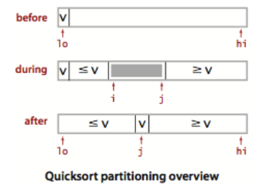
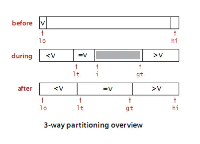

# 快速排序

快速排序是一种分治策略的排序算法，是由英国计算机科学家 `Tony Hoare` 发明的， 该算法被发布在 `1961` 年的 `Communications of the ACM 月刊`。

快速排序是对冒泡排序的一种改进，也属于交换类的排序算法。

## 一、算法介绍

快速排序通过一趟排序将要排序的数据分割成独立的两部分，其中一部分的所有数据都比另外一部分的所有数据都要小，然后再按此方法对这两部分数据分别进行快速排序，整个排序过程可以递归进行，以此达到整个数据变成有序序列。

步骤如下：

1. 先从数列中取出一个数作为基准数。一般取第一个数。
2. 分区过程，将比这个数大的数全放到它的右边，小于或等于它的数全放到它的左边。
3. 再对左右区间重复第二步，直到各区间只有一个数。

举一个例子：`5 9 1 6 8 14 6 49 25 4 6 3`。

```
一般取第一个数 5 作为基准，从它左边和最后一个数使用[]进行标志，

如果左边的数比基准数大，那么该数要往右边扔，也就是两个[]数交换，这样大于它的数就在右边了，然后右边[]数左移，否则左边[]数右移。

5 [9] 1 6 8 14 6 49 25 4 6 [3]  因为 9 > 5，两个[]交换位置后，右边[]左移
5 [3] 1 6 8 14 6 49 25 4 [6] 9  因为 3 !> 5，两个[]不需要交换，左边[]右移
5 3 [1] 6 8 14 6 49 25 4 [6] 9  因为 1 !> 5，两个[]不需要交换，左边[]右移
5 3 1 [6] 8 14 6 49 25 4 [6] 9  因为 6 > 5，两个[]交换位置后，右边[]左移
5 3 1 [6] 8 14 6 49 25 [4] 6 9  因为 6 > 5，两个[]交换位置后，右边[]左移
5 3 1 [4] 8 14 6 49 [25] 6 6 9  因为 4 !> 5，两个[]不需要交换，左边[]右移
5 3 1 4 [8] 14 6 49 [25] 6 6 9  因为 8 > 5，两个[]交换位置后，右边[]左移
5 3 1 4 [25] 14 6 [49] 8 6 6 9  因为 25 > 5，两个[]交换位置后，右边[]左移
5 3 1 4 [49] 14 [6] 25 8 6 6 9  因为 49 > 5，两个[]交换位置后，右边[]左移
5 3 1 4 [6] [14] 49 25 8 6 6 9  因为 6 > 5，两个[]交换位置后，右边[]左移
5 3 1 4 [14] 6 49 25 8 6 6 9  两个[]已经汇总，因为 14 > 5，所以 5 和[]之前的数 4 交换位置
第一轮切分结果：4 3 1 5 14 6 49 25 8 6 6 9  

现在第一轮快速排序已经将数列分成两个部分：

4 3 1 和 14 6 49 25 8 6 6 9

左边的数列都小于 5，右边的数列都大于 5。

使用递归分别对两个数列进行快速排序。
```

快速排序主要靠基准数进行切分，将数列分成两部分，一部分比基准数都小，一部分比基准数都大。

在最好情况下，每一轮都能平均切分，这样遍历元素只要 `n/2` 次就可以把数列分成两部分，每一轮的时间复杂度都是：`O(n)`。因为问题规模每次被折半，折半的数列继续递归进行切分，也就是总的时间复杂度计算公式为： `T(n) = 2*T(n/2) + O(n)`。按照主定理公式计算，我们可以知道时间复杂度为：`O(nlogn)`，当然我们可以来具体计算一下：

```
我们来分析最好情况，每次切分遍历元素的次数为 n/2

T(n) = 2*T(n/2) + n/2
T(n/2) = 2*T(n/4) + n/4
T(n/4) = 2*T(n/8) + n/8
T(n/8) = 2*T(n/16) + n/16
...
T(4) = 2*T(2) + 4
T(2) = 2*T(1) + 2
T(1) = 1

进行合并也就是：

T(n) = 2*T(n/2) + n/2
     = 2^2*T(n/4)+ n/2 + n/2
     = 2^3*T(n/8) + n/2 + n/2 + n/2
     = 2^4*T(n/16) + n/2 + n/2 + n/2 + n/2
     = ...
     = 2^logn*T(1) + logn * n/2
     = 2^logn + 1/2*nlogn
     = n + 1/2*nlogn

因为当问题规模 n 趋于无穷大时 nlogn 比 n 大，所以 T(n) = O(nlogn)。

最好时间复杂度为：O(nlogn)。
```

最差的情况下，每次都不能平均地切分，每次切分都因为基准数是最大的或者最小的，不能分成两个数列，这样时间复杂度变为了 `T(n) = T(n-1) + O(n)`，按照主定理计算可以知道时间复杂度为：`O(n^2)`，我们可以来实际计算一下：

```
我们来分析最差情况，每次切分遍历元素的次数为 n

T(n) = T(n-1) + n
     = T(n-2) + n-1 + n
     = T(n-3) + n-2 + n-1 + n
     = ...
     = T(1) + 2 +3 + ... + n-2 + n-1 + n
     = O(n^2)

最差时间复杂度为：O(n^2)。
```

根据熵的概念，数量越大，随机性越高，越自发无序，所以待排序数据规模非常大时，出现最差情况的情形较少。在综合情况下，快速排序的平均时间复杂度为：`O(nlogn)`。

为了避免切分非常不均匀情况的发生，有几种方法：

1. 每次进行快速排序切分时，先将数列随机打乱，再进行快速排序，这样随机加了个震荡，减少不均匀的情况。当然，也可以随机选择一个基准数，而不是选第一个数。
2. 每次取数列头部，中部，尾部三个数，取三个数的中位数进行切分。

方法 1 相对好，而方法 2 引入了额外的比较操作。

对比之前介绍的排序算法，快速排序是综合最好的，平均情况下时间复杂度是 `O(nlogn)`，比那些平方级别的初级排序算法更佳，这也是为什么大部分编程语言内置排序都使用它的原因。

快速排序使用原地排序，存储空间复杂度为：`O(1)`。而因为递归栈的影响，递归的程序栈开辟的层数范围在 `logn~n`，所以递归栈的空间复杂度为：`O(logn)~log(n)`，最坏为：`log(n)`，当元素较多时，程序栈可能溢出。通过改进算法，使用伪尾递归进行优化，递归栈的空间复杂度可以减小到 `O(logn)`，可以见下面算法优化。

快速排序是不稳定的，因为切分过程中进行了交换，相同值的元素可能发生位置变化。

## 二、算法实现

```go
package main

import "fmt"

// 普通快速排序
func QuickSort(array []int, begin, end int) {
	if begin < end {
		// 进行切分
		loc := partition(array, begin, end)
		// 对左部分进行快排
		QuickSort(array, begin, loc-1)
		// 对右部分进行快排
		QuickSort(array, loc+1, end)
	}
}

// 切分函数，并返回切分元素的下标
func partition(array []int, begin, end int) int {
	i := begin + 1 // 将array[begin]作为基准数，因此从array[begin+1]开始与基准数比较！
	j := end       // array[end]是数组的最后一位

	// 没重合之前
	for i < j {
		if array[i] > array[begin] {
			array[i], array[j] = array[j], array[i] // 交换
			j--
		} else {
			i++
		}
	}

	/* 跳出while循环后，i = j。
	 * 此时数组被分割成两个部分  -->  array[begin+1] ~ array[i-1] < array[begin]
	 *                        -->  array[i+1] ~ array[end] > array[begin]
	 * 这个时候将数组array分成两个部分，再将array[i]与array[begin]进行比较，决定array[i]的位置。
	 * 最后将array[i]与array[begin]交换，进行两个分割部分的排序！以此类推，直到最后i = j不满足条件就退出！
	 */
	if array[i] >= array[begin] { // 这里必须要取等“>=”，否则数组元素由相同的值组成时，会出现错误！
		i--
	}

	array[begin], array[i] = array[i], array[begin]
	return i
}

func main() {
	list := []int{5}
	QuickSort(list, 0, len(list)-1)
	fmt.Println(list)

	list1 := []int{5, 9}
	QuickSort(list1, 0, len(list1)-1)
	fmt.Println(list1)

	list2 := []int{5, 9, 1}
	QuickSort(list2, 0, len(list2)-1)
	fmt.Println(list2)

	list3 := []int{5, 9, 1, 6, 8, 14, 6, 49, 25, 4, 6, 3}
	QuickSort(list3, 0, len(list3)-1)
	fmt.Println(list3)
}
```

输出：

```go
[5]
[5 9]
[1 5 9]
[1 3 4 5 6 6 6 8 9 14 25 49]
```

示例图：



快速排序，每一次切分都维护两个下标，进行推进，最后将数列分成两部分。

## 三、算法改进

快速排序可以继续进行算法改进。

1. 在小规模数组的情况下，直接插入排序的效率最好，当快速排序递归部分进入小数组范围，可以切换成直接插入排序。
2. 排序数列可能存在大量重复值，使用三向切分快速排序，将数组分成三部分，大于基准数，等于基准数，小于基准数，这个时候需要维护三个下标。
3. 使用伪尾递归减少程序栈空间占用，使得栈空间复杂度从 `O(logn)~log(n)` 变为：`O(logn)`。

### 3.1 改进：小规模数组使用直接插入排序

```go
func QuickSort1(array []int, begin, end int) {
	if begin < end {
		// 当数组小于 4 时使用直接插入排序
		if end-begin <= 4 {
			InsertSort(array[begin : end+1])
			return
		}

		// 进行切分
		loc := partition(array, begin, end)
		// 对左部分进行快排
		QuickSort1(array, begin, loc-1)
		// 对右部分进行快排
		QuickSort1(array, loc+1, end)
	}
}
```

我们只需将 `end-begin <= 4` 的递归部分换成直接插入排序，这部分表示小数组排序。

### 3.2 改进：三向切分

```go
package main

import "fmt"

// 三切分的快速排序
func QuickSort2(array []int, begin, end int) {
	if begin < end {
		// 三向切分函数，返回左边和右边下标
		lt, gt := partition3(array, begin, end)
		// 从lt到gt的部分是三切分的中间数列
		// 左边三向快排
		QuickSort2(array, begin, lt-1)
		// 右边三向快排
		QuickSort2(array, gt+1, end)
	}
}

// 切分函数，并返回切分元素的下标
func partition3(array []int, begin, end int) (int, int) {
	lt := begin       // 左下标从第一位开始
	gt := end         // 右下标是数组的最后一位
	i := begin + 1    // 中间下标，从第二位开始
	v := array[begin] // 基准数

	// 以中间坐标为准
	for i <= gt {
		if array[i] > v { // 大于基准数，那么交换，右指针左移
			array[i], array[gt] = array[gt], array[i]
			gt--
		} else if array[i] < v { // 小于基准数，那么交换，左指针右移
			array[i], array[lt] = array[lt], array[i]
			lt++
			i++
		} else {
			i++
		}
	}

	return lt, gt
}
```

演示：

```
数列：4 8 2 4 4 4 7 9，基准数为 4

[4] [8] 2 4 4 4 7 [9]  从中间[]开始：8 > 4，中右[]进行交换，右边[]左移
[4] [9] 2 4 4 4 [7] 8  从中间[]开始：9 > 4，中右[]进行交换，右边[]左移
[4] [7] 2 4 4 [4] 9 8  从中间[]开始：7 > 4，中右[]进行交换，右边[]左移
[4] [4] 2 4 [4] 7 9 8  从中间[]开始：4 == 4，不需要交换，中间[]右移
[4] 4 [2] 4 [4] 7 9 8  从中间[]开始：2 < 4，中左[]需要交换，中间和左边[]右移
2 [4] 4 [4] [4] 7 9 8  从中间[]开始：4 == 4，不需要交换，中间[]右移
2 [4] 4 4 [[4]] 7 9 8  从中间[]开始：4 == 4，不需要交换，中间[]右移，因为已经重叠了
第一轮结果：2 4 4 4 4 7 9 8

分成三个数列：

2
4 4 4 4 (元素相同的会聚集在中间数列)
7 9 8

接着对第一个和最后一个数列进行递归即可。
```

示例图：



三切分，把小于基准数的扔到左边，大于基准数的扔到右边，相同的元素会进行聚集。

如果存在大量重复元素，排序速度将极大提高，将会是线性时间，因为相同的元素将会聚集在中间，这些元素不再进入下一个递归迭代。

### 3.3 改进：伪尾递归优化

```go
// 伪尾递归快速排序
func QuickSort3(array []int, begin, end int) {
	for begin < end {
		// 进行切分
		loc := partition(array, begin, end)

		// 那边元素少先排哪边
		if loc-begin < end-loc {
			// 先排左边
			QuickSort3(array, begin, loc-1)
			begin = loc + 1
		} else {
			// 先排右边
			QuickSort3(array, loc+1, end)
			end = loc - 1
		}
	}
}
```

很多人以为这样子是尾递归。其实这样的快排写法是伪装的尾递归，不是真正的尾递归，因为有 `for` 循环，不是直接 `return QuickSort`，递归还是不断地压栈，栈的层次仍然不断地增长。

但是，因为先让规模小的部分排序，栈的深度大大减少，程序栈最深不会超过 `logn` 层，这样堆栈最坏空间复杂度从 `O(n)` 降为 `O(logn)`。

这种优化也是一种很好的优化，因为栈的层数减少了，对于排序十亿个整数，也只要：`log(100 0000 0000)=29.897`，占用的堆栈层数最多 `30` 层，比不进行优化，可能出现的 `O(n)` 常数层好很多。

## 四、补充：非递归写法

非递归写法仅仅是将之前的递归栈转化为自己维持的手工栈。

```go
// 非递归快速排序
func QuickSort5(array []int) {

	// 人工栈
	helpStack := new(LinkStack)

	// 第一次初始化栈，推入下标0，len(array)-1，表示第一次对全数组范围切分
	helpStack.Push(len(array) - 1)
	helpStack.Push(0)

	// 栈非空证明存在未排序的部分
	for !helpStack.IsEmpty() {
		// 出栈，对begin-end范围进行切分排序
		begin := helpStack.Pop() // 范围区间左边
		end := helpStack.Pop()   // 范围

		// 进行切分
		loc := partition(array, begin, end)

		// 右边范围入栈
		if loc+1 < end {
			helpStack.Push(end)
			helpStack.Push(loc + 1)
		}

		// 左边返回入栈
		if begin < loc-1 {
			helpStack.Push(loc - 1)
			helpStack.Push(begin)
		}
	}
}
```

本来需要进行递归的数组范围 `begin,end`，不使用递归，依次推入自己的人工栈，然后循环对人工栈进行处理。

我们可以看到没有递归，程序栈空间复杂度变为了：`O(1)`，但额外的存储空间产生了。

辅助人工栈结构 `helpStack` 占用了额外的空间，存储空间由原地排序的 `O(1)` 变成了 `O(logn)~log(n)`。

我们可以参考上面的伪尾递归版本，继续优化非递归版本，先让短一点的范围入栈，这样存储复杂度可以变为：`O(logn)`。如：

```
// 非递归快速排序优化
func QuickSort6(array []int) {

	// 人工栈
	helpStack := new(LinkStack)

	// 第一次初始化栈，推入下标0，len(array)-1，表示第一次对全数组范围切分
	helpStack.Push(len(array) - 1)
	helpStack.Push(0)

	// 栈非空证明存在未排序的部分
	for !helpStack.IsEmpty() {
		// 出栈，对begin-end范围进行切分排序
		begin := helpStack.Pop() // 范围区间左边
		end := helpStack.Pop()   // 范围

		// 进行切分
		loc := partition(array, begin, end)

		// 切分后右边范围大小
		rSize := -1
		// 切分后左边范围大小
		lSize := -1

		// 右边范围入栈
		if loc+1 < end {
			rSize = end - (loc + 1)
		}

		// 左边返回入栈
		if begin < loc-1 {
			lSize = loc - 1 - begin
		}

		// 两个范围，让范围小的先入栈，减少人工栈空间
		if rSize != -1 && lSize != -1 {
			if lSize > rSize {
				helpStack.Push(end)
				helpStack.Push(loc + 1)
				helpStack.Push(loc - 1)
				helpStack.Push(begin)
			} else {
				helpStack.Push(loc - 1)
				helpStack.Push(begin)
				helpStack.Push(end)
				helpStack.Push(loc + 1)
			}
		} else {
			if rSize != -1 {
				helpStack.Push(end)
				helpStack.Push(loc + 1)
			}

			if lSize != -1 {
				helpStack.Push(loc - 1)
				helpStack.Push(begin)
			}
		}
	}
}
```

完整的程序如下：

```go
package main

import (
	"fmt"
	"sync"
)

// 链表栈，后进先出
type LinkStack struct {
	root *LinkNode  // 链表起点
	size int        // 栈的元素数量
	lock sync.Mutex // 为了并发安全使用的锁
}

// 链表节点
type LinkNode struct {
	Next  *LinkNode
	Value int
}

// 入栈
func (stack *LinkStack) Push(v int) {
	stack.lock.Lock()
	defer stack.lock.Unlock()

	// 如果栈顶为空，那么增加节点
	if stack.root == nil {
		stack.root = new(LinkNode)
		stack.root.Value = v
	} else {
		// 否则新元素插入链表的头部
		// 原来的链表
		preNode := stack.root

		// 新节点
		newNode := new(LinkNode)
		newNode.Value = v

		// 原来的链表链接到新元素后面
		newNode.Next = preNode

		// 将新节点放在头部
		stack.root = newNode
	}

	// 栈中元素数量+1
	stack.size = stack.size + 1
}

// 出栈
func (stack *LinkStack) Pop() int {
	stack.lock.Lock()
	defer stack.lock.Unlock()

	// 栈中元素已空
	if stack.size == 0 {
		panic("empty")
	}

	// 顶部元素要出栈
	topNode := stack.root
	v := topNode.Value

	// 将顶部元素的后继链接链上
	stack.root = topNode.Next

	// 栈中元素数量-1
	stack.size = stack.size - 1

	return v
}

// 栈是否为空
func (stack *LinkStack) IsEmpty() bool {
	return stack.size == 0
}

// 非递归快速排序
func QuickSort5(array []int) {

	// 人工栈
	helpStack := new(LinkStack)

	// 第一次初始化栈，推入下标0，len(array)-1，表示第一次对全数组范围切分
	helpStack.Push(len(array) - 1)
	helpStack.Push(0)

	// 栈非空证明存在未排序的部分
	for !helpStack.IsEmpty() {
		// 出栈，对begin-end范围进行切分排序
		begin := helpStack.Pop() // 范围区间左边
		end := helpStack.Pop()   // 范围

		// 进行切分
		loc := partition(array, begin, end)

		// 右边范围入栈
		if loc+1 < end {
			helpStack.Push(end)
			helpStack.Push(loc + 1)
		}

		// 左边返回入栈
		if begin < loc-1 {
			helpStack.Push(loc - 1)
			helpStack.Push(begin)
		}
	}
}

// 非递归快速排序优化
func QuickSort6(array []int) {

	// 人工栈
	helpStack := new(LinkStack)

	// 第一次初始化栈，推入下标0，len(array)-1，表示第一次对全数组范围切分
	helpStack.Push(len(array) - 1)
	helpStack.Push(0)

	// 栈非空证明存在未排序的部分
	for !helpStack.IsEmpty() {
		// 出栈，对begin-end范围进行切分排序
		begin := helpStack.Pop() // 范围区间左边
		end := helpStack.Pop()   // 范围

		// 进行切分
		loc := partition(array, begin, end)

		// 切分后右边范围大小
		rSize := -1
		// 切分后左边范围大小
		lSize := -1

		// 右边范围入栈
		if loc+1 < end {
			rSize = end - (loc + 1)
		}

		// 左边返回入栈
		if begin < loc-1 {
			lSize = loc - 1 - begin
		}

		// 两个范围，让范围小的先入栈，减少人工栈空间
		if rSize != -1 && lSize != -1 {
			if lSize > rSize {
				helpStack.Push(end)
				helpStack.Push(loc + 1)
				helpStack.Push(loc - 1)
				helpStack.Push(begin)
			} else {
				helpStack.Push(loc - 1)
				helpStack.Push(begin)
				helpStack.Push(end)
				helpStack.Push(loc + 1)
			}
		} else {
			if rSize != -1 {
				helpStack.Push(end)
				helpStack.Push(loc + 1)
			}

			if lSize != -1 {
				helpStack.Push(loc - 1)
				helpStack.Push(begin)
			}
		}
	}
}

// 切分函数，并返回切分元素的下标
func partition(array []int, begin, end int) int {
	i := begin + 1 // 将array[begin]作为基准数，因此从array[begin+1]开始与基准数比较！
	j := end       // array[end]是数组的最后一位

	// 没重合之前
	for i < j {
		if array[i] > array[begin] {
			array[i], array[j] = array[j], array[i] // 交换
			j--
		} else {
			i++
		}
	}

	/* 跳出while循环后，i = j。
	 * 此时数组被分割成两个部分  -->  array[begin+1] ~ array[i-1] < array[begin]
	 *                        -->  array[i+1] ~ array[end] > array[begin]
	 * 这个时候将数组array分成两个部分，再将array[i]与array[begin]进行比较，决定array[i]的位置。
	 * 最后将array[i]与array[begin]交换，进行两个分割部分的排序！以此类推，直到最后i = j不满足条件就退出！
	 */
	if array[i] >= array[begin] { // 这里必须要取等“>=”，否则数组元素由相同的值组成时，会出现错误！
		i--
	}

	array[begin], array[i] = array[i], array[begin]
	return i
}

func main() {
	list3 := []int{5, 9, 1, 6, 8, 14, 6, 49, 25, 4, 6, 3}
	QuickSort5(list3)
	fmt.Println(list3)

	list4 := []int{5, 9, 1, 6, 8, 14, 6, 49, 25, 4, 6, 3}
	QuickSort6(list4)
	fmt.Println(list4)
}
```

输出：

```go
[1 3 4 5 6 6 6 8 9 14 25 49]
[1 3 4 5 6 6 6 8 9 14 25 49]
```

使用人工栈替代递归的程序栈，换汤不换药，速度并没有什么变化，但是代码可读性降低。