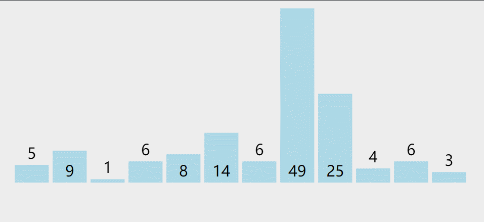
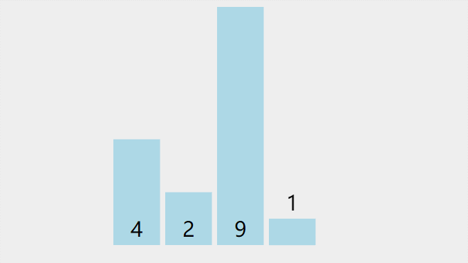

# 选择排序

选择排序，一般我们指的是简单选择排序，也可以叫直接选择排序，它不像冒泡排序一样相邻地交换元素，而是通过选择最小的元素，每轮迭代只需交换一次。虽然交换次数比冒泡少很多，但效率和冒泡排序一样的糟糕。

选择排序属于选择类排序算法。

我打扑克牌的时候，会习惯性地从左到右扫描，然后将最小的牌放在最左边，然后从第二张牌开始继续从左到右扫描第二小的牌，放在最小的牌右边，以此反复。选择排序和我玩扑克时的排序特别相似。

## 一、算法介绍

现在有一堆乱序的数，比如：`5 9 1 6 8 14 6 49 25 4 6 3`。

第一轮迭代，从第一个数开始，左边到右边进行扫描，找到最小的数 1，与数列里的第一个数交换位置。

第二轮迭代，从第二个数开始，左边到右边进行扫描，找到第二小的数 3，与数列里的第二个数交换位置。

第三轮迭代，从第三个数开始，左边到右边进行扫描，找到第三小的数 4，与数列里的第三个数交换位置。

第N轮迭代：....

经过交换，最后的结果为：`1 3 4 5 6 6 6 8 9 14 25 49`，我们可以看到已经排好序了。



> 注：
>
> * 橙色表示已完成排序的元素
> * 红色表示标记当前（最小/需要交换）元素
> * 绿色表示扫描元素

每次扫描数列找出最小的数，然后与第一个数交换，然后排除第一个数，从第二个数开始重复这个操作，这种排序叫做简单选择排序。

举个简单例子，选择排序一个 4 个元素的数列：`4 2 9 1`：

```go
[]表示排好序

起始： 4 2 9 1  未排序数列从左扫描最小的数是 1，与第一个元素 4 交换，交换 1，4
一轮： [1] 2 9 4 未排序数列从左扫描最小的数是 2，不需要交换
二轮： [1 2] 9 4 未排序数列从左扫描最小的数是 4，与第三个元素 9 交换，交换 4，9
三轮： [1 2 4] 9 未排序数列只有 1 个数，结束
结果： [1 2 4 9]
```



> 注：
>
> * 橙色表示已完成排序的元素
> * 红色表示标记当前（最小/需要交换）元素
> * 绿色表示扫描元素

比较的次数和冒泡排序一样多，因为扫描过程也是比较的过程，只不过交换的次数减少为每轮 1 次。最佳和最坏时间复杂度仍然是：`O(n^2)`。

选择排序是一个不稳定的排序算法，比如数组：`[5 6 5 1]`，第一轮迭代时最小的数是 `1`，那么与第一个元素 `5` 交换位置，这样数字 `1` 就和数字 `5` 交换了位置，导致两个相同的数字 `5` 排序后位置变了。

## 二、算法实现

```go
package main

import "fmt"

func SelectSort(list []int) {
	n := len(list)
	// 进行 N-1 轮迭代
	for i := 0; i < n-1; i++ {
		// 每次从第 i 位开始，找到最小的元素
		min := list[i] // 最小数
		minIndex := i  // 最小数的下标
		for j := i + 1; j < n; j++ {
			if list[j] < min {
				// 如果找到的数比上次的还小，那么最小的数变为它
				min = list[j]
				minIndex = j
			}
		}

		// 这一轮找到的最小数的下标不等于最开始的下标，交换元素
		if i != minIndex {
			list[i], list[minIndex] = list[minIndex], list[i]
		}
	}
}

func main() {
	list := []int{5, 9, 1, 6, 8, 14, 6, 49, 25, 4, 6, 3}
	SelectSort(list)
	fmt.Println(list)
}
```

每进行一轮迭代，我们都会维持这一轮最小数：`min` 和最小数的下标：`minIndex`，然后开始扫描，如果扫描的数比该数小，那么替换掉最小数和最小数下标，扫描完后判断是否应交换，然后交换：`list[i], list[minIndex] = list[minIndex], list[i]`。

## 三、算法改进

上面的算法需要从某个数开始，一直扫描到尾部，我们可以优化算法，使得复杂度减少一半。

我们每一轮，除了找最小数之外，还找最大数，然后分别和前面和后面的元素交换，这样循环次数减少一半，如：


```go
package main

import "fmt"

func SelectGoodSort(list []int) {
	n := len(list)

	// 只需循环一半
	for i := 0; i < n/2; i++ {
		minIndex := i // 最小值下标
		maxIndex := i // 最大值下标

		// 在这一轮迭代中要找到最大值和最小值的下标
		for j := i + 1; j < n-i; j++ {
			// 找到最大值下标
			if list[j] > list[maxIndex] {
				maxIndex = j // 这一轮这个是大的，直接 continue
				continue
			}
			// 找到最小值下标
			if list[j] < list[minIndex] {
				minIndex = j
			}
		}

		if maxIndex == i && minIndex != n-i-1 {
			// 如果最大值是开头的元素，而最小值不是最尾的元素
			// 先将最大值和最尾的元素交换
			list[n-i-1], list[maxIndex] = list[maxIndex], list[n-i-1]
			// 然后最小的元素放在最开头
			list[i], list[minIndex] = list[minIndex], list[i]
		} else if maxIndex == i && minIndex == n-i-1 {
			// 如果最大值在开头，最小值在结尾，直接交换
			list[minIndex], list[maxIndex] = list[maxIndex], list[minIndex]
		} else {
			// 否则先将最小值放在开头，再将最大值放在结尾
			list[i], list[minIndex] = list[minIndex], list[i]
			list[n-i-1], list[maxIndex] = list[maxIndex], list[n-i-1]
		}
	}
}

func main() {
	list := []int{5}
	SelectGoodSort(list)
	fmt.Println(list)

	list1 := []int{5, 9}
	SelectGoodSort(list1)
	fmt.Println(list1)

	list2 := []int{5, 9, 1}
	SelectGoodSort(list2)
	fmt.Println(list2)

	list3 := []int{5, 9, 1, 6, 8, 14, 6, 49, 25, 4, 6, 3}
	SelectGoodSort(list3)
	fmt.Println(list3)

	list4 := []int{5, 9, 1, 6, 8, 14, 6, 49, 25, 4, 6}
	SelectGoodSort(list4)
	fmt.Println(list4)
}
```

输出：

```go
[5]
[5 9]
[1 5 9]
[1 3 4 5 6 6 6 8 9 14 25 49]
[1 4 5 6 6 6 8 9 14 25 49]
```

优化后的选择排序还是很慢，它很好理解，但是还是不建议在工程上使用。