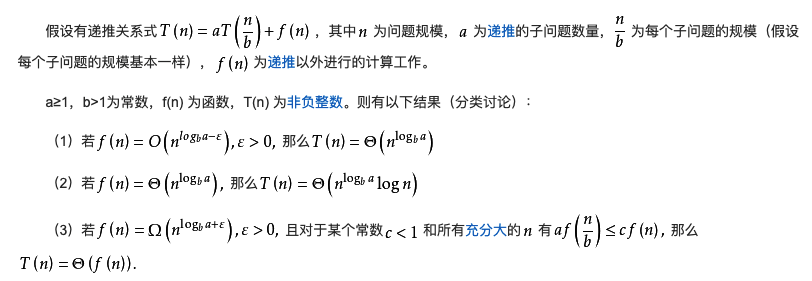

# 算法复杂度主方法

有时候，我们要评估一个算法的复杂度，但是算法被分散为几个递归的子问题，这样评估起来很难，有一个数学公式可以很快地评估出来。

## 一、分治法和递归

在计算机科学中，分治法是建立于多项分支递归的一种很重要的算法范式。字面上的解释是“分而治之”，就是把一个复杂的问题分成两个或更多的相同或相似的子问题，直到最后子问题可以简单的直接求解，原问题的解即子问题的解的合并。

下面是递归的例子，比如我们求阶乘：

```go
func Rescuvie(n int) int {
	if n == 0 {
		return 1
	}

	return n * Rescuvie(n-1)
}
```

会反复进入一个函数，他的递归过程如下:

```go
Rescuvie(5)
{5 * Rescuvie(4)}
{5 * {4 * Rescuvie(3)}}
{5 * {4 * {3 * Rescuvie(2)}}}
{5 * {4 * {3 * {2 * Rescuvie(1)}}}}
{5 * {4 * {3 * {2 * 1}}}}
{5 * {4 * {3 * 2}}}
{5 * {4 * 6}}
{5 * 24}
120
```


我们还可以有另外一种写法，叫尾递归：

```go
func RescuvieTail(n int, a int) int {
	if n == 1 {
		return a
	}

	return RescuvieTail(n-1, a*n)
}
```

他的递归过程如下:

```
RescuvieTail(5, 1)
RescuvieTail(4, 5)
RescuvieTail(3, 20)
RescuvieTail(2, 60)
RescuvieTail(1, 120)
120
```

尾部递归是指递归函数在调用自身后直接传回其值，而不对其再加运算。

很容易看出, 普通的线性递归比尾递归更加消耗资源, 在实现上说, 每次重复的过程调用都使得调用链条不断加长. 系统不得不使用栈进行数据保存和恢复.而尾递归就
不存在这样的问题, 因为他的状态完全由 `n` 和 `a` 保存。

如果每次递归都要对越来越长的链进行运算，那速度极慢，所以我们应该要用尾递归。

## 二、复杂度主方法

主方法，也可以叫主定理。对于那些用分治法，有递推关系式的算法，可以很快求出其复杂度。


定义如下：



举例：


并非所有递推关系式都可应用主定理。

比如：


