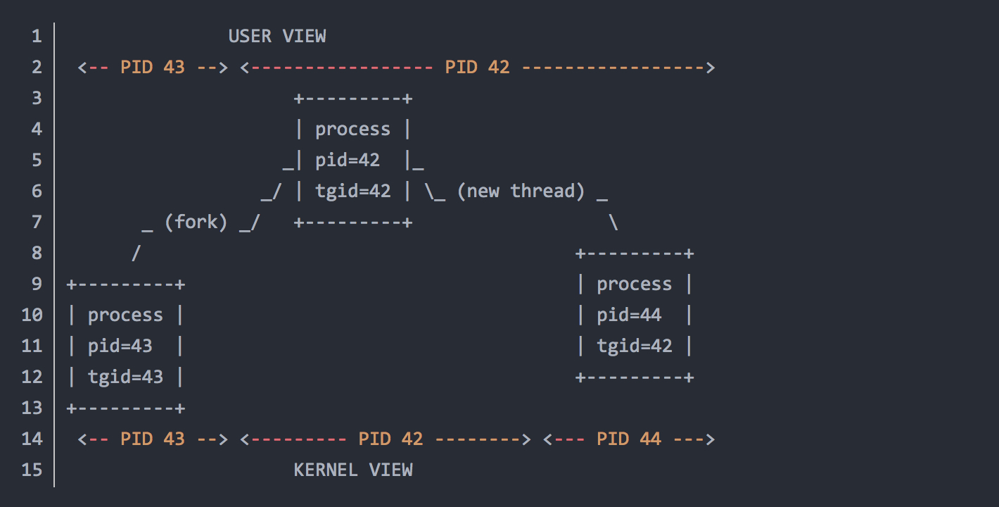

# 并发、协程和信道

`Golang` 语言提供了 `go` 关键字，以及名为 `chan` 的数据类型，以及一些标准库的并发锁等，我们将会简单介绍一下并发的一些概念，然后学习这些 `Golang` 特征知识。

## 一、并发介绍

我们写程序时，可能会读取一个几千兆的日志，读磁盘可能需要读几十秒钟，我们不可能一直等他，因为虽然磁盘 `IO` 繁忙，但是处理器 `CPU` 很空闲，我们可以并发地开另一条路去处理其他逻辑。

在操作系统层面，出现了多进程和多线程的概念。一个处理器会在一个时间片里比如20纳秒执行一个进程，当时间片用完了或者发生了中断比如进程抢占事件，当前进程上下文会被保存，然后处理器开始处理另外一个进程，这样频繁地切换执行，切换和执行的速度特别快，就产生了貌似程序们都在同时执行，其实还是串行执行，这种叫并发。在多核处理器上，进程可以调度到不同的处理器，时间片轮训也只是针对每一个处理器，同一时间在两个处理器上执行的两个进程，它们是实在的同时，这种叫并行。一般情况下，我们统称并发。

进程是计算机资源分配的最小单位，进程是对处理器资源(`CPU`)，虚拟内存（1）的抽象，

虚拟内存是对主存资源(`Memory`)和文件（2）的抽象，文件是对I/O设备的抽象。

>虚拟内存是操作系统初始化后内部维护的一个程序加载空间，对于32位操作系统来说，也就是寄存器有32位的比特长度，虚拟内存中每个字节都有一个内存地址，内存地址的指针长度为32位(刚好是寄存器可以存放的位数)，算下来2的32次，刚好可以存放4G左右的字节，所以在32位的操作系统上，你的8G内存条只有50%的利用率，所以现在都是64位的操作系统。

其中，`CPU`，`Memory`，`I/O` 设备就是我们所说的处理器，内存，硬盘。

线程是计算机调度的最小单位，也就是 `CPU` 大脑调度的最小单位，同个进程下的线程可以共享同个进程分配的计算机资源。

同个进程下的线程间切换需要 `CPU` 切换上下文，但不需要创建新的虚拟内存空间，不需要内存管理单元切换上下文，比不同进程切换会显得更轻量。

总上所述，实际并发的是线程。首先，每个进程都有一个主线程，因为线程是调度的最小单位，你可以只有一个线程，但是你也可以创建多几个线程，线程调度需要 `CPU` 来切换，需要内核层的上下文切换，如果你跑了A线程，然后切到B线程，内核调用开始，`CPU` 需要对A线程的上下文保留，然后切到B线程，然后把控制权交给你的应用层调度。进程切换也需要内核来切换，因为从C进程的主线程切换到D进程的主线程。

事实上，进程和线程只是概念上的划分，在操作系统内部，只用了一个数据结构来表示，里面有 `pid`：进程ID，`tgid`：线程属于的线程组ID（也就是进程ID，主线程ID），如下图（其中 `fork` 表示创建进程）：



每一个 `进程/线程` 都有一个 `pid`，如果它是主线程，那么 `tgid=pid`，从一个主线程 `fork` 出来的是另一个进程的主线程，`pid`，`tgid` 都变了，而 `new thread` 出来的线程，除了 `pid` 变了，`tgid` 不变。

进程间还要通讯，因为它们资源不共享，这个时候需要用 `IPC`（`Inter-Process Communication`，进程间通信），常用的有信号量，共享内存，套接字等。

而同个进程的多个线程共享资源，通讯起来比进程容易多了，因为它们共享了虚拟内存的空间，直接就可以读取内存，现在很多 `Python`，`Java` 等编程语言都有这种线程库实现。

至于 `IO` 多路复用，其实就是维持一个线程队列，然后让一个线程或多个线程，去队列里面拿任务去完成。为什么呢？因为线程的数量是有限的，而且线程间通讯需要点资源，内核也要频繁切换上下文，干脆就弄一个池，有任务就派个小弟出去。

只有一个线程的 `IO` 多路复用，典型的就是 `Redis` 和 `Nodejs` 了，根本不需要切换上下文，一个线程走天下。而多个线程的 `IO` 多路复用，就是 `Golang` 协程的实现方式了，协程，自己管理线程，把线程控制到一定的数量，然后构造一个规则状态机来调度任务。

## 二. 协程和 go 关键字

在操作系统更高层次的应用层，高级编程语言也有开发并发程序的需求。无论是一个进程下的多个线程，还是不同进程，还是不同进程下的线程，切换时都需要损耗资源，浪费一些资源，所以 `Golang` 有 `goruntime`(协程)这种东西，它会在内部维持一个固定线程数的线程池，进行合理的调度，使得线程不那么频繁的切换。

`Golang` 语言实现的调度器，其实就是通过使用数量合适的线程并在每一个线程上执行更多的工作来降低操作系统和硬件的负载。

主要用法如下：

```go
package main

import (
	"fmt"
	"time"
)

func Hu() {
	// 使用睡眠模仿一些耗时
	time.Sleep(2 * time.Second)
	fmt.Println("after 2 second hu!!!")
}

func main() {

	// 将会堵塞
	//Hu()

	// 开启新的协程，不会堵塞
	go Hu()

	fmt.Println("start hu, wait...")

	// 必须死循环，不然主协程退出了，程序就结束了
	for {
		time.Sleep(1 * time.Second)
	}

}
```

如果直接使用 `Hu()` 函数，因为函数内部使用 `time.Sleep` 进行睡眠，需等待两秒，所以程序会堵塞。

这个时候可以使用关键字 `go` 开启一个新的协程，不再堵塞，即 `go Hu()` 执行完毕后，马上会接着执行后续的语句。

输出：

```go
start hu, wait...
after 2 second hu!!!
```

因为 `main` 函数本身作为程序的主协程，如果 `main` 函数结束的话，其他协程也会死掉，必须使用死循环来避免主协程终止。

## 三、信道 chan

如何在两个协程间通讯呢？ `Golang` 提供了一种称为 `chan` 的数据类型，我们可以把它叫做信道。

```go
package main

import (
	"fmt"
	"time"
)

func Hu(ch chan int) {
	// 使用睡眠模仿一些耗时
	time.Sleep(2 * time.Second)
	fmt.Println("after 2 second hu!!!")

	// 执行语句后，通知主协程已经完成操作
	ch <- 1000
}

func main() {
	// 新建一个没有缓冲的信道
	ch := make(chan int)

	// 将信道传入函数，开启协程
	go Hu(ch)
	fmt.Println("start hu, wait...")

	// 从空缓冲的信道读取 int，将会堵塞，直到有消息到来
	v := <-ch
	fmt.Println("receive:", v)
}
```

输出：

```go
start hu, wait...
after 2 second hu!!!
receive: 1000
```

我们可以使用 `make(chan int)` 创建一个能存取 `int` 类型的没有缓冲的信道，没有缓冲，意味着往里面发送消息，或者接收消息都会堵塞。

我们将 `ch` 传入函数 `func Hu(ch chan int)`，因为信道和字典，切片一样都是引用类型，所以在函数内可以往信道里面发送消息，外面的信道可以收到。

发送一个整数到信道可以使用 `ch <- 1000`，接收整数可以使用：`v := <-ch`。

我们执行协程后，因为函数里面会睡眠两分钟，所以两分钟之后信道才会收到消息，在没有收到消息之前 `v := <-ch` 会堵塞，直到协程 `go Hu(ch)` 完成，那么消息收到，程序结束。

使用信道 `chan` 除了可以用来协程间通讯，也可以用来缓存数据，比如建一个带有缓冲的信道：

```go
package main

import (
	"fmt"
	"time"
)

func Receive(ch chan int) {
	// 先等几秒后再接收消息
	time.Sleep(2 * time.Second)
	for {
		select {
		case v, ok := <-ch:
			// 接收信道里面的消息，接收后缓冲就充足了

			// 信道被关闭了，退出
			if !ok {
				fmt.Println("chan close,receive:", v)
				return
			}
			// 打印
			fmt.Println("receive:", v)
		}
	}
}

func Send(ch chan int) {
	// 发到第11个时，会卡住，因为信道满了
	for i := 0; i < 13; i++ {
		ch <- i
		fmt.Println("send:", i)
	}
	// 打印完毕，关闭信道
	close(ch)
}

func main() {
	// 新建一个5个缓冲的信道
	ch := make(chan int, 10)

	// 将信道传入函数，开启协程
	go Receive(ch)
	go Send(ch)

	// 必须死循环，不然主协程退出了，程序就结束了
	for {
		time.Sleep(1 * time.Second)
	}

}
```

我们建了一个有 `10` 个缓冲的信道：`make(chan int, 10)`，然后开了两个协程：`go Receive(ch)` 和 `go Send(ch)`，一个用来收消息，一个用来发送消息。

在 `func Receive(ch chan int)` 中我们先睡眠几秒后再接收消息：`time.Sleep(2 * time.Second)`。

在 `func Send(ch chan int)` 中使用循环，往信道打消息，打到第十个，因为信道缓冲满了，所以会堵塞，直到 `Receive` 开始接收消息再继续打，然后关闭信道：`close(ch)`。

输出结果：

```go
send: 0
send: 1
send: 2
send: 3
send: 4
send: 5
send: 6
send: 7
send: 8
send: 9
receive: 0
receive: 1
receive: 2
receive: 3
receive: 4
receive: 5
receive: 6
receive: 7
receive: 8
receive: 9
receive: 10
send: 10
send: 11
receive: 11
send: 12
receive: 12
chan close,receive: 0
```

在这里有一种 `select` 语句专门用来和信道打交道：

```go
		select {
		case v, ok := <-ch:
			// 接收信道里面的消息，接收后缓冲就充足了

			// 信道被关闭了，退出
			if !ok {
				fmt.Println("chan close,receive:", v)
				return
			}
			// 打印
			fmt.Println("receive:", v)
		}
```

从 `<-ch` 接收消息，如果信道 `ch` 没被关闭，且信道没有消息了，那么会堵塞。如果信道有消息，那么 `ok` 为 `true`，并且消息赋值给 `v`。当信道被关闭：`close(ch)`，那么 `ok` 将会为 `false`，表示信道关闭了。

使用 `range` 也可以遍历信道里的消息，如：

```go
package main

import "fmt"

func main() {
	buffedChan := make(chan int, 2)
	buffedChan <- 2
	buffedChan <- 3
	for i := range buffedChan { // 必须关闭，否则死锁
		fmt.Println(i)
	}
}
```

上面运行后会输出：

```go
2
3
fatal error: all goroutines are asleep - deadlock!
```

因为 `range` 会一直读取消息，如果没有消息将会堵塞，主协程堵塞了，`Golang` 会认为死锁了，这时候我们可以关闭信道后再打印，如：

```
package main

import "fmt"

func main() {
	buffedChan := make(chan int, 2)
	buffedChan <- 2
	buffedChan <- 3
	close(buffedChan) // 关闭后才能for打印出，否则死锁

	//close(buffedChan) // 不能重复关闭
	//buffedChan <- 4  // 关闭后就不能再送数据了，但是之前的数据还在
	for i := range buffedChan { // 必须关闭，否则死锁
		fmt.Println(i)
	}
}
```

输出:

```go
2
3
```

信道关闭后，`range` 操作读完消息后，将会结束。

在这里要注意，不能多次关闭一个信道，不能往关闭了的信道打消息，否则会报错：

```go
panic: send on closed channel
```

## 四、锁实现并发安全

多个协程可能对同一个变量做修改操作，可能不符合预期，比如转账：

```go
package main

import (
	"fmt"
	"time"
)

type Money struct {
	amount int64
}

// 加钱
func (m *Money) Add(i int64) {
	m.amount = m.amount + i
}

// 减钱
func (m *Money) Minute(i int64) {
	// 钱足才能减
	if m.amount >= i {
		m.amount = m.amount - i
	}
}

// 查看还有多少钱
func (m *Money) Get() int64 {
	return m.amount
}

func main() {
	m := new(Money)
	m.Add(10000)

	for i := 0; i < 1000; i++ {
		go func() {
			time.Sleep(500 * time.Millisecond)
			m.Minute(5)
		}()
	}

	time.Sleep(20 * time.Second)
	fmt.Println(m.Get())

}
```

我们先 `m.Add(10000)`，这样就有一万块钱了，然后转账 `1000` 次，每次转 `5` 元，所以结果应该是 `5000`，但事与愿违，结果一直在变化，可能是 `5725` 或者 `5720`。

因为转账是并发的，减钱操作会读取结构体 `Money` 里面的 `amount`，同时操作时可能读到同一个值，比如两个协程都读到 `9995`，那么做减法时，就都变成 `9990`，有一次转账就失败了。

我们需要实现并发安全，同一时间只能允许一个协程修改金额，我们需要加锁，如下：

```
type Money struct {
	lock   sync.Mutex // 锁
	amount int64
}

// 加钱
func (m *Money) Add(i int64) {
	// 加锁
	m.lock.Lock()

	// 在该函数结束后执行
	defer m.lock.Unlock()
	m.amount = m.amount + i
}

// 减钱
func (m *Money) Minute(i int64) {
	// 加锁
	m.lock.Lock()

	// 在该函数结束后执行
	defer m.lock.Unlock()
	
	// 钱足才能减
	if m.amount >= i {
		m.amount = m.amount - i
	}
}
```

我们多加了一个字段：`lock sync.Mutex`，每次做修改时都会先加锁，函数执行完后再把锁去掉。如：


```go
	// 加锁
	m.lock.Lock()

	// 在该函数结束后执行
	defer m.lock.Unlock()

    // 开始进行一些操作
```

协程如果想修改金额，进入函数后，需要先通过 `m.lock.Lock()` 获取到锁，如果获取不到锁的话，会堵塞，直到拿到锁，修改完金额后函数结束时会调用 `m.lock.Unlock()`，这样就实现了并发安全。

我们看到有一个 `defer` 的关键字，这是 `Golang` 提供的延迟执行的关键字，会延迟到函数结束后，该关键字后面的指令才会执行。